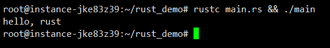

# 第1章 初识 Rust


使用 Rust 提供的构建工具和包管理器 `Cargo` 创建工程。


## 1.1 Rust 语言简介

由内存安全以及内存缓冲区溢出所导致的密钥泄露、拒绝服务和远程代码执行漏洞等相关的问题频发。简单来说，内存安全是不出现内存访问的错误。使用未初始化内存、引用空指针、释放指针后再次使用、重复释放指针、缓冲区溢出等都会导致内存访问错误。

Rust 语言的独到之处就是为了保证内存安全，建立了严格的内存管理模型——所有权系统和类型系统，通过其严格的编译器来检查代码中的每个变量和引用的每个内存指针，为每个变量建立了清晰的生命周期。一旦超过生命周期，变量就会被自动释放，从而不需要垃圾回收机制。每个被分配的内存都有一个独占其所有权的指针。当该指针被销毁时，其对应的内存才会被释放。

Rust 语言可以用于开发：

-   传统命令行程序：Rust 编译器可以直接生成目标可执行程序，不需要任何解释程序。
-   Web 应用：Rust 可以被编译成 WebAssembly，WebAssembly 是一种 JavaScript 的高效替代品。
-   网络服务器：Rust 用极低的资源消耗做到安全高效，且具备很强的大规模并发处理能力，十分适合开发普通或极端的服务器程序。
-   嵌入式设备：Rust 同时具有JavaScript 一般的高效开发语法和 C 语言的执行效率，支持底层平台的开发。


## 1.2 搭建编程环境

### Windows 环境

#### 1. 下载安装器

前往 https://www.rust-lang.org/zh-CN/tools/install 下载安装器。

网站会自动判定当前的操作系统，选择对应的系统位宽版本进行下载。


#### 2. 开始安装

运行 `rustup-init.exe`。

如果没有安装必要的组件，安装程序将会有提示。


如上图所示，键入英文字母 `y` 并按回车。


看见下图提示时，直接按回车即可进入安装。


#### 3. 检查是否安装正确

按组合键 `win+R` 调出命令行窗口，键入命令 `rustc --version` 并回车。

如果能看到如下图中的 Rust 版本信息号，说明就是安装成功了。


#### 4. 安装 Rust Visual C++ 支持组件

在运行安装程序时，如果当前系统中没有 `Visual C++` 生成工具的组件，就会出现提示，内容如下图所示：


前去官网：https://visualstudio.microsoft.com/zh-hans/visual-cpp-build-tools/ 下载生成工具，然后运行。

看到下图界面，把“使用 C++ 的桌面开发”这一项勾上，右侧红色框框内即会选定 `Rust Visual C++` 所必须的组件。如果需要更换安装位置，在安装界面中，点击“安装位置”这个选项卡，即可自定义安装目录。然后执行安装，安装完毕需要重启操作系统。


#### 5. 在 VS Code 上安装支持 Rust 的插件

按需安装插件即可。


### Linux 环境

当时我使用的 Linux 发行版本是 Ubuntu Server 18.04 LTS 64bit.

注意：当前用户是否有足够的权限支持以下命令的运行！

#### 1. 下载安装器

直接运行命令：

```shell
curl https://sh.rustup.rs -sSf | sh
```


出现下图提示内容时，直接按回车即可，然后就等着它安装完。

注：如果中途因为网络不稳定而导致安装失败，重新执行安装命令即可。


#### 2. 安装成功的提示信息

出现下面的信息提示，就表示已经安装成功了。


#### 3. 设置 PATH 环境变量

1.  键入命令：`vim ~/.bash_profile`，使用 `VIM` 进行编辑。

2.  输入代码：`export PATH="$HOME/.cargo/bin:$PATH"`，保存并退出。

3.  使用 `source` 命令让配置立刻生效，键入命令：`source ~/.bash_profile`。

4.  检查是否已正确配置环境变量：`rustc --version`，如果能看到如下图中的版本信息号，就表示正确。

    


#### 4. 测试代码

1.  新建一个文件夹，并进入。

2.  在文件夹中，键入命令：`vim main.rs`，新建并编辑这个 Rust 源码文件。

3.  键入如下代码：

    ```rust
    fn main() {
        println!("hello, rust");
    }
    ```

    保存并退出。

4.  执行命令：`rustc main.rs && ./main`，能够看到打印的内容，就表明成功。

    


## 1.4 Hello Cargo

在实际项目开发中，建议一律使用 `Cargo` 来管理 Rust 项目。

### 1. 创建项目

`cargo` 可以创建两种类型的项目：可执行的二进制程序和库。

1.  运行以下命令，可以创建可执行的二进制程序。

    `cargo new project_name`

2.  运行以下命令，可以创建库。

    `cargo new project_name --lib`

在终端运行以下命令：`cargo new hello-rocket`，便会生成一个名为 `hello-rocket` 的新文件夹，目录结构如下：


根目录下的 `Cargo.toml` 文件，是项目数据描述文件，其中包含项目的元数据和依赖库。

这个 `hello-rocket` 文件夹就是工程本身。

### 2. 编译并运行项目

编译项目的命令：`cargo build`。该命令会在 `./target/debug` 目录下生成一个可执行文件 `hello-rocket.exe`，运行该文件后即可看到结果。

也可以直接使用 `cargo run` 命令，在编译的同时运行生成的可执行文件。

### 3. 发布项目

最终发布时，可以使用 `cargo build --release` 来优化编译项目。这时会在 `./target/release` 目录下生成一个在生产环境中使用的可执行文件。


对于简单的项目，`Cargo` 可能并不比 `rustc` 来得更便利。但特别是对于多 `crate` 的复杂项目，`Cargo` 将会提供极大的便利。


## 更新 Rust

想要升级 Rust 到最新版本，在命令行窗口中键入命令 `rustup update`，即可实现自动更新。

没有更新时，如下图所示：


遇到有新版本时，便可实现自动更新：


## Rust crates 国内镜像源加速配置

拉取 crates.io 仓库代码尤其慢，很多次超时导致引用库没法编译。这里可以切到国内镜像，配置如下：

### Win10 下的配置

#### 切换镜像源操作

1.  进入当前用户目录下的 `.cargo` 文件夹内，例如：`C:\Users\MLoong\.cargo`

2.  当前目下创建 `config` 文件，并使用 `Notepad++` 进行编辑。

3.  将如下代码复制黏贴到正在编辑的 `config` 文件中，保存并退出。

    ```
    [source.crates-io]
    registry = "https://github.com/rust-lang/crates.io-index"
    replace-with = 'ustc'
    [source.ustc]
    registry = "git://mirrors.ustc.edu.cn/crates.io-index"
    ```

4.  直接可以使用，无需刷新配置文件或重启系统。


#### 使用第三方进行测试

找个第三方库进行测试，我挑选了一个 Web 框架：`rocket` 进行测试。具体步骤如下：

1.  `cargo new hello-rocket --bin`

2.  进入该目录

3.  编辑根目录中的 `Cargo.toml` 文件，在文件最底部添加依赖：

    ```
    [dependencies]
    rocket = "0.5.0-rc.1"
    ```

4.  编辑 `src` 目录下的 `main.rs` 文件，键入如下代码：

    ```rust
    #[macro_use] extern crate rocket;
    
    #[get("/")]
    fn index() -> &'static str {
        "Hello, world!"
    }
    
    #[launch]
    fn rocket() -> _ {
        rocket::build().mount("/", routes![index])
    }
    ```

5.  在项目根目录中，启动命令行窗口，键入命令：`cargo run`。如果之前没有安装过该库，则会自动拉取，并编译。
    如下图所示：

    

6.  通过浏览器访问一下，如果能看到正确结果，表明已配置成功。

    

### Linux 下的配置

新建并编辑配置文件：

```shell
vim $HOME/.cargo/config
```


写入中科大软件源：

```rust
[source.crates-io]
registry = "https://github.com/rust-lang/crates.io-index"
replace-with = 'ustc'
[source.ustc]
registry = "git://mirrors.ustc.edu.cn/crates.io-index"
```

保存并退出，无需刷新，即刻生效使用。