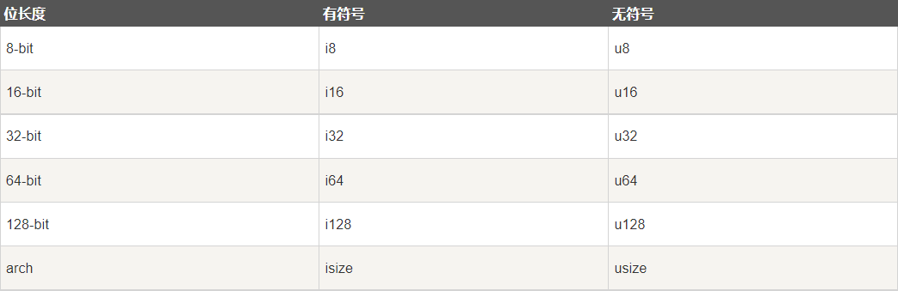

# 第2章 变量与数据类型


数据结构是计算机存储和组织数据的方式，程序中常用的三大数据结构包括动态数组、映射和字符串。

Rust 标准库 `std::collections` 提供了 4 种通用的容器类型。


## 2.1 变量和可变性

Rust 的变量其本质上是一种绑定语义，即：将一个变量名与一个值绑定在一起，变量名和值建立关联关系。

变量默认是不可改变的，这是为了让开发者能充分利用 Rust 提供的安全性来编写代码。


### 2.1.1 变量声明

Rust 通过 `let` 关键字声明变量，变量遵循先声明后使用的原则。

变量声明的语法如下：

```rust
let x: i8 = 1;
let x = 1; // 等价于 let x: i32 = 1;
```

Rust 编译器具有变量类型的自动推导功能。在可以根据赋值类型或上下文信息推导出变量类型的情况下，冒号和数据类型可以省略。

变量名必须由字母、数字、下划线组成，字母区分大小写且不能以数字开头，也不能只有下划线。Rust 中，下划线是一种特殊的标识符，其含义是“忽略这个变量”。

以下划线开头的变量名是常规名称，只是编译器不会警告它们未被使用。例如：

```rust
let _x = 42; // 编译器不会警告该变量没被使用
```


### 2.1.2 变量的可变性

`let` 声明的变量默认是不可变的，在第一次赋值后不能通过再次赋值来改变它的值，即声明的变量是只读状态。

```rust
// 对不可变变量的二次赋值，将会报错
fn main() {
    let x = 3;
    x = 5; // cannot assign twice to immutable variable
    println!("x: {}", x);
}
```


在变量名的前面加上 `mut` 关键字就是告诉编译器，这个变量是可以重新赋值的。

```rust
// mut 关键字将变量 x 声明为可变变量，即：x 为可写状态
fn main() {
    let mut x = 3;
    x = 5;
    println!("x: {}", x);
}


/*
运行结果：

x: 5
*/
```


将变量区分为可变与不可变两种状态，是 Rust 语言安全性的一大体现。Rust 语言为了高并发安全而做的设计：在语言层面尽量少的让变量的值可以改变。

假设在大型程序中，如果有一部分变量想成为不可变的只读状态，而另一部分代码却尝试改变这一预设，那么第一部分代码就有可能以不可预料的结果呈现。而 Rust 编译器保证了，如果一个变量声明为不可变变量，那它真的不会变。想要在之后改变该变量的值，只需要在变量名之前加上 `mut`（mutable）关键字即可。


### 2.1.3 变量遮蔽

Rust 允许在同一个代码块中声明一个与之前已声明变量同名的新变量，新变量会遮蔽之前的变量，即无法再去访问前一个同名的变量，这样就实现了变量遮蔽。

```rust
// 变量遮蔽
fn main() {
    let x = 3;
    let x = x + 2;
    let x = x * 2;
    println!("x: {}", x);

    let x = "Hello Rust";
    println!("x: {}", x);
}


/*
运行结果：

x: 10
x: Hello Rust
*/
```

变量遮蔽的实质是通过 `let` 关键字声明了一个新的变量，只是名称恰巧与前一个变量名相同而已。但它们两个 `x` 是完全不同的变量，处于不同的内存空间，值可以不同、值的类型也可以不同。

变量遮蔽与可变变量的赋值不是一个概念。变量遮蔽是指用同一个名字重新代表另一个变量实体，其类型、可变属性和值都可以变化。但可变变量赋值仅能发生值的变化。

```rust
// 变量遮蔽可以是其他类型
fn main() {
    let x = 3;
    let x = x + 2;
    println!("x: {}", x);

    let x = "abc";
    println!("x: {}", x);

    let x = true;
    println!("x: {}", x);

    let x = 3.1415;
    println!("x: {}", x);

    let x = 1..=5; // 类型为 RangeInclusive<i32>
    println!("x: {:?}", x);
}


/*
运行结果：

x: 5
x: abc
x: true
x: 3.1415
x: 1..=5
*/
```

```rust
// 可变变量赋值不能给其他类型
fn main() {
    let mut s = "123";
    s = s.len();
}


/*
运行结果：

error[E0308]: mismatched types
 --> main.rs:3:9
  |
3 |     s = s.len();
  |         ^^^^^^^ expected `&str`, found `usize`
*/
```


### 2.1.4 常量

常量是指绑定到一个标识符且不允许改变的值，一旦定义后就没有任何方法能改变其值。

Rust 声明常量的语法：`const MAX_NUM: u32 = 1024;`

Rust 使用 `const` 关键字来声明常量。常量名通常是大写字母，且**必须指定常量的数据类型**。

常量与不可变变量的区别主要在于：

1.  常量声明使用 `const` 关键字，且必须注明值的类型。

2.  通过变量遮蔽的方式可以让不可变变量的值改变（本质上是新的变量，只是同名而已）。但常量不能遮蔽，不能重复定义，不存在内层或后面作用域定义的常量去遮蔽外层或前面定义的同名常量！常量一旦定义后，就永远不可变更和重新赋值。

3.  常量可以在任何作用域中声明，包括全局作用域。在声明常量的作用域中，常量在整个程序声明周期内都有效，使得常量可以作为多处代码共同使用的全局范围的值。

    ```rust
    // 常量依旧需要遵循作用域规则
    fn main() {
        println!("start...");
    
        {
            const MAX_V: u32 = 10;
        } // 出了大括号，不管是任何形式的标识符，都会被销毁
    
        println!("constant value MAX_V: {}", MAX_V); // error[E0425]: cannot find value `MAX_V` in this scope
    }
    ```

4.  常量只能被赋值为常量表达式或数学表达式，不能是函数返回值，或是其他在运行时才能确定的值。


## 2.2 基本数据类型

Rust 的基本数据类型有：整数类型、浮点数类型、布尔类型、字符类型、范围类型等。

### 2.2.1 整数类型

整数型简称整型。根据有无符号，整数可以分为有符号整型和无符号整型。按照存储大小，整数类型可以进一步分为 1 字节、2 字节、4 字节、8 字节、16 字节（1 字节 = 8 位）。



Rust 默认的整数类型是 `i32`。`isize` 和 `usize` 主要作为数组或集合的索引类型使用，其长度依赖于运行程序的计算机系统，在 64 位计算机系统上，其长度是 64 位；在 32 位计算机系统上，其长度是 32 位。

为了方便阅读数值较大的数字，Rust 允许使用下划线 `_` 作为虚拟分隔符来对数字进行可读性分割。比如：为了提高 50000 的可读性，可以写成 `50_000`，Rust 在编译时会自动移除数字可读性分隔符 `_`。

有符号整数类型的数值范围是 <code>-2<sup>n-1</sup>-1 ~ 2<sup>n-1</sup>-1</code>，无符号整数类型的数值范围是 <code>0 ~ 2<sup>n</sup>-1</code>，这里的 `n` 是长度。比如，`i8` 的数值范围是 <code>-2<sup>7-1</sup>-1 ~ 2<sup>7-1</sup>-1</code>，也就是 `-128 ~ 127`。`u8` 的数值范围是 <code>0 ~ 2<sup>8</sup>-1</code>，也就是 `0 ~ 255`。

如果某个变量的值超出了给定的数值范围，将会发生整型溢出。编译器将其视为一种错误。

整数的表述方法有以下几种：


### 2.2.2 浮点数类型

按照存储大小，浮点数分为 `f32` 和 `f64` 两类。Rust 默认的浮点数类型是 `f64`。

`f32`：单精度浮点数，小数点后至少有 6 位有效数字。

`f64`：双精度浮点数，小数点后至少有 15 位有效数字。

### 2.2.3 布尔类型

布尔类型只有两个可能的取值，即 `true` 或 `false`。

### 2.2.4 字符类型

Rust 使用 `UTF-8` 作为底层的编码。字符类型代表的是一个 `Unicode` 标量值（Unicode Scalar Value），包括数字、字母、Unicode 和其他特殊字符。Unicode 值的范围从 `U+0000` 到 `U+D7FF` 和 `U+E000 ` 到 `U+10FFFF`（包括两端）。

**每个字符占 4 个字节**，代表 Unicode 标量值，它可以支持中文、日文、韩文字符等非英文字符甚至表情符号和零宽度空格在 Rust 中都是有效的 `char` 值。字符类型 `char` 由单引号定义。

```rust
fn main() {
    let z = 'z';
    let zz = 'ℤ';
    let heart_eyed_cat = '😻'; // Unicode 标量值来表示表情符号
    println!("{}", z);
    println!("{}", zz);
    println!("{}", heart_eyed_cat);
    
    println!();
    
    println!("{}", z.len_utf8());
    println!("{}", zz.len_utf8());
    println!("{}", heart_eyed_cat.len_utf8());
}


/*
运行结果：

z
ℤ
😻

1
3
4
*/
```

注意：由于中文文字编码有两种（GBK 和 UTF-8），所以编程中使用中文字符串有可能导致乱码的出现，这是因为源程序与命令行的文字编码不一致，所以在 Rust 中字符串和字符都必须使用 UTF-8 编码，否则编译器会报错。

### 2.2.5 范围类型

范围类型常用来生成从一个整数开始到另一个整数结束的整数序列，有左闭右开和全闭两种形式。`(1..5)` 是左闭右开，表示生成 `1, 2, 3, 4` 这 4 个数字；`(1..=5)` 是全闭区间，表示生成 `1, 2, 3, 4, 5` 这 5 个数字。范围类型自带一些方法。

```rust
// 范围类型以及一些其自带的方法
fn main() {
    print!("(1..5): ");
    for i in 1..5 {
        print!("{} ", i);
    }
    println!();

    print!("(1..=5).rev: ");
    for i in (1..=5).rev() {
        print!("{} ", i);
    }
    println!();

    let sum: i32 = (1..=5).sum();
    println!("1+2+3+4+5 = {}", sum);
}


/*
运行结果：

(1..5): 1 2 3 4 
(1..=5).rev: 5 4 3 2 1 
1+2+3+4+5 = 15
*/
```


## 2.3 复合数据类型

Rust 的复合数据类型有：元组、数组、结构体、枚举等。

### 2.3.1 元组类型

元组类型是由一个或多个类型的元素组合成的复合类型，使用小括号 `()` 把所有元素放在一起，元素之间使用逗号 `,` 分隔。

Rust 中，元祖的特性：

1.  元组中的每个元素都有各自的类型，且这些元素的类型可以不同（可以包含不同种类的数据）。
2.  元组的长度固定，一旦定义就不能再增长或缩短！如果显示指定了元组的数据类型，那么元素的个数必须和数据类型的个数相同。
3.  当元组中只包含一个元素时，应该在元素后面添加逗号 `,` 来区分是元组，而不是括号表达式。
4.  使用 `元组名.索引` 语法来访问元组中相应索引位置的元素。

可以将元祖看作是“不同类型值的定长集合”。

```rust
// 元组类型
fn main() {
    let tup1: (i8, f32, bool) = (-10, 7.7, false); // 显式指定了数据类型以及数量。等号右边的元素个数和数据类型必须与之匹配，不能出现任何差错
    let tup2 = (7.7, (false, 10)); // 第 2 个元素是元组类型
    let tup3 = (100,); // 只包含一个元素的元组。如果不加逗号，只是一个普通的整型类型

    println!("{}, {}", tup1.0, (tup2.1).1);
    println!("{}", tup3.0);

    let (x, y, z) = tup1; // 使用模式匹配的方式来解构赋值，元组中的每个元素按照位置顺序赋值给变量
    println!("x: {}, y: {}, z: {}", x, y, z);
}


/*
运行结果：

-10, 10
100
x: -10, y: 7.7, z: false
*/
```


元组在赋值时可以被拆解成各自的字段：

```rust
let (some_char, some_int) = ('a', 17); // some_char = 'a', some_int = 17
```


### 2.3.2 数组类型

数组类型是由**相同类型**的元素组合成的复合类型，可以使用 `[T; n]` 表示，`T` 代表元素类型，`n` 代表长度（元素个数）。

数组的声明和初始化有以下 3 中方式。

1.  指定数组类型，为每个元素赋初始值。所有初始值放入中括号 `[]` 中，使用逗号 `,` 分隔。

    e.g., `let arr: [i32; 5] = [1, 2, 3, 4, 5];`

2.  省略数组类型，为每个元素赋初始值。由于已指定每个元素的初始值，可以从初始值推断出数组类型。

    e.g., `let arr = [1, 2, 3, 4, 5];`

3.  省略数组类型，为所有元素使用默认值初始化。

    e.g., `let arr = [1; 5];` 等价于：`let arr = [1, 1, 1, 1, 1];`

```rust
// 数组类型
fn get_i() -> usize {
    10
}

fn main() {
    let arr1: [i32; 5] = [1, 2, 3, 4, 5];
    let arr2 = [1, 2, 3, 4, 5];
    let arr3: [i32; 5] = [1; 5];
    let arr4 = [1; 5];

    println!("{:?}", arr1);
    println!("{:?}", arr2);
    println!("{:?}", arr3);
    println!("{:?}", arr4);
    println!("arr1[0]: {}, arr3[2]: {}", arr1[0], arr3[2]);

    let index = get_i();
    println!("arr1[10]: {}", arr1[index]); // 通过某个函数的返回值作为下标，必须是 usize 类型
}


/*
运行结果：

[1, 2, 3, 4, 5]
[1, 2, 3, 4, 5]
[1, 1, 1, 1, 1]
[1, 1, 1, 1, 1]
arr1[0]: 1, arr3[2]: 1
thread 'main' panicked at 'index out of bounds: the len is 5 but the index is 10', main.rs:18:30
note: run with `RUST_BACKTRACE=1` environment variable to display a backtrace
*/
```

上段代码中，通过 `get_i()` 函数，返回了一个 `usize` 类型作为访问数组的下标。编译器是不会检查该值是否存在下标越界，是在运行时才发生的。


通过上图中看到，可以通过编译，但运行时下标越界，导致程序崩溃。


如果显示指定了一个具体的索引值，那么在编译时，就会检查数组下标是否越界。如下图所示：


明确地给了一个 `10`，那么在执行编译命令 `rustc` 时，就已经检查出了下标越界。编译都通不过，根本就不会生成可执行文件。


### 2.3.3 结构体类型

结构体中以 `name:type` 格式定义字段，`name` 是字段名称，`type` 是字段类型。字段默认不可变，并要求明确指定数据类型，不能使用自动类型推倒功能。

结构体实例默认是不可变的，且不允许只将某个字段标记为可变，如果要修改结构体实例必须在实例创建时就声明其为可变的。

```rust
// 结构体类型
struct Student {
    name: &'static str,
    score: i32,
}

fn main() {
    let score = 59;
    let username = "zhangsan";

    // 在实例化结构体的时候用 JSON 对象的 key:value 语法来实现定义
    let mut student = Student {
        score, // 将变量 score 的值赋值给字段 score，两者有着相同的名称，可以简写成 score，不用写成 score: score
        	   // 正在实例化的结构体，有字段名称和现存变量名称一样的，就可以简化书写
        name: username,
    };

    student.score = 60;
    println!("name: {}, score: {}", student.name, student.score);

    let student2 = Student {
        // 实例中字段的顺序可以和结构体中声明的顺序不一致
        name: "lisi",
        ..student // 结构体更新语法后面，不要加逗号。并且，这种语法不允许一成不变地复制另一个结构体实例，就是说至少重新设定一个字段的值才能引用其他实例的值
    };
    
    // let student3 = Student { ..student }; // 表示所有字段
    
    println!("name: {}, score: {}", student2.name, student2.score);
}


/*
运行结果：

name: zhangsan, score: 60
name: lisi, score: 60
*/
```


另外，还有两种特殊的结构体：元组结构体和单元结构体。

1.  元组结构体

    特点是字段只有类型，没有名称。与元组的区别是：元组结构体它有名字和固定的类型格式。

    元组结构体存在的意义是为了处理那些需要定义类型，又不想太复杂的简单数据。例如：

    ```rust
    fn main() {
        struct Color(u8, u8, u8);
        struct Point(f64, f64);
    
        let black = Color(0, 0, 0);
        let origin = Point(0.0, 0.0);
    
        println!("black = ({}, {}, {})", black.0, black.1, black.2);
        println!("origin = ({}, {})", origin.0, origin.1);
    }
    
    
    /*
    运行结果：
    
    black = (0, 0, 0)
    origin = (0, 0)
    */
    ```

2.  单元结构体

    是指没有任何字段的结构体，只作为一种象征而无需任何成员，只用于特定的场景。

    例如：

    ```rust
    struct Solution;
    ```


结构体与元组一样，可以被解构。就像是一个有效的 let 模式：

```rust
let (left, right) = slice.split_at(middle); // 元素解构

let v = Vec2 { x: 3.0, y: 6.0 };
let Vec2 { x, y } = v; // 结构体解构。x = 3.0, y = 6.0
```


### 2.3.4 枚举类型

当一个变量有几种可能的取值时，我们就可以将它定义为枚举类型。变量的值限于枚举值范围内，这样能有效防止用户提供无效值。

使用 `枚举名::枚举值` 访问枚举值。

```rust
// 描述两种书的不同属性
// 如果正在开发一个图书管理系统，需要描述两种书的不同属性（纸质书有索书号，电子书只有 URL），可以为枚举类成员添加元组属性描述
fn main() {
    // 如果想为属性命名，可以用结构体语法
    enum Book {
        Papery { index: u32 },
        Electronic { url: String },
    }
    // 虽然可以如此命名，但请注意，并不能像访问结构体字段一样访问枚举类绑定的属性。访问的方法在 match 语法中。

    let book = Book::Papery { index: 1001 };
    let ebook = Book::Electronic {
        url: String::from("https://..."),
    };

    match book {
        Book::Papery { index } => {
            println!("Papery book: {}", index);
        }

        Book::Electronic { url } => {
            println!("E-book: {}", url);
        }
    }
}


/*
运行结果：

Papery book: 1001
*/
```


枚举类型还可以分成无参数枚举类型和带参数枚举类型。

```rust
// 无参数枚举类型
#[derive(Debug)]
enum ColorNoParam {
    Red,
    Yellow,
    Blue,
}

fn main() {
    let color_no_param = ColorNoParam::Red; // 变量 color_no_param 与枚举值 Red 绑定
    match color_no_param {
        ColorNoParam::Red => println!("{:?}", ColorNoParam::Red),
        ColorNoParam::Yellow => println!("{:?}", ColorNoParam::Yellow),
        ColorNoParam::Blue => println!("{:?}", ColorNoParam::Blue),
    }
}


/*
运行结果：

Red
*/
```

第 1 行代码使用 `#[derive(Debug)]` 让 `ColorNoParam` 自动实现 `Debug trait`，**只有实现了 `Debug trait` 的类型才拥有使用 `{:?}` 格式化打印的行为**。


```rust
// 带参数枚举类型
#[derive(Debug)]
enum ColorNoParam {
    Red(String),
    Yellow(String),
    Blue(String),
}

fn main() {
    println!("{:?}", ColorNoParam::Blue(String::from("blue")));
}


/*
运行结果：

Blue("blue")
*/
```

枚举类型 `ColorNoParam` 的枚举值都带有 `String` 类型参数，类似于函数调用，使用这种枚举值需要传入实参。

也可以将上面的代码改写成如下等价：

```rust
enum ColorNoParam {
    Red(&'static str), // 需要指定声明周期
    Yellow(&'static str),
    Blue(&'static str),
}

fn main() {
    println!("{:?}", ColorNoParam::Blue("blue"));
}
```


## 2.4 容器类型

Rust 标准库 `std::collections` 提供了 4 种通用的容器类型，包含以下 8 中数据结构。

备注：在文件系统中，目录结构往往以斜杠在路径字符串中表示位置，Rust 中的路径分隔符是 `::`。


### 2.4.1 Vec

`Vec`（Vector 向量）是一种动态可变长数组（简称动态数组），即在运行时可增长或者缩短数组的长度。只能存储相同类型的元素。

#### 1. 动态数组的创建

创建动态数组有以下 3 种方式。

##### 1) 创建空的动态数组

使用 `Vec::new` 函数创建空的动态数组，语法：`let mut v: Vec<i32> = Vec::new();`

##### 2) 创建指定容量的动态数组

使用 `Vec::with_capacity` 函数创建指定容量的动态数组，语法：`let mut v: Vec<i32> = Vec::with_capacity(10);`

动态数组的**容量**是指为存储元素分配的内存空间量，而**长度**是动态数组中实际存储的元素个数。动态数组的长度小于其容量时，动态数组可以随意增长，但动态数组的长度超过其容量时就需要重新分配更大的容量。重新分配容量的过程会消耗一定的系统资源。

##### 3) `vec!` 宏

使用 `vec!` 宏在创建动态数组的同时进行初始化，并且根据初始值自动推断动态数组的元素类型。

例如：

```rust
let mut v: Vec<i32> = vec![]; // 创建一个空的动态数组，由于没有给初始值，编译器并不知道具体类型，因此需要显示声明元素类型
let mut v = vec![1, 2, 3]; // 编译器会根据初始值自动推断元素类型是 i32
let mut v = vec![0; 10]; // 创建的动态数组包含 10 个元素，元素的初始值全部是 0
```


#### 2. 动态数组的修改

##### 1) `push`

`push` 方法在动态数组的尾部添加单个元素。

```rust
// push 添加元素
fn main() {
    let mut v: Vec<i32> = Vec::new();
    v.push(1);
    v.push(2);
    v.push(3);

    println!("v: {:?}", v);
}


/*
运行结果：

v: [1, 2, 3]
*/
```

##### 2) `append`

用于将一个动态数组拼接到另一个动态数组的尾部。

```rust
// append 拼接动态数组
fn main() {
    let mut v1: Vec<i32> = vec![1, 2, 4, 8];
    let mut v2: Vec<i32> = vec![16, 32, 64];
    v1.append(&mut v2); // 在 v1 后面拼接整个 v2

    println!("{:?}", v1);
}


/*
运行结果：

[1, 2, 4, 8, 16, 32, 64]
*/
```

往 `v1` 后面拼接另外一个动态数组会改变原 `v1` 的值，所以需要可变类型。`append` 方法的参数必须是可变引用，因此需要 `&mut v2`。

##### 3) 为指定索引的元素重新赋值

使用 `实例名[索引]` 语法为指定索引的元素重新赋值。

```rust
// 修改指定索引的元素值
fn main() {
    let mut v: Vec<i32> = Vec::new();
    v.push(1);
    v.push(2);
    v.push(3);

    v[1] = 5;

    println!("v: {:?}", v);
}


/*
运行结果：

v: [1, 5, 3]
*/
```

##### 4) 删除动态数组的元素

###### 1. 使用 `pop` 方法

使用 `pop` 方法删除并返回动态数组的最后一个元素（返回的是一个 `Option` 类型的值 `Some(value)`），如果数组为空则返回 `None`。

```rust
// 使用 pop 方法删除元素
fn main() {
    let mut v: Vec<i32> = Vec::new();
    v.push(1);
    v.push(2);
    v.push(3);

    println!("e: {:?}", v.pop());
    println!("v: {:?}", v);
}


/*
运行结果：

e: Some(3)
v: [1, 2]
*/
```

###### 2. 使用 `remove` 方法

使用 `remove` 方法删除并返回动态数组指定索引的元素，同时将其后面的所有元素向左移动一位。**如果索引越界，将会导致程序错误**。

```rust
// 使用 remove 方法删除元素
fn main() {
    let mut v = vec![1, 2, 3];

    println!("e: {}", v.remove(1));
    println!("v: {:?}", v);
}


/*
运行结果：

e: 2
v: [1, 3]
*/
```


#### 3. 动态数组的访问

##### 1) 使用 `实例名[索引]` 语法为访问指定索引的元素

##### 2) `get` 方法

使用 `get` 方法以索引作为参数访问元素，返回值类型是 `Option<&T>`，如果索引越界，将会返回 `None`。

```rust
// 使用 get 方法访问元素
fn main() {
    let v = vec![1, 2, 3];

    println!("e: {:?}", v.get(2));
    println!("e: {:?}", v.get(10));
}


/*
运行结果：

e: Some(3)
e: None
*/
```

##### 3) 遍历动态数组的所有元素

```rust
// 遍历所有元素
fn main() {
    let v = vec![10, 20, 30];
    for i in v {
        print!("{} ", i);
    }

    println!();

    let mut v = vec![10, 20, 30];
    for i in &mut v { // 可变引用
        *i += 50; // 使用解引用操作符 `*` 来追踪和修改元素值
        print!("{} ", i);
    }
}


/*
运行结果：

10 20 30 
60 70 80 
*/
```


### 2.4.2 VecDeque

双端队列是一种同时具有栈和队列特征的数据结构。

Rust 使用 `VecDeque` 结构体表示双端队列，它定义在标准库 `std::collections` 模块中，使用 `VecDeque` 结构体之前需要显示导入 `std::collections::VecDeque`。

#### 1. `VecDeque` 的创建

创建 `VecDeque` 有以下两种方式。

##### 1) 使用 `VecDeque::new` 函数创建空的 `VecDeque`

语法：`let mut v: VecDeque<u32> = VecDeque::new();`

##### 2) 使用 `VecDeque::with_capacity` 函数创建指定容量的 `VecDeque`

语法：`let mut v: VecDeque<u32> = VecDeque::with_capacity(10);`

#### 2. `VecDeque` 的修改

##### 1) 添加新元素

```rust
// 添加元素
use std::collections::VecDeque; // 需要显示导入

fn main() {
    let mut v: VecDeque<u32> = VecDeque::new();
    v.push_back(1); // push_back 在队列的尾部添加新元素
    v.push_back(2);
    v.push_back(3);
    v.push_front(1); // push_front 在队列的头部添加新元素
    v.push_front(2);

    println!("v: {:?}", v);
}


/*
运行结果：

v: [2, 1, 1, 2, 3]
*/
```

##### 2) 为指定索引的元素重新赋值

使用 `实例名[索引]` 语法，为指定索引的元素重新赋值。

```rust
// 修改指定索引的元素值
use std::collections::VecDeque;

fn main() {
    let mut v: VecDeque<u32> = VecDeque::new();
    v.push_back(1);
    v.push_back(2);
    v.push_back(3);

    v[1] = 5;

    println!("v: {:?}", v);
}


/*
运行结果：

v: [1, 5, 3]
*/
```

##### 3) 删除 `VecDeque` 中的元素

###### 1. `pop_front` 和 `pop_back`

`pop_front` 方法删除并返回队列的头部元素，`pop_back` 方法删除并返回队列的尾部元素。返回的都是 `Option` 类型的值 `Some(value)`。

```rust
// 使用 pop_front、pop_back 方法删除元素
use std::collections::VecDeque;

fn main() {
    let mut v: VecDeque<u32> = VecDeque::new();
    v.push_back(1);
    v.push_back(2);
    v.push_back(3);
    v.push_front(1);
    v.push_front(2);

    println!("e: {:?}", v.pop_back());
    println!("e: {:?}", v.pop_front());
    println!("v: {:?}", v);
}


/*
运行结果：

e: Some(3)
e: Some(2)
v: [1, 1, 2]
*/
```

###### 2. `remove` 方法

`remove` 方法删除并返回队列指定索引的元素（返回 `Option` 类型的值 `Some(value)`），同时将其后面的所有元素向左移动一位。如果索引越界，则返回 `None`。

```rust
// 使用 remove 方法删除元素
use std::collections::VecDeque;

fn main() {
    let mut v: VecDeque<u32> = VecDeque::with_capacity(2); // 创建一个指定容量为 2，存储 u32 类型的 VecDeque
    v.push_back(1);
    v.push_back(2);
    v.push_back(3); // 长度超过了容量，会自动扩容

    println!("e: {:?}", v.remove(1));
    println!("e: {:?}", v.remove(5)); // 索引越界，返回 None
    println!("v: {:?}", v);
}


/*
运行结果：

e: Some(2)
e: None
v: [1, 3]
*/
```

#### 3. `VecDeque` 的访问

##### 1) `实例名[索引]` 语法

使用 `实例名[索引]` 语法访问指定索引的元素，如果索引越界，将会导致程序错误。

```rust
// 使用索引语法访问元素
use std::collections::VecDeque;

fn main() {
    let mut v: VecDeque<u32> = VecDeque::new();
    v.push_back(1);
    v.push_back(2);
    v.push_back(3);

    println!("e: {}", v[0]);
}


/*
运行结果：

e: 1
*/
```

##### 2) `get` 方法

使用 `get` 方法以索引作为参数访问元素，返回值类型是 `Option<&T>`，如果索引越界，则返回 `None`。

```rust
// 使用 get 方法访问元素
use std::collections::VecDeque;

fn main() {
    let mut v: VecDeque<u32> = VecDeque::new();
    v.push_back(1);
    v.push_back(2);
    v.push_back(3);

    println!("e: {:?}", v.get(0));
    println!("e: {:?}", v.get(10));
}


/*
运行结果：

e: Some(1)
e: None
*/
```


### 2.4.2 HashMap

哈希表（HashMap）是基于哈希算法来存储键-值对的集合，所有的键必须是同一类型，所有的值也必须是同一类型。Rust 使用 HashMap 结构体表示哈希表，使用 HashMap 结构体之前需要显示导入 `std::collections::HashMap`。

#### 1. HashMap 的创建

##### 1) 创建空的 HashMap

语法：`let mut map: HashMap<&str, i32> = HashMap::new();`

##### 2) 创建指定容量的 HashMap

语法：`let mut map: HashMap<&str, i32> = HashMap::with_capacity(10);`

#### 2. HashMap 的修改

##### 1) `insert` 方法

`insert` 方法在 HashMap 中插入或更新键-值对。如果键不存在，执行插入操作并返回 `None`。如果键已存在，执行更新操作，将对应键的值更新并**返回旧值**（类型是 `Option<T>`）。

```rust
// 使用 insert 方法插入/更新键-值对
use std::collections::HashMap; // 显示导入

fn main() {
    let mut map: HashMap<&str, i32> = HashMap::new();

    let zhangsan1 = map.insert("zhangsan", 97); // 键 "zhangsan" 不存在，执行插入操作，返回 None
    map.insert("lisi", 86);
    println!("{:?}", zhangsan1);
    println!("{:?}", map);

    let zhangsan2 = map.insert("zhangsan", 79); // 键 "zhangsan" 已存在，执行更新操作，返回 Some(97) 旧的值
    println!("{:?}", zhangsan2);
    println!("{:?}", map);
}


/*
运行结果：

None
{"zhangsan": 97, "lisi": 86}
Some(97)
{"zhangsan": 79, "lisi": 86}
*/
```

注意：由于每次的哈希算法不同，打印实例 `map` 的结果顺序并不确定，可能是 `"lisi"` 先出现，也有可能是 `"zhangsan"`。

##### 2) `entry` 和 `or_insert`

使用 `entry` 和 `or_insert` 方法检查键是否有对应的值，没有对应值就插入键值对，已有对应值则不执行任何操作。

`entry` 方法以键为参数，返回值是一个枚举类型 `Entry`。`Entry` 类型的 `or_insert` 方法以值为参数，在键有对应值时不执行任何操作，在键没有对应值时，将键与键值对插入 HashMap。

```rust
// 使用 entry 方法插入键值对
use std::collections::HashMap;

fn main() {
    let mut map: HashMap<&str, i32> = HashMap::new();

    map.entry("zhangsan").or_insert(97); // entry 方法检查键 "zhangsan" 是否有对应值，没有对应值就插入该键值对
    map.entry("lisi").or_insert(86);
    println!("{:?}", map);

    map.entry("zhangsan").or_insert(79); // 再次检查键 "zhangsan" 是否有对应值，发现键 "zhangsan" 已有对应值 97，那就不执行任何操作，直接返回这个值的类型 Entry
    println!("{:?}", map);
}


/*
运行结果：

{"zhangsan": 97, "lisi": 86}
{"zhangsan": 97, "lisi": 86}
*/
```

##### 3) 以计算结果来更新键对应值

以新旧两值的计算结果来更新键值对是指找到一个键对应值，结合新旧两值进行某些计算处理，以计算结果来更新键对应的值。

例如，老师发现本次试卷出现了一道错题，决定给所有学生的分数都加上 2 分。那么就可以将每个学生的名字作为键（目前简单学习，不考虑有多个相同名字的学生），将对应分数加上 2。

```rust
// 修改 HashMap 元素
use std::collections::HashMap;

fn main() {
    let mut map: HashMap<&str, i32> = HashMap::new();
    map.insert("zhangsan", 97);
    map.insert("lisi", 86);
    map.insert("wangwu", 55);
    println!("{:?}", map);

    // 迭代元素是表示键值对的元组
    for (_, val) in map.iter_mut() { // 只针对值进行处理，因此抛弃了键，只取 &mut i32 类型的 val
        *val += 2; // 通过解引用操作符 `*` 对 val 进行赋值操作
        // 分开写就是 *val = *val + 2;
    }
    println!("{:?}", map);
}


/*
运行结果：

{"wangwu": 55, "zhangsan": 97, "lisi": 86}
{"wangwu": 57, "zhangsan": 99, "lisi": 88}
*/
```

`iter_mut` 方法会返回由 HashMap 中所有键值对的可变**引用**组成的迭代器。

##### 4) 删除键值对

使用 `remove` 方法删除并返回指定的键值对（返回的类型为 `Option<T>`），如果不存在则返回 `None`。

```rust
// 使用 remove 方法删除键值对
use std::collections::HashMap;

fn main() {
    let mut map: HashMap<&str, i32> = HashMap::new();
    map.insert("zhangsan", 97);
    map.insert("lisi", 86);
    map.insert("wangwu", 55);
    println!("{:?}", map);

    let result = map.remove("wangwu");
    println!("{:?}", map);
    println!("{:?}", result);
}


/*
运行结果：

{"lisi": 86, "wangwu": 55, "zhangsan": 97}
{"lisi": 86, "zhangsan": 97}
Some(55)
*/
```


#### 3. HashMap 的访问

##### 1) `实例名[键]` 语法

使用 `实例名[键]` 语法访问指定的键值对。如果键不存在，将会导致程序错误。

```rust
// 使用 `实例名[键]` 语法访问键值对
use std::collections::HashMap;

fn main() {
    let mut map: HashMap<&str, i32> = HashMap::new();
    map.insert("zhangsan", 97);

    println!("zhangsan: {}", map["zhangsan"]);
    println!("wangwu: {}", map["wangwu"]); // 由于键 "wangwu" 不存在，将会导致程序错误
}


/*
运行结果：

zhangsan: 97
thread 'main' panicked at 'no entry found for key', main.rs:8:28
note: run with `RUST_BACKTRACE=1` environment variable to display a backtrace
*/
```

##### 2) `get` 方法

使用 `get` 方法以键为参数访问指定的键值对，返回值类型是 `Option<T>`，如果键不存在，则返回 `None`。

```rust
// 使用 get 方法为参数访问指定的键值对
use std::collections::HashMap;

fn main() {
    let mut map: HashMap<&str, i32> = HashMap::new();
    map.insert("zhangsan", 97);

    println!("zhangsan: {:?}", map.get("zhangsan"));
    println!("wangwu: {:?}", map.get("wangwu"));
}


/*
运行结果：

zhangsan: Some(97)
wangwu: None
*/
```


`get_mut` 方法可以获取可变引用，在已经确定有该键的情况下直接修改对应的值。

```rust
// 使用 get_mut 修改 HashMap 中的值
use std::collections::HashMap;

fn main() {
    let mut map = HashMap::new();
    map.insert(1, "aaa");
    println!("{:?}", map);

    if let Some(v) = map.get_mut(&1) {
        *v = "b";
    }
    println!("after change, map: {:?}", map);
}


/*
运行结果：

{1: "aaa"}
after change, map: {1: "b"}
*/
```

注意：Rust 不同于其他编程语言（例如 Go），Rust 不能通过 `map[key] = value` 的方式直接修改 HashMap 中的值，`trait IndexMut` 没有为 `HashMap` 实现修改索引内容这个功能。

在 VSCode 中，鼠标滑到错误提示处，就会有提示。如下图所示：


即使是字符串类型作为键，也没有实现 `trait IndexMut`。


## 2.5 字符串

字符串的本质是一种特殊的容器类型，是由零个或多个字符组成的有限序列。

### 2.5.1 字符串的创建

Rust 常用的字符串有两种，一种是固定长度的字符串字面量 `str`，另一种是可变长度的字符串对象 `String`。

#### 1. `&str` 的创建

Rust 内置的字符串类型是 `str`，它通常以引用的形式 `&str` 出现。字符串字面量 `&str` 是字符的集合，代表的是不可变的 `UTF-8` 编码的字符串的引用，**创建后无法再为其追加内容或更改内容**。

创建字符串字面量 `&str` 有以下两种方式。

##### 1) 使用双引号创建字符串字面量

语法：`let s1 = "hello, rust!";`

##### 2) `as_str` 方法

使用 `as_str` 方法将字符串对象转换为字符串字面量。

语法：

```rust
let str = String::from("hello, rust");
let s2 = str.as_str();
```

#### 2. `String` 的创建

字符串对象 `String` 是由 Rust 标准库提供的、拥有所有权的 `UTF-8` 编码的字符串类型，创建后可以为其追加内容或更改内容。

`String` 类型的本质是一个字段为 `Vec<u8>` 类型的结构体，它把字符内容存放在堆上，由指向堆上字节序列的指针（`as_ptr` 方法）、记录堆上字节序列的长度（`len` 方法）和堆分配的容量（`capacity` 方法）3 部分组成。

创建字符串对象 `String` 有以下 3 种方式。

##### 1) 创建空的字符串对象

使用 `String::new` 函数创建空的字符串对象。

语法：`let mut s = String::new();`

##### 2) 根据指定的字符串字面量创建字符串对象

使用 `String::from` 函数根据指定的字符串字面量创建字符串对象。

语法：`let s = String::from("hello, rust!");`

##### 3) `to_string` 方法

使用 `to_string` 方法将字符串字面量转换为字符串对象。

语法：

```rust
let str = "hello, rust!";
let s = str.to_string();
```


### 2.5.2 字符串的修改

#### 1. `push` 追加

使用 `push` 方法在字符串后追加字符，使用 `push_str` 方法在字符串后追加字符串字面量。

这两个方法都是在原字符串上追加，并不会返回新的字符串。

```rust
// 追加字符串
fn main() {
    let mut s = String::from("Hello, "); // 要在字符串后追加内容，所以该字符串必须是可变的，需要加关键字 mut
    s.push('R');
    s.push_str("ust!");

    println!("{}", s);
}


/*
运行结果：

Hello, Rust!
*/
```

#### 2. `insert` 插入

使用 `insert` 方法在字符串中插入字符，使用 `insert_str` 方法在字符串中插入字符串字面量。

这两个方法都接收两个参数，第 1 个参数是插入位置的索引，第 2 个参数是插入字符或字符串字面量。都是在原字符串上插入，并不会返回新的字符串。

```rust
// 插入字符串
fn main() {
    let mut s = String::from("Hello World!");
    s.insert(5, ',');
    s.insert_str(7, "Rust ");

    println!("{}", s);
}


/*
运行结果：

Hello, Rust World!
*/
```

需要注意的是：`insert` 和 `insert_str` 方法是基于字节序列的索引进行操作的，其内部会通过 `is_char_boundary` 方法判断插入位置的索引是否在合法边界内，**如果索引非法将会导致程序错误**。

#### 3. `+` 或 `+=` 连接

使用 `+` 或 `+=` 运算符将两个字符串连接成一个新的字符串，要求运算符的右边必须是字符串字面量，但不能对两个 `String` 类型字符串使用 `+` 或 `+=` 运算符。

连接与追加的区别在于：连接会返回新的字符串，而不是在原字符串上的追加。

```rust
// 使用 `+` 或 `+=` 运算符连接字符串
fn main() {
    let s1 = String::from("Hello");
    let s2 = String::from(", ");
    let s3 = String::from("Rust ");
    let s4 = "World";
    let mut s = s1 + &s2 + s3.as_str() + s4;
    s += "!";

    println!("{}", s);
}


/*
运行结果：

Hello, Rust World!
*/
```

由于 `s2`、`s3` 是 `String` 类型，不能出现在 `+` 运算符的右边，因此需要将 `s2` 和 `s3` 转换为字符串字面量。

`&s2` 为 `&String` 类型，但 `String` 类型实现了 `Deref trait`，执行连接操作时会自动解引用为 `&str` 类型。

`s3` 使用 `as_str` 方法将 `String` 类型转换为 `&str` 类型。

`s4` 和字符串 `!` 已是 `&str` 类型，可以直接使用 `+` 或 `+=` 运算符连接。


对于较为复杂或带有格式的字符串连接，可以使用格式化宏 `format!`，它对于 `String` 类型和 `&str` 类型的字符串都使用。

```rust
// 使用 `format!` 连接字符串
fn main() {
    let s1 = String::from("Hello");
    let s2 = String::from("Rust");
    let s3 = "World";
    let s = format!("{}-{}-{}", s1, s2, s3);

    println!("{}", s);
}


/*
运行结果：

Hello-Rust-World
*/
```

#### 4. `replace` 或 `replacen` 替换

使用 `replace` 或 `replacen` 方法将字符串中指定的子串替换为另一个字符串。

```rust
// 替换字符串
fn main() {
    let s = String::from("aabbbbccaadd");
    let s1 = s.replace("aa", "77");
    let s2 = s.replacen("aa", "77", 1); // 第 3 个参数来指定替换几次

    println!("{}", s1);
    println!("{}", s2);
}


/*
运行结果：

77bbbbcc77dd
77bbbbccaadd
*/
```

#### 5. `pop`、`remove`、`truncate`、`clear`

-   `pop`：删除并返回字符串的最后一个字符，返回值类型是 `Option<char>`。如果字符串为空，则返回 `None`。
-   `remove`：删除并返回字符串中指定位置的字符，参数是该字符的起始索引位置。`remove` 方法是按字节处理字符串的。如果给定的索引位置不是合法的字符边界，将会导致程序错误。
-   `truncate`：删除字符串中从指定位置开始到结尾的全部字符，参数是起始索引位置。`truncate` 方法也是按字节处理字符串的。如果给定的索引位置不是合法的字符边界，将会导致程序错误。
-   `clear`：删除字符串中所有字符，等价于将 `truncate` 方法的参数指定为 `0`。

```rust
// 删除字符串
fn main() {
    let mut s = String::from("Löwe 老虎 Léopard");

    println!("{:?}", s.pop());
    println!("{}", s);

    println!("{:?}", s.remove(9));
    println!("{}", s);

    s.truncate(9);
    println!("{}", s);

    s.clear();
    println!("{}", s); // ""
}


/*
运行结果：

Some('d')
Löwe 老虎 Léopar
'虎'
Löwe 老 Léopar
Löwe 老

*/
```


### 2.5.3 字符串的访问

了解以下 2 点，能够处理常见的字符串操作。

1.  字符串是 `UTF-8` 编码的字节序列，不能直接使用索引来访问字符。
2.  字符串操作可以分为按字节处理和按字符处理两种方式。按字节处理使用 `bytes` 方法返回按字节迭代的迭代器，按字符处理使用 `chars` 方法返回按字符迭代的迭代器。

#### 1. `len` 方法

使用 `len` 方法获取以字节为单位的字符串长度，即**字符串中所有字符的总字节数**，而不是直观上看到的字符长度。

```rust
// 使用 len 方法获取字符串长度
fn main() {
    let s = String::from("Löwe 老虎");
    println!("Löwe 老虎: {}", s.len());

    let s = String::from("L");
    println!("L: {}", s.len());

    let s = String::from("ö");
    println!("ö: {}", s.len());

    let s = String::from("老"); // 中文占 3 个字节
    println!("老: {}", s.len());
}


/*
运行结果：

Löwe 老虎: 12
L: 1
ö: 2
老: 3
*/
```

#### 2. `bytes` 和 `chars` 方法

`bytes` 方法返回 `Bytes` 迭代器，是按字节进行迭代。`chars` 方法返回 `Chars` 迭代器，按字符进行迭代。

```rust
// 通过迭代器访问字符串的字符
fn main() {
    let s = String::from("Löwe 老虎");
    let bytes = s.bytes();
    for b in bytes {
        print!("{}, ", b);
    }

    println!();

    let cs = s.chars(); // chars 是 core::str 中的方法，需要避免变量名和方法名冲突
    println!("cs length: {}", s.chars().count()); // 想统计字符数量可以先取字符串为字符集合。统计字符的速度比统计数据长度的速度慢得多。
    for c in cs {
        print!("{}, ", c);
    }
}


/*
运行结果：

76, 195, 182, 119, 101, 32, 232, 128, 129, 232, 153, 142, 
cs length: 7
L, ö, w, e,  , 老, 虎, 
*/
```


## 2.6 字面量和运算符

### 2.6.1 字面量

字面量是指由文字、数字或符号构成的值，它只能作为等号右边的值出现。比如，整数 `1`、浮点数 `1.2`、字符 `'a'`、字符串 `"abc"`、布尔值 `true` 和单元值 `()` 都是字面量。

单元类型的值叫作单元值，以 `()` 表示。一个函数无返回值，实际上是以单元值作为函数的返回值了。

通过在字面量后面加类型后缀可以进行类型说明，比如 `1u8` 是使用 `u8` 后缀来表明字面量是一个 8 位无符号整数，`1.2f32` 是使用 `f32` 后缀来表明字面量是一个 32 位的浮点数。


### 2.6.2 运算符

Rust 语言支持算术运算符、关系运算符、逻辑运算符、位运算符，4 种运算符。

#### 1. 算术运算符

算术运算符主要包括：加、减、乘、除、求余运算。

Rust 不支持自增运算符 `++` 和自减运算符 `--`。

#### 2. 关系运算符

关系运算符用于比较两个值之间的关系（大于、小于、不等于），并返回一个布尔类型的值。

#### 3. 逻辑运算符

逻辑运算符用于组合两个或多个条件表达式，并返回一个布尔类型的逻辑运算结果。

|  名称  | 运算符 |                             说明                             |
| :----: | :----: | :----------------------------------------------------------: |
| 逻辑与 |  `&&`  |    两边的条件表达式都为真时返回 `true`，否则返回 `false`     |
| 逻辑或 |  `||`  | 两边的条件表达式只要有一个为真时返回 `true`，否则返回 `false` |
| 逻辑非 |  `!`   |        条件表达式为真时返回 `false`，否则返回 `true`         |

#### 4. 位运算符

位运算符是对二进制格式的数据进行操作。

|   名称   | 运算符 |                     说明                     |
| :------: | :----: | :------------------------------------------: |
|  按位与  |  `&`   |      相同位都为 1 时返回 1，否则返回 0       |
|  按位或  |  `|`   |  相同位只要有一个是 1 就返回 1，否则返回 0   |
| 按位异或 |  `^`   |       相同位不相同时返回 1，否则返回 0       |
|  按位非  |  `!`   |         把位中的 1 换成 0，0 换成 1          |
|   左移   |  `<<`  | 操作数中所有位向左移动指定位数，右边的位补 0 |
|   右移   |  `>>`  | 操作数中所有位向右移动指定位数，左边的位补 0 |


## 其他技巧

### 把某个变量输出两次

```rust
fn main() {
    let a = 12;
    println!("a is {0}, a is {0}", a);
}


/*
运行结果：

a is 12, a is 12
*/
```

在 `{}` 之间可以放一个整数，它将把之后的参数作为数组来访问，下标从 0 开始。


### 输出 `"{}"`

单纯输出一对大括号 `{}`：

```rust
fn main() {
    println!("{{}} {{ }}");
}


/*
运行结果：

{} { }
*/
```

通过 `{{` 和 `}}` 分别转义代表 `{` 和 `}`。其他常用转义字符与 C 语言里的转义字符一样，都是反斜杠开头的形式。


### 用于说明文档的注释

函数 `add` 就会拥有一段优雅的注释，并可以显示在 IDE 中：


Cargo 具有 cargo doc 功能，开发者可以通过这个命令将工程中的说明注释转换成 HTML 格式的说明文档。