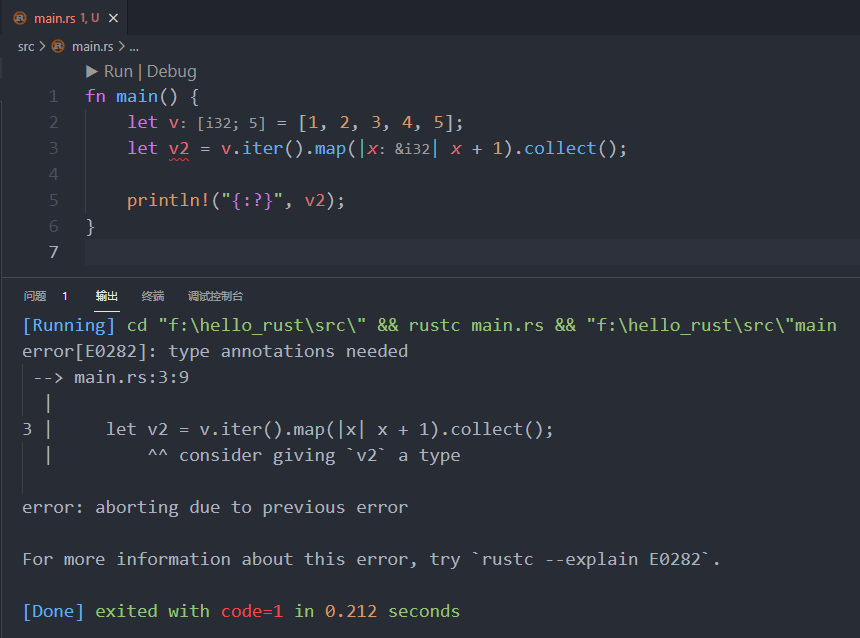

# 第4章 函数、闭包与迭代器


函数之所以普遍且重要，是因为操作系统进程执行模型大多是基于“栈”的，编译器只需要处理好函数的参数和返回值就能让其在栈上运行。

函数作为一等公民，本身就是一种类型。函数类型变量可以作为其他函数的参数或返回值，也可以赋值给别的变量，还可以直接调用执行。


## 4.1 函数

### 4.1.1 定义函数

函数定义，由函数签名和函数体组合而成。函数签名由函数名、参数和返回值类型组成，主要作用是防止定义两个相同签名的函数。函数名建议使用 `snake case` 规范风格，所有字母都是小写并使用下划线分隔单词。

函数需要调用才会被执行，让函数运行起来的过程叫作函数调用。

Rust 不在乎你在何处定义函数，只需在某个地方定义它们即可。

#### 1. `main` 函数

`main` 函数是程序的入口点。对于二进制可执行的文件来说，`main` 函数是必不可少的。对于库函数来说，`main` 函数不是必需的。

#### 2. 函数体

函数体由一系列语句和一个可选的结尾表达式构成。**语句是执行某些操作且没有返回值的步骤，表达式有计算步骤且有返回值**。

```rust
// 可选的结尾表达式
fn main() {
    let x = 5;
    let y = { // 包含了一个表达式块，这种表达式块也叫做函数体表达式
        let x = 2; // 这里的 x 跟上面的 x 没有任何关系，是一个局部变量
        x + 1 // 表达式有计算步骤且有返回值，此表达式的结果值是整个表达式块所代表的值
    };

    println!("x: {}, y: {}", x, y);
}


/*
运行结果：

x: 5, y: 3
*/
```

需要注意的是：`let y = { let x = 2; x + 1 };` 这段代码中，`x + 1` 这行代码的结尾没有分号，代表是一个表达式而非语句，将会自动返回表达式的值。表达式的结尾如果加上分号，它就变成了语句，而语句没有返回值。注意：**函数体表达式并不能等同于函数体，它不能使用 `return` 关键字**。


子函数中，也是同样的原理。

示例：

```rust
// 子函数中，可选的结尾表达式
fn get_sum(x: i32, y: i32) -> i32 {
    x + y
}

fn main() {
    let x = 5;
    let y = 10;

    println!("x + y = {}", get_sum(x, y));
}


/*
运行结果：

x + y = 15
*/
```

`get_sum` 函数最终返回一个 `i32` 类型的值。表达式 `x + y` 会自动返回表达式的值。如果末尾加上分号，那只是一条普通的加法运算语句，不会有返回值，程序就会报错。


而且在 Rust 中，函数定义可以嵌套：

```rust
fn main() {
    fn five() -> i32 {
        5
    }

    println!("five(): {}", five());
}


/*
运行结果：

five(): 5
*/
```

#### 3. 函数参数

**Rust 要求函数参数必须明确指定数据类型，但不能指定默认值**。函数参数分为可变和不可变参数，默认是不可变参数。当需要可变操作时，可以使用 `mut` 关键字。

#### 4. 返回值

如果函数需要返回值给调用者，在函数定义时就要明确返回值的类型。函数只能有唯一的返回值，如果需要返回多个值，可以使用元组类型。Rust 中每个函数都有返回值，即使是没有显式返回值的函数，也会隐式地返回一个单元值 `()`。

大部分情况下，函数隐式地返回函数体中最后一个表达式的值。如果需要提前退出函数并返回指定的值，必须显式地使用 `return` 语句。

函数体中返回值的类型必须和函数签名中返回值的类型一致，否则会导致程序错误。而且 Rust 不支持自动判断返回值类型！如果没有明确声明函数返回值的类型，函数将被认为是"纯过程"，不允许产生返回值，`return` 后面不能有返回值表达式。这样做的目的是为了让公开的函数能够形成可见的公报。


### 4.1.2 方法和函数

方法来自面向对象的编程范式，它表示某个类型实例的行为。这里以结构体为例，介绍结构体的方法和关联函数。

结构体的方法必须在结构体的上下文中定义，也就是定义在 `impl` 块中。定义在 `impl` 块中的不一定是方法，有可能是关联函数。**方法要求第一个参数必须是 `&self`，它代表调用该方法的结构体实例。在方法中使用 `&self` 能够读取实例中的数据，使用 `&mut self` 能够向实例中写入数据**。使用方法替代函数的最大好处在于组织性，应该将结构体实例所有的行为都一起放入 `impl` 块中。

关联函数是指在 `impl` 块中定义，但又不以 `self` 作为参数的函数。它与结构体相关联，但不直接作用于结构体实例，常用作返回一个结构体实例的构造函数。

方法的第一个参数都是 `self`，在方法内部可以使用 `self.字段名` 语法来访问结构体的字段，在方法外部可使用 `实例名.方法名` 语法调用方法。在调用结构体方法时，第一个参数 `self` 不需要传递参数，这个参数的传递是由 Rust 编译器完成的。因为在 `impl` 上下文，Rust 知道 `self` 类型是某个具体的结构体，即 `&self` 等价于 `实例名:&结构体类型`。

调用关联函数可使用 `结构体名::关联函数名` 语法。

```rust
// 结构体方法和关联函数
#[derive(Debug, PartialEq)]
pub struct Student {
    name: &'static str,
    score: i32,
}

impl Student {
    pub fn new(name: &'static str, score: i32) -> Self { // 关联函数常用于返回一个结构体实例的构造函数
        Student { name, score }
    }

    pub fn get_name(&self) -> &str {
        self.name
    }

    pub fn set_name(&mut self, name: &'static str) {
        self.name = name
    }

    pub fn get_score(&self) -> i32 {
        self.score
    }

    pub fn set_score(&mut self, score: i32) {
        self.score = score
    }
}

fn main() {
    let mut student: Student = Student::new("zhangsan", 59); // 调用关联函数使用 `结构体::关联函数名` 语法，有参数就需要给值
    println!(
        "name: {}, score: {}",
        student.get_name(),
        student.get_score()
    );

    student.set_score(60);
    println!("{:?}", student);
}


/*
运行结果：

name: zhangsan, score: 59
Student { name: "zhangsan", score: 60 }
*/
```


Dots 点号 `.` 通常用于访问某个对象的字段或调用对象（值）的方法。双冒号 `::` 与此类似，它是对命名空间的操作。


### 4.1.3 高阶函数

高阶函数是指以函数为参数或返回值的函数。函数是一种类型，函数类型的变量可以像其他类型的变量一样使用，既可以被直接调用执行，也可以作为其他函数的参数或返回值。实现这一切的基础是函数指针，函数指针类型使用 `fn()` 来指定。

#### 1. 函数指针

函数指针是指向函数的指针，其值是函数的地址。声明函数指针，**在声明中必须显式地指定函数指针类型 `fn()`**。

```rust
// 函数指针
fn hello() {
    println!("hello function pointer.");
}

fn main() {
    let fn_ptr: fn() = hello; // 等号右边使用的是函数名，不要加括号，加了括号就是调用
    println!("{:p}", fn_ptr); // 打印指针地址

    let other_fn = hello; // 函数 hello 本身的类型

    fn_ptr();
    other_fn();
}


/*
运行结果：

0x7ff7c26813d0
hello function pointer.
hello function pointer.
*/
```

`other_fn` 的类型实际上是 `fn() {hello}`，这是函数 `hello` 本身的类型，而非函数指针类型。不是函数指针类型，所以不能打印地址。

不管是函数指针类型，还是函数 `hello` 本身的函数，都可以直接进行调用。

#### 2. 函数作参数

函数作为参数时，为了提升代码可读性，可以使用 `type` 关键字为函数指针类型定义别名。

```rust
// 函数作参数
type MathOp = fn(i32, i32) -> i32;
fn math(op: MathOp, x: i32, y: i32) -> i32 {
    println!("op: {:p}", op);
    op(x, y)
}

fn add(x: i32, y: i32) -> i32 {
    x + y
}

fn subtract(x: i32, y: i32) -> i32 {
    x - y
}

fn main() {
    let (x, y) = (8, 3);
    println!("add operation result: {}", math(add, x, y));
    println!("subtraction operation result: {}", math(subtract, x, y));
}


/*
运行结果：

op: 0x7ff7a5d414d0
add operation result: 11
op: 0x7ff7a5d41510
subtraction operation result: 5
*/
```

使用 `type` 关键字为函数指针类型 `fn(i32,i32)->i32` 定义了别名 `MathOp`。`math` 函数中的第一个参数 `op` 的类型是 `MathOp`，因此 `math` 是高阶函数。

`main` 函数中调用 `math` 函数，并传入 `add` 或 `subtract` 函数作为实参，它们会自动转换成函数指针类型。**在函数之间传递的是函数指针类型 `fn()`**。

#### 3. 函数作返回值

函数作为返回值时，也可以使用 `type` 关键字为函数指针类型定义别名。

```rust
// 函数作返回值
type MathOp = fn(i32, i32) -> i32;
fn math_op(op: &str) -> MathOp {
    match op {
        "add" => add,
        _ => subtract,
    }
}

fn add(x: i32, y: i32) -> i32 {
    x + y
}

fn subtract(x: i32, y: i32) -> i32 {
    x - y
}

fn main() {
    let (x, y) = (8, 3);

    let mut op = math_op("add");
    println!("operation result: {}", op(x, y));

    op = math_op("divide");
    println!("operation result: {}", op(x, y));
}


/*
运行结果：

operation result: 11
operation result: 5
*/
```

`math_op` 函数的返回值是函数指针类型，函数体中使用 `match` 模式匹配，如果字符串字面量是 `"add"` 则返回 `add` 函数，否则返回 `subtract` 函数。这里的 `add` 和 `subtract` 都是函数名。


## 4.2 闭包

闭包是一个函数内创建的匿名函数，虽然没有函数名，但可以将闭包赋值给一个变量，通过调用该变量完成闭包的调用。

闭包可以访问外层函数中的变量，即：闭包是一个可以捕获外部环境变量的函数。外部环境变量是指闭包定义时所在的作用域中的变量，而非在闭包内定义的变量。


### 4.2.1 基本语法

闭包由管道符 `||` 和大括号`{}` 组合而成。格式如下：

```rust
|参数1, 参数2, ...| -> 返回值类型 {
    // 函数体
}
```

管道符 `||` 中指定闭包的参数，多个参数使用逗号 `,` 分隔。管道符后面可以紧跟返回值类型。

大括号即闭包体，用来存放执行语句。如果闭包体只有一行，大括号也可以省略。闭包体中最后一个表达式的值，默认为闭包的返回值。

```rust
// 闭包基本语法
fn main() {
    let add_one = |x: u32| -> u32 { x + 1 };
    println!("{}", add_one(1));
}


/*
运行结果：

2
*/
```

`let` 语句声明了变量 `add_one`，并与一个闭包的定义绑定。注意：这里并没有执行闭包中的代码。

通过调用 `add_one` 并传入参数，真正执行了闭包中的代码。


### 4.2.2 类型推断

闭包通常只应用于相对较小的场景上下文，并不像函数那样严格要求为参数和返回值注明类型，编译器能可靠地推断出闭包的参数和返回值的类型。

```rust
fn add_one_v1(x: u32) -> u32 {x + 1} // 是一个函数定义
let add_one_v2 = |x: u32| -> u32 {x + 1}; // 一个完整的闭包定义
let add_one_v3 = |x| {x + 1}; // 对比上一行代码，省略了参数与返回值的类型
let add_one_v4 = |x| x + 1; // 省略了参数与返回值的类型以及大括号
```

第 2~4 行代码都是有效的闭包定义，并在调用时产生相同的行为。


注意：**虽然编译器会为每个参数和返回值推断出一个具体的类型，但是如果多次调用同一闭包，却传递不同类型的参数，将会导致类型错误**。

**错误**示例：

```rust
let add_one_v4 = |x| x + 1;
let i = add_one_v4(1);
let f = add_one_v4(1.1);
```

第 2 行代码使用 `i32` 类型的值作为闭包参数，编译器会推断参数和闭包返回值的类型都为 `i32`，这样 `i32` 类型会被锁定在闭包中。

第 3 行代码使用 `f64` 类型的值作为闭包参数，会导致抛出 `expected integer, found floating-point number` 的错误提示。


### 4.2.3 捕获环境变量

闭包和函数最大的区别是：闭包可以捕获和使用其**被定义时所在的作用域中**的变量。

```rust
// 闭包捕获环境变量
fn main() {
    let i = 1;
    let add = |x| x + i;

    println!("{}", add(7));
}


/*
运行结果：

8
*/
```

变量 `add` 与闭包绑定，变量 `i` 和 `add` 都处于同一个作用域中，闭包可以捕获和使用作用域中的变量 `i`。


## 4.3 迭代器

迭代器模式是将遍历数据集合的行为抽象为单独的迭代对象，这样在遍历集合时可以把集合中所有元素按顺序传递给处理逻辑，使用迭代器可以极大地简化数据操作。


### 4.3.1 Iterator trait

Iterator trait 是迭代器模式的抽象接口，接口中有两个重要方法：

1.  `iter` 方法用于返回一个迭代器实例
2.  `next` 方法用于返回迭代器中的下一个元素，并将其封装在 `Some` 函数中。如果已经迭代到集合的末尾（最后一个元素的后面），则返回 `None`。

```rust
// 数组转换为迭代器访问元素
fn main() {
    let v = [1, 2, 3];
    let mut iter = v.iter(); // 声明的变量必须是可变的，因为每一次调用 `next` 方法都会从迭代器中消费一个元素

    println!("{:?}", iter.next());
    println!("{:?}", iter.next());
    println!("{:?}", iter.next());
    println!("{:?}", iter.next());
}


/*
运行结果：

Some(1)
Some(2)
Some(3)
None
*/
```


### 4.3.2 消费器

Rust 中的迭代器都是惰性的，它们不会自动发生遍历行为。Iterator trait 中定义了一类方法，这类方法叫作消费器。通过消费器可以消费迭代器中的元素，这些方法的默认实现都调用了 `next` 方法。

消费器可以在 `std::iter::Iterator` 中找到。

#### 1. `sum`

```rust
// 消费器 sum
fn main() {
    let v = [1, 2, 3];
    let total: i32 = v.iter().sum(); // 通过 `iter` 方法将数组转换为迭代器，再调用 `sum` 消费器获取迭代器中所有元素的总和

    println!("total: {}", total);
}


/*
运行结果：

total: 6
*/
```

#### 2. `any`

消费器 `any` 可以查找迭代器中是否存在满足条件的元素。

```rust
// 消费器 any
fn main() {
    let v = [1, 3, 4, 5];
    let result1 = v.iter().any(|&x| x == 2);
    let result2 = v.iter().any(|x| *x == 2);

    println!("{}", result1);
    println!("{}", result2);
}


/*
运行结果：

false
false
*/
```

消费器 `any` 的内部实现中有一个 `for` 循环，会自动调用迭代器的 `next` 方法返回 `Option<&[T]>` 或 `Option<&mut[T]>` 类型的值，再通过模式匹配得到 `&[T]` 或 `&mut[T]` 类型的值。

因此，在消费器 `any` 调用闭包中，只有使用引用和解引用两种方式，程序才能正常运行。

#### 3. `collect`

消费器 `collect` 可以将迭代器转换成指定的容器类型，即：将迭代器中的元素收集到指定的容器中。

```rust
// 消费器 collect
fn main() {
    let v = [1, 2, 3, 4, 5];
    let v2: Vec<i32> = v.iter().map(|x| x + 1).collect();

    println!("{:?}", v2);
}


/*
运行结果：

[2, 3, 4, 5, 6]
*/
```

`iter` 方法将数组转换为迭代器，再使用 `map` 方法对原迭代器中的每个元素调用闭包执行 `+1` 操作，并生成一个新的迭代器。最后调用 `collect` 方法将新迭代器中的元素收集到动态数组中。


注意：**必须显式地指定消费器 `collect` 目标容器的类型**。消费器 `collect` 的原则是被转换成指定的容器，你没有显式地指定，两者发生矛盾，导致错误。

如果将上面代码的 `v2` 类型去掉，就会直接报错：`type annotations needed`，需要类型注解。如下图所示：




除了可以指定为动态数组，还可以将容器指定为双端队列、双向链表、集合、优先队列。

示例：

```rust
// 消费器 collect 指定为双端队列
use std::collections::BTreeSet;
use std::collections::BinaryHeap;
use std::collections::LinkedList;
use std::collections::VecDeque;

fn main() {
    let v = [1, 2, 3, 4, 5];
    let v2: VecDeque<i32> = v.iter().map(|x| x + 1).collect(); // 转换为指定的容器：双端队列
    let v3: LinkedList<i32> = v.iter().map(|x| x + 1).collect(); // 转换为指定的容器：双向链表
    let v4: BTreeSet<i32> = v.iter().map(|x| x + 1).collect(); // 转换为指定的容器：基于 B 树的有序集合
    let v5: BinaryHeap<i32> = v.iter().map(|x| x + 1).collect(); // 转换为指定的容器：基于二叉堆的优先队列

    println!("v2: {:?}", v2);
    println!("v3: {:?}", v3);
    println!("v4: {:?}", v4);
    println!("v5: {:?}", v5);
}


/*
运行结果：

v2: [2, 3, 4, 5, 6]
v3: [2, 3, 4, 5, 6]
v4: {2, 3, 4, 5, 6}
v5: [6, 5, 4, 2, 3]
*/
```


如果只是想把某个容器转换为另一个指定的容器，可以采取以下方式：

```rust
// 不进行任何逻辑操作，只是将一个容器转换为另一个容器
use std::collections::BTreeSet;
use std::collections::BinaryHeap;
use std::collections::LinkedList;
use std::collections::VecDeque;

fn main() {
    let v = [1, 2, 3, 4, 5];
    // map 中的变量名随意，只要符合变量命名规范即可
    let v2: VecDeque<i32> = v.iter().map(|x| *x).collect(); // 转换为指定的容器：双端队列
    let v3: LinkedList<i32> = v.iter().map(|f| *f).collect(); // 转换为指定的容器：双向链表
    let v4: BTreeSet<i32> = v.iter().map(|a| *a).collect(); // 转换为指定的容器：B 树的有序集合
    let v5: BinaryHeap<i32> = v.iter().map(|yy| *yy).collect(); // 转换为指定的容器：二叉堆的优先队列

    println!("v2: {:?}", v2);
    println!("v3: {:?}", v3);
    println!("v4: {:?}", v4);
    println!("v5: {:?}", v5);
}


/*
运行结果：

v2: [1, 2, 3, 4, 5]
v3: [1, 2, 3, 4, 5]
v4: {1, 2, 3, 4, 5}
v5: [5, 4, 3, 1, 2]
*/
```

注意：`map` 中的元素需要解引用操作！


### 4.3.3 迭代器适配器

迭代器 Iterator trait 中定义了一类方法，这类方法叫作迭代器适配器。它会将当前迭代器转换成另一种类型的迭代器，并支持链式调用多个迭代器适配器。

由于所有的迭代器都是惰性的，必须使用一个消费器来获取迭代器适配器的调用结果。

常用的迭代器适配器：`map`、`take`、`filter`、`rev`、`zip`，其他迭代器适配器可以在 `std::iter` 中找到。


#### 1. `map`

适配器 `map` 对迭代器中每个元素调用闭包并生成一个新迭代器。

```rust
// 迭代器适配器 map
fn main() {
    let v = [1, 2, 3];
    let result: Vec<i32> = v.iter().map(|x| x + 3).collect();

    println!("{:?}", result);
}


/*
运行结果：

[4, 5, 6]
*/
```

通过 `iter` 方法将数组转换为迭代器，再使用 `map` 方法对原迭代器中的每个元素调用闭包执行 `+3` 操作并生成一个新迭代器，最后调用消费器 `collect` 将新迭代器中的元素收集到动态数组中。


#### 2. `take`

适配器 `take` 生成一个仅迭代原迭代器中前 `n` 个元素的新迭代器，常用于遍历指定数量元素的场景。

注意：这个 `n` 不是切片的左闭右开，是完整地取到指定数量的元素个数。

```rust
// 迭代器适配器 take
fn main() {
    let v = [1, 2, 3, 4, 5];
    let result = v.iter().take(3); // 生成一个由前 3 个元素组成的新迭代器

    for i in result {
        print!("{} ", i);
    }
}


/*
运行结果：

1 2 3 
*/
```


#### 3. `filter`

适配器 `filter` 对迭代器中每个元素调用闭包并生成一个过滤元素的新迭代器。闭包会返回 `true` 或 `false`，**如果返回 `true` 则该元素放入新迭代器**，否则该元素将被忽略。

```rust
// 迭代器适配器 filter
fn main() {
    let v = [1, 2, 3];
    let result: Vec<i32> = v.iter().map(|x| x + 3).filter(|y| y % 3 == 0).collect();

    println!("{:?}", result);
}


/*
运行结果：

[6]
*/
```

通过 `iter` 方法将数组转换为迭代器。

再使用 `map` 方法对原迭代器中的每个元素调用闭包执行 `+3` 操作并生成一个新迭代器。

然后对新迭代器调用 `filter` 方法生成一个能被 3 整除的元素组成的新适配器。

最后调用 `collect` 方法将新迭代器中的元素收集到动态数组中。


#### 4. `rev`

适配器 `rev` 可以反转迭代方向，生成一个方向相反的新迭代器，即：新迭代器将从右往左进行迭代。

```rust
// 迭代器适配器 rev
fn main() {
    let v = [1, 2, 3];
    let result = v.iter().rev();

    for i in result {
        print!("{} ", i);
    }
}


/*
运行结果：

3 2 1 
*/
```


#### 5. `zip`

它在两个迭代器上同时迭代并**返回一个元组**，其中第一个元素来自第一个迭代器，第二个元素来自第二个迭代器。如果两个迭代器中任一迭代器返回 `None`，适配器 `zip` 就立即停止迭代。

```rust
// 迭代器适配器 zip
fn main() {
    let v1 = [1, 2, 3];
    let v2 = [2, 3, 6];

    let result: Vec<i32> = v1.iter().zip(v2.iter())
        .map(|(a, b)| a + b)
        .filter(|x| x % 3 == 0)
        .collect();

    println!("{:?}", result);
}


/*
运行结果：

[3, 9]
*/
```


将上段代码拆开来看：

第一步 `v1.iter().zip(v2.iter())` 的结果：

```rust
fn main() {
    let v1 = [1, 2, 3];
    let v2 = [2, 3, 6];

    let result = v1.iter().zip(v2.iter());
    for (i, j) in result {
        print!("({}, {}) ", i, j);
    }
}

/*
运行结果：

(1, 2) (2, 3) (3, 6) 
*/
```

`v1.iter().zip(v2.iter());` 生成一个由元组 `(a, b)` 组成的新迭代器。从结果来看，元组的构成形式为：`((v1[0], v2[0]), (v1[1], v2[1]), ..., (v1[N], v2[N]))`。

如果想要把由适配器 `zip` 产生的元组，转换为一个动态数组，可以尝试使用如下方式：

```rust
fn main() {
    let v1 = [1, 2, 3];
    let v2 = [2, 3, 6];

    let result = v1.iter().zip(v2.iter());
    let mut new_v: Vec<i32> = Vec::new();
    for (i, j) in result {
        new_v.push(*i);
        new_v.push(*j);
    }
    println!("new_v: {:?}", new_v);
}


/*
运行结果：

new_v: [1, 2, 2, 3, 3, 6]
*/
```


第二步 `v1.iter().zip(v2.iter()).map(|(a, b)| a + b).collect();` 的结果：

```rust
fn main() {
    let v1 = [1, 2, 3];
    let v2 = [2, 3, 6];

    let result: Vec<i32> = v1.iter().zip(v2.iter()).map(|(a, b)| a + b).collect();
    println!("{:?}", result);
}

/*
运行结果：

[3, 5, 9]
*/
```

使用 `map` 方法调用闭包对新迭代器中的每个元素执行 `a + b` 操作并生成一个新迭代器。