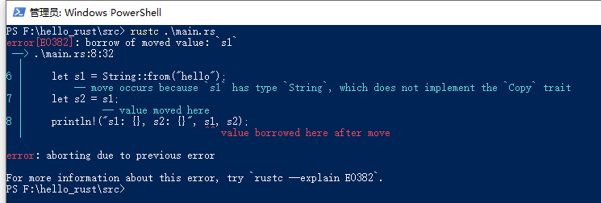
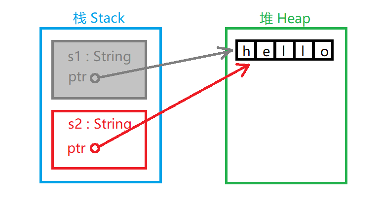
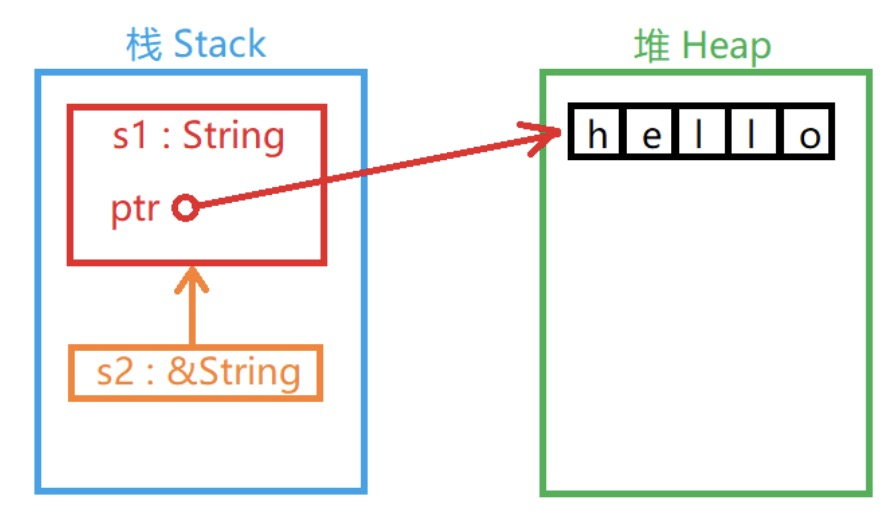
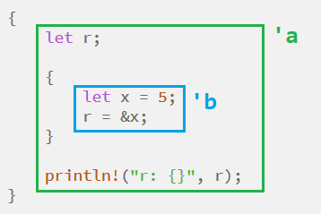

# 第6章 所有权系统


所有权系统（Ownership System），让 Rust 无须内存垃圾回收机制就可以保障内存安全与运行效率。所有权系统包括所有权（Ownership）、借用（Borrowing）、生命周期（Lifetimes）。

Rust 编译器在编译时会根据所有权系统的一系列规则进行检查，所有的分析与检查都是在编译时完成的。所有权系统拥有零或者极小的运行时开销，在运行时，所有权系统的任何功能都不会影响程序的运行效率。


## 6.1 通用概念

Rust 作为系统编程语言，值位于栈上还是堆上，在很大程度上影响了其行为以及管理内存的方式，是理解所有权机制的基础和必要知识准备。

### 6.1.1 栈内存和堆内存

栈和堆都是代码在运行时可供使用的内存，但它们存储数据的方式不同。

栈内存存储的数据大小在编译时已知且固定。Rust 所有的基本类型都可以存储在栈上，因为它们的大小都是固定的。

堆内存存储的数据大小在编译时未知或可能发生变化，也就是只有在程序运行时才能确定数据的大小。比如：字符串类型的数据在编译时大小是未知的，且运行时大小可能发生变化，因此其必须存储在堆上。当向堆上放入数据时，操作系统会先找到一块足够大的内存空间，将其标记为已使用，并返回一个指向该空间地址的指针，这个过程称作在堆上分配内存。堆，一种在程序运行时程序自己申请使用内存的机制。

数据入栈比在堆上分配内存的速度要快。入栈时，操作系统无须为存储新数据去搜索内存空间，其位置总是在栈顶。与之相比，在堆上分配内存需要做更多的工作，访问堆上数据需要通过指针搜索内存地址。

**所有权系统要做的正是跟踪代码正在使用的堆上数据**，最大限度地减少堆上重复的数据，及时清理堆上不再使用的数据，确保垃圾数据不会耗尽内存空间等。了解所有权的存在，有助于管理堆内存中的数据，理解所有权机制的工作方式。


### 6.1.2 值语义与引用语义

值语义（Value Semantic），是指按位复制后与原值无关，保证值的独立性，**基本数据类型都是值语义**。要修改具有值语义特性的变量，只能通过它本身来修改，修改了具有值语义特性的变量，并不会影响复制的值。按位复制就是栈复制，也叫作浅复制（Shallow Copy），是指复制栈上数据。与之对应的是**深复制（Deep Copy），是指对栈上和堆上数据一起复制**。

基本数据类型有这些：

-   所有整数类型，例如 `i32`、`u32`、`i64` 等。
-   所有浮点类型，`f32` 和 `f64`。
-   布尔类型，值为 `true` 或 `false`。
-   字符类型 `char`。
-   仅包含以上类型数据的元组。

引用语义（Reference Semantic），是指数据存储在堆内存中，通过存储在栈内存的指针来管理堆内存的数据，并且禁止按位复制。按位复制只能复制栈上的指针，这样就会有两个栈上的指针指向堆上的同一数据，容易造成堆上数据二次释放。动态数组、字符串都属于引用语义。


### 6.1.3 复制语义与移动语义

在所有权机制下，Rust 又引入了复制语义（Copy Semantic）和移动语义（Move Semantic）。

复制语义对应值语义，具有值语义特性的变量可以在栈上进行按位复制。

移动语义对应引用语义，**在堆上存储的数据只能进行深复制**，而深复制又可能带来极大的性能开销。因此需要在栈上移动指向堆上数据的指针地址，不仅保证了内存安全，还拥有与按位复制同样的性能。


## 6.2 所有权机制

Rust 所有权机制的核心是以下 3 点：

1.  每个值都有一个被称为其所有者的变量，也就是每块内存空间都有其所有者，所有者具有这块内存空间的释放和读写权限。
2.  每个值在任一时刻有且仅有一个所有者。
3.  当所有者（变量）离开作用域，这个变量（值）将被丢弃。

简单来说，就是：

1.  Rust 中的每个值都有一个变量，称为其所有者。
2.  一次只能有一个所有者。
3.  当所有者不在程序运行范围时，该值将被删除。


### 6.2.1 变量绑定

`let` 关键字将一个变量与一个值绑定在一起，这个变量就拥有了这个值的所有权。更进一步讲，就是将变量与存储这个值的内存空间绑定，从而让变量对这块内存空间拥有所有权。并且 Rust 确保对于每块内存空间都只有一个绑定变量与之对应，不允许有两个变量同时指向同一块内存空间。

变量绑定具有空间和时间的双重属性。空间属性是指变量与内存空间进行了绑定，时间属性也就是它的生命周期。每个 `let` 关键字声明的变量都会创建一个默认的词法作用域，变量在作用域内有效；当变量离开作用域，它所绑定的资源就会被释放，变量也随之无效并被销毁。

以 `String` 类型为例，它需要在堆上分配一块在编译时未知大小的内存来存放数据，这意味着必须在运行时向操作系统请求内存，并在处理完 `String` 相关业务逻辑后将内存返还给操作系统。

```rust
fn foo() {
    let s = String::from("hello"); // s 有效
    
    // 使用 s
} // 作用域结束，s 无效，内存被释放
```

对上段代码的分析：

第 2 行代码 `let` 关键字声明变量 `s`，并与通过调用 `String::from` 函数分配到的内存绑定，此时 `s` 进入作用域开始有效。

第 5 行代码在 `}` 处，`s` 离开作用域，成为无效变量并被销毁（Rust 会自动调用 `drop` 函数来释放 `s` 所绑定的内存）。Rust 编译器自动添加了调用释放资源函数的步骤，帮助程序员在适当的地方添加了一个释放资源的函数调用。


**对于释放内存，Rust 采取的策略是内存的所有者（变量）离开作用域后就自动释放**。


### 6.2.2 所有权转移

所有权移动对应于移动语义，一个属于移动语义类型的值，其绑定变量的所有权转移给另一个变量的过程叫作所有权转移。**所有权转移之后，原变量不能再继续使用**。

Rust 中会发生所有权转移的场景主要有：变量赋值、向函数传递值、从函数返回值。

#### 1. 变量赋值

**所有权机制只针对在堆上分配的数据**，而基本类型的存储都是在栈上，因此基本类型没有所有权的概念。对于基本类型来说，把一个变量赋值给另一个变量可以在内存上重新开辟一个空间来存储复制的数据，再与新的变量绑定。

```rust
// 字符串变量赋值给另一个变量时，转移所有权
fn main() {
    let x = 5; // 整型属于基本类型（值语义）
    let y = x; // 在栈上生成一个 x 的复制并绑定到变量 y
    println!("x: {}, y: {}", x, y);

    let s1 = String::from("hello");
    let s2 = s1; // 将 s1 赋值给 s2 时，发生了所有权转移。在之后与 s1 有关的代码不能再继续使用
    println!("s1: {}, s2: {}", s1, s2);
}
```

运行结果：根本无法通过编译！



针对上述代码，分析 Rust 对所有权机制的基本处理思想：

`String` 类型是引用语义，数据存储在堆上，并在栈上存放指向堆上数据的指针。

Rust 如果深复制了栈上和堆上的数据，那么当堆上数据占内存空间比较大时，会对运行时性能造成严重影响。**实际上，把 `s1` 赋值给 `s2` 只会从栈上复制它的指针、长度和容量，并没有复制指针指向的堆上数据。但是，这种处理方式会带来一个新的问题**，如果 `s1` 和 `s2` 两个数据指针都指向了堆上的同一位置，当  `s1` 和 `s2` 离开各自的作用域时，都会尝试释放这一相同的内存空间，这时二次释放会导致潜在的安全漏洞出现。

为了确保内存安全，**Rust 在完成对 `s1` 栈上数据复制的同时，会将 `s1` 置为无效，因此在 `s1` 离开作用域后不需要清理任何资源**。也就是说，在 `s2` 创建之后，已不能再使用 `s1`，因为 Rust 禁止使用无效的变量，否则将会抛出 `value borrowed here after move` 错误提示。

值 `hello` 的所有权由 `s1` 转移到 `s2`，并使 `s1` 无效的这一过程叫作所有权转移。此时，`s1` 已无效，只有 `s2` 是有效的，`s2` 离开作用域后会被自动释放、销毁，这样就完美地解决了内存二次释放的问题。

大致流程可参考下图：




#### 2. 向函数传递值

将值传递给函数在语义上与给变量赋值相似。

```rust
// 向函数传递字符串参数时，转移所有权
fn take_onwership(str: String) { // str 有效
    println!("take_onwership: str: {}", str);
} // 作用域结束，str 无效，释放 str 占用的内存空间

fn make_copy(int: i32) { // int 有效
    println!("make_copy, int: {}", int);
} // 作用域结束，int 无效，无须特殊操作

fn main() {
    let s = String::from("hello"); // s 有效
    take_onwership(s); // s 所有权转移给函数参数
					   // s 无效，不能继续使用
    let x = 5; // x 有效
    make_copy(x); // x 绑定值按位复制后传递给函数参数
    			  // x 有效，可以继续使用
} // 作用域结束，x 无效，s 无效。s 所有权已转移，无须特殊操作


/*
运行结果：

take_onwership: str: hello
make_copy, int: 5
*/
```


传递 `&str` 类型参数时，不转移所有权。传递 `String` 类型参数时，转移所有权；但传递 `String` 类型参数的引用时，不转移所有权。

```rust
// 传递 `&str` 类型参数时，不转移所有权
use std::collections::HashMap;

fn main() {
    let key = "Favorite color";
    let value = "Red";

    let mut map = HashMap::new();
    map.insert(key, value);
    println!("{}", map[key]);
}


/*
运行结果：

Red
*/
```

```rust
// 传递 `String` 类型参数时，转移所有权
use std::collections::HashMap;

fn main() {
    let key = String::from("Favorite color");
    let value = String::from("Red");

    let mut map = HashMap::new();
    map.insert(key, value); // 所有权在这里发生转移
    println!("{}", map[key]);
}


/*
无法通过编译，错误信息如下：

error[E0308]: mismatched types // 类型不匹配
 --> .\main.rs:9:24
  |
9 |     println!("{}", map[key]);
  |                        ^^^
  |                        |
  |                        expected reference, found struct `String`
  |                        help: consider borrowing here: `&key`
  |
  = note: expected reference `&_`
                found struct `String`
*/
```

上面代码中，如果需要继续使用 `key`，可以将 `&key` 作为实参传递给 `insert` 方法，这样 `key` 的所有权不会转移给 `map`。

```rust
// 传递 `String` 类型参数的引用时，不转移所有权
use std::collections::HashMap;

fn main() {
    let key = String::from("Favorite color");
    let value = String::from("Red");

    let mut map = HashMap::new();
    map.insert(&key, &value); // 两个参数都必须要有取地址符 `&`。如果 `value` 不加取地址符，单次 `insert` 没有问题，但再次 `insert` 就会报错
    println!("{}", map[&key]);
    //                 ^ 不加这个取地址符，依然会报错。因为上面一行代码将 `&str` 作为实参传递给 `insert` 方法，HashMap 的类型是 HashMap<&String, &String>，再传递 `String` 类型参数就是类型不匹配
}


/*
运行结果：

Red
*/
```

或者使用 `as_str` 方法，将 `String` 类型转换为 `&str` 类型也可以：

```rust
use std::collections::HashMap;

fn main() {
    let key = String::from("Favorite color");
    let value = String::from("Red");

    let mut map = HashMap::new();
    map.insert(key.as_str(), value.as_str());
    println!("{}", map[key.as_str()]);
}


/*
运行结果：

Red
*/
```


#### 3. 从函数返回值

函数的形参所获得的所有权会在函数执行完成时失效，失效之后就再也不能被访问。为了解决这个问题，可以通过函数返回值将所有权转移给调用者。

```rust
// 展示了返回值转移所有权的过程（转移返回值的所有权）
fn give_ownership() -> String {
    let str = String::from("ownership"); // str 有效
    str
} // 作用域结束，str 所有权转移给函数调用者

fn take_and_give_back(name: String) -> String { // name 有效
    let hello = String::from("hello"); // hello 有效
    hello + " " + &name
} // 作用域结束，返回值的所有权转移给函数调用者
  // hello 无效，释放 hello 占用的内存空间
  // name 无效，释放 name 占用的内存空间

fn main() {
    let s1 = give_ownership(); // give_ownership 函数返回值所有权转移给 s1

    let s2 = take_and_give_back(s1); // s1 所有权转移到 take_and_give_back 函数中。take_and_give_back 函数返回值所有权转移给 s2
    
    println!("s2: {}", s2);
}


/*
运行结果：

s2: hello ownership
*/
```

注意：`main` 函数中的 `println!` 语句，不能再使用 `s1`，因为 `s1` 在 `take_and_give_back(s1)` 时已经转移给了 `take_and_give_back`。

如果想要继续使用 `s1`，可以给 `take_and_give_back` 函数传递 `&String` 类型参数：

```rust
fn give_ownership() -> String {
    let str = String::from("ownership");
    str
}

fn take_and_give_back(name: &String) -> String {
    let hello = String::from("hello");
    hello + " " + &name
}

fn main() {
    let s1 = give_ownership();

    let s2 = take_and_give_back(&s1); // 传递 String 类型参数的引用时，不转移所有权

    println!("s1: {}\ns2: {}", s1, s2);
}


/*
运行结果：

s1: ownership
s2: hello ownership
*/
```

或者，可以使用 `as_str` 方法进行传参，运行结果一样：

```rust
fn give_ownership() -> String {
    let str = String::from("ownership");
    str
}

fn take_and_give_back(name: &str) -> String {
    let hello = String::from("hello");
    hello + " " + &name
}

fn main() {
    let s1 = give_ownership();

    let s2 = take_and_give_back(s1.as_str());

    println!("s1: {}\ns2: {}", s1, s2);
}
```


### 6.2.3 浅复制与深复制

浅复制是指复制栈上数据，深复制是指复制栈上和堆上数据。

由 `Copy trait` 可以区分值语义和引用语义，实现了 `Copy trait` 的类型都是值语义，凡是值语义类型数据都支持浅复制。整数类型、浮点数类型、布尔类型、字符类型，这些基本类型数据都默认实现了 `Copy trait`，因此基本类型数据默认支持浅复制。

对于元祖类型，如果每个元素的类型都实现了 `Copy trait`，那么该元祖类型数据支持浅复制。比如：元祖 `(i32, bool)` 支持浅复制，但元祖 `(i32, String)` 不支持浅复制。

#### 1. 结构体和枚举默认不支持浅复制

**结构体和枚举有些特殊，即使所有字段的类型都实现了 `Copy trait`，也不支持浅复制**。

```rust
// 即使字段都实现 Copy trait 的结构体也不支持浅复制
#[derive(Debug)]
struct Foo {
    x: i32,
    y: bool,
}

fn main() {
    let foo = Foo { x: 8, y: true };
    let other = foo;
    println!("other: {:?}", other);
    println!("foo: {:?}", foo);
}


/*
运行结果：

无法通过编译，错误信息：
error[E0382]: borrow of moved value: `foo`
  --> .\main.rs:11:27
   |
8  |     let foo = Foo { x: 8, y: true };
   |         --- move occurs because `foo` has type `Foo`, which does not implement the `Copy` trait
9  |     let other = foo;
   |                 --- value moved here
10 |     println!("other: {:?}", other);
11 |     println!("foo: {:?}", foo);
   |                           ^^^ value borrowed here after move
*/
```

无法通过编译的原因：

即使结构体 `Foo` 中的字段都是基本类型，但结构体本身并不会自动实现 `Copy trait`，也就不支持浅复制。执行 `let other = foo;` 该行代码时，`foo` 把所有权转移给了变量 `other`，发生所有权转移。


要解决这个问题，必须在结构体定义上标记 `#[derive(Copy, Clone)]`，让结构体实现 `Copy trait`。

```rust
// 标记上 #[derive(Copy, Clone)]，让结构体实现 Copy trait
#[derive(Debug, Clone, Copy)]
struct Foo {
    x: i32,
    y: bool,
}

fn main() {
    let foo = Foo { x: 8, y: true };
    let other = foo;
    println!("other: {:?}", other);
    println!("foo: {:?}", foo);
}


/*
运行结果：

other: Foo { x: 8, y: true }
foo: Foo { x: 8, y: true }
*/
```


#### 2. 包含引用语义类型也不支持浅复制

需要注意：如果结构体包含引用语义类型的字段，即使添加了 `#[derive(Copy, Clone)]` 标记，也不支持浅复制。

```rust
// 如果结构体中包含有引用语义类型的字段，即使添加了 #[derive(Copy, Clone)] 标记，也不支持浅复制
#[derive(Debug, Clone, Copy)]
struct Foo {
    x: i32,
    y: String,
}

fn main() {
    let foo = Foo {
        x: 8,
        y: String::from("hello"),
    };
    let other = foo;
    println!("other: {:?}", other);
    println!("foo: {:?}", foo);
}
```

对上段代码编译时，会有如下报错信息：

```rust
error[E0204]: the trait `Copy` may not be implemented for this type
 --> main.rs:1:24
  |
1 | #[derive(Debug, Clone, Copy)]
  |                        ^^^^
...
4 |     y: String,
  |     --------- this field does not implement `Copy`
```


在某些场景中，如果确实需要深复制堆上数据，可以使用 `clone` 方法。

例如：

```rust
// 对 String 使用 clone 方法深复制
fn main() {
    let s1 = String::from("hello");
    let s2 = s1.clone();
    println!("s1 = {}, s2 = {}", s1, s2);
}


/*
运行结果：

s1 = hello, s2 = hello
*/
```

`s1` 和 `s2` 都分别绑定了一个值，释放的时候也会被当作两个资源。


#### 3. 其他技巧

假如有个需求：调用函数，修改结构体实例中某个字段的值，可以参考如下操作：

```rust
// 调用函数，修改结构体实例中的某个字段的值
#[derive(Debug)]
struct Foo {
    x: i32,
    y: String,
}

fn change(foo: &mut Foo) { // 参数是可变引用类型
    foo.y = String::from("rust");
}

fn main() {
    let mut foo = Foo {
        x: 8,
        y: String::from("hello"),
    };
    println!("foo: {:?}", foo);

    change(&mut foo); // 以可变引用的方式传递（相当于 C 语言中的传址调用）

    println!("after change, foo: {:?}", foo);
}


/*
运行结果：

foo: Foo { x: 8, y: "hello" }
after change, foo: Foo { x: 8, y: "rust" }
*/
```


## 6.3 引用和借用

从作者的理解来看，引用（Reference）是一种语法（本质上是 Rust 提供的一种指针语义），借用（Borrowing）是对引用行为的描述。使用 `&` 操作符执行不可变引用，使用 `&mut` 执行可变引用。`&x` 也可称为对 `x` 的借用，通过 `&` 操作符完成对所有权的借用，不会造成所有权的转移。借用也分为不可变借用和可变借用。

### 6.3.1 引用与可变引用

先看一个**错误**示例：

```rust
// 向函数传递实参时转移所有权
fn sum_vec(v1: Vec<i32>, v2: Vec<i32>) -> i32 {
    let sum1: i32 = v1.iter().sum();
    let sum2: i32 = v2.iter().sum();

    sum1 + sum2
}

fn main() {
    let vec1 = vec![1, 2, 3];
    let vec2 = vec![4, 5, 6];

    let answer = sum_vec(vec1, vec2);
    println!("v1: {:?}, v2: {:?}, sum: {}", vec1, vec2, answer);
}


/*
运行结果：

无法通过编译
*/
```

编译代码，会报如下错误提示：

```rust
error[E0382]: borrow of moved value: `vec1`
  --> .\main.rs:13:45
   |
9  |     let vec1 = vec![1, 2, 3];
   |         ---- move occurs because `vec1` has type `Vec<i32>`, which does not implement the `Copy` trait
...
12 |     let answer = sum_vec(vec1, vec2);
   |                          ---- value moved here
13 |     println!("v1: {:?}, v2: {:?}, sum: {}", vec1, vec2, answer);
   |                                             ^^^^ value borrowed here after move

error[E0382]: borrow of moved value: `vec2`
  --> .\main.rs:13:51
   |
10 |     let vec2 = vec![4, 5, 6];
   |         ---- move occurs because `vec2` has type `Vec<i32>`, which does not implement the `Copy` trait
11 |
12 |     let answer = sum_vec(vec1, vec2);
   |                                ---- value moved here
13 |     println!("v1: {:?}, v2: {:?}, sum: {}", vec1, vec2, answer);
   |                                                   ^^^^ value borrowed here after move
```

根据报错信息得知，当把变量 `vec1` 传递给 `sum_vec` 函数时发生所有权转移，`vec1` 绑定的动态数据的所有权转移给了 `sum_vec` 函数的参数 `v1`，那么在 `println!` 函数中再次调用 `vec1` 就会发生错误。


一个解决方案是将 `sum_vec` 函数获取的两个动态数组的所有权返回，可以使用元祖返回多个值。

```rust
// 返回所有权
fn sum_vec(v1: Vec<i32>, v2: Vec<i32>) -> (Vec<i32>, Vec<i32>, i32) {
    let sum1: i32 = v1.iter().sum();
    let sum2: i32 = v2.iter().sum();

    (v1, v2, sum1 + sum2)
}

fn main() {
    let vec1 = vec![1, 2, 3];
    let vec2 = vec![4, 5, 6];

    let (vec1, vec2, answer) = sum_vec(vec1, vec2); // 变量遮蔽
    println!("v1: {:?}, v2: {:?}, sum: {}", vec1, vec2, answer);
}


/*
运行结果：

v1: [1, 2, 3], v2: [4, 5, 6], sum: 21
*/
```

函数先获取值的所有权，使用之后再返回所有权。


Rust 支持**所有权的借用：通过引用，给函数传递实参**。就是把所有权借用给函数的参数，当函数的参数离开作用域时会自动归还所有权。这个过程需要将函数的参数通过 `&` 操作符定义为引用，同时传递实参时也应该传递变量的引用。

```rust
// 实际上，引用是变量的间接访问方式
fn main() {
    let s1 = String::from("hello");
    let s2 = &s1; // & 运算符可以取变量的引用
    println!("s1 is {}, s2 is {}", s1, s2);
}


/*
运行结果：

s1 is hello, s2 is hello
*/
```

当一个变量的值被引用时，变量本身不会被认定无效。因为"引用"并没有在栈中复制变量的值：




```rust
// 以引用作为函数参数不获取值的所有权
fn sum_vec(v1: &Vec<i32>, v2: &Vec<i32>) -> i32 { // 定义了带有 `&Vec<i32>` 类型参数
    let sum1: i32 = v1.iter().sum();
    let sum2: i32 = v2.iter().sum();

    sum1 + sum2
}

fn main() {
    let vec1 = vec![1, 2, 3];
    let vec2 = vec![4, 5, 6];

    let answer = sum_vec(&vec1, &vec2); // 通过传递 `&Vec<i32>` 类型的实参来调用函数
    println!("v1: {:?}, v2: {:?}, sum: {}", vec1, vec2, answer);
}


/*
运行结果：

v1: [1, 2, 3], v2: [4, 5, 6], sum: 21
*/
```

**引用不会获得值的所有权，引用只能借用值的所有权**。


引用默认是只读的，要想修改引用的值，应该使用可变引用 `&mut`。在定义与调用带有可变引用参数的函数时，必须同时满足以下 3 个要求，缺一不可，否则会导致程序错误。

1.  变量本身必须是可变的，因为可变引用只能操作可变变量，不能获取不可变变量的可变引用。变量声明中必须使用 `mut`。
2.  函数的参数必须是可变的，函数的参数定义中必须使用 `&mut`。
3.  调用函数时传递的实参必须是可变的，传递给函数的实参必须使用 `&mut`。

示例，`push_vec` 函数实现以单调递增的方式向动态数组中添加元素：

```rust
// 以可变引用修改动态数组的值
fn push_vec(v: &mut Vec<i32>, value: i32) { // 第一个参数类型是 `&mut Vec<i32>`
    if v.is_empty() || v.get(v.len() - 1).unwrap() < &value {
        v.push(value);
    }
}

fn main() {
    let mut vec = Vec::new(); // 后续代码会往 vec 中添加值，因此必须是可变的
    push_vec(&mut vec, 1); // 通过传递 `&mut Vec<i32>` 类型的实参来调用函数
    push_vec(&mut vec, 2);
    push_vec(&mut vec, 2);
    push_vec(&mut vec, 5);

    println!("vec: {:?}", vec);
}


/*
运行结果：

vec: [1, 2, 5]
*/
```


引用本身也是一个类型并具有一个值，这个值记录的是别的值所在的位置，但引用不具有所指值的所有权。

错误示例：

```rust
fn main() {
    let s1 = String::from("hello");
    let s2 = &s1;
    let s3 = s1;
    println!("{}", s2);
}


/*
运行结果：

error[E0505]: cannot move out of `s1` because it is borrowed
 --> main.rs:4:14
  |
3 |     let s2 = &s1;
  |              --- borrow of `s1` occurs here
4 |     let s3 = s1;
  |              ^^ move out of `s1` occurs here
5 |     println!("{}", s2);
  |                    -- borrow later used here
*/
```

`s2` 借用的 `s1` 已经将所有权转移到了 `s3`，所以 `s2` 将无法继续借用 `s1` 的所有权。如果需要 `s2` 使用该值，必须重新借用：

```rust
fn main() {
    let s1 = String::from("hello");
    let s2 = &s1;
    let s3 = &s1;
    println!("s2: {}, s3: {}", s2, s3);
}


/*
运行结果：

s2: hello, s3: hello
*/
```


再来看一个对基本类型的可变引用进行修改的示例。

```rust
// 以可变引用修改基本类型的值
fn main() {
    let mut x = 6;

    let y = &mut x;
    *y += 1; // 等价写法：*y = *y + 1;

    println!("x: {}", x);
}


/*
运行结果：

x: 7
*/
```

变量 `y` 是变量 `x` 的可变引用，使用解引用操作符 `*` 来追踪引用的值，`*y` 表示 `y` 所引用的值，即 `x` 的值。


如果想继续使用 `y`，可以重新绑定变量：

```rust
fn main() {
    let mut x = 6;

    let y = &mut x;
    *y += 1;
    let y = *y;

    println!("x: {}, y: {}", x, y);
}


/*
运行结果：

x: 7, y: 7
*/
```

如果不加 `let y = *y;` 这条语句，就会得到如下报错信息：

```rust
error[E0502]: cannot borrow `x` as immutable because it is also borrowed as mutable
 --> main.rs:8:30
  |
4 |     let y = &mut x;
  |             ------ mutable borrow occurs here
...
8 |     println!("x: {}, y: {}", x, y);
  |                              ^  - mutable borrow later used here
  |                              |
  |                              immutable borrow occurs here
```

原因：在尝试以可变方式访问变量之前，Rust 需要确保没有对该变量的任何其他引用。附上官方文档：https://doc.rust-lang.org/error-index.html#E0502


### 6.3.2 借用规则

为了保证内存安全，借用必须遵循以下规则：

1.  对于同一个资源的借用，在同一个作用域只能有一个可变引用（`&mut T`），或有 n 个不可变引用（`&T`），但不能同时存在可变引用和不可变引用。
2.  在可变引用释放前不能访问资源所有者。
3.  任何引用的作用域都必须小于资源所有者的作用域，并在离开作用域后自动释放

借用规则类似于读写锁，即：同一时刻只能拥有一个写锁，或者多个读锁，不允许写锁和读锁同时出现。Rust 在编译时完成借用规则的检查，这样可以有效比较数据竞争，保障数据一致性，避免运行时出现死锁等问题。

```rust
// 在可变借用的同时进行不可变借用
fn main() {
    let mut x = 6;

    let y = &mut x;
    *y += 1;

    let z = &x;
    println!("y: {}, z: {}", *y, *z);
}


/*
运行结果：

无法通过编译
*/
```

编译代码，会得到如下错误提示：

```rust
error[E0502]: cannot borrow `x` as immutable because it is also borrowed as mutable
 --> .\main.rs:7:13
  |
4 |     let y = &mut x;
  |             ------ mutable borrow occurs here
...
7 |     let z = &x;
  |             ^^ immutable borrow occurs here
8 |     println!("y: {}, z: {}", *y, *z);
  |                              -- mutable borrow later used here
```

错误原因：在同一个作用域，有一个可变引用 `y`，又有一个不可变引用 `z`，显然违反了借用规则的第一条：不能在可变借用的同事进行不可变借用。


```rust
// 在可变引用释放前访问资源所有者
fn main() {
    let mut x = 6;

    let y = &mut x;
    *y += 1;

    let z = x;
    println!("y: {}, z: {}", *y, z);
}


/*
运行结果：

无法通过编译
*/
```

编译代码，会得到如下错误提示：

```rust
error[E0503]: cannot use `x` because it was mutably borrowed
 --> .\main.rs:7:13
  |
4 |     let y = &mut x;
  |             ------ borrow of `x` occurs here
...
7 |     let z = x;
  |             ^ use of borrowed `x`
8 |     println!("y: {}, z: {}", *y, z);
  |                              -- borrow later used here
```

错误原因：在变量 `x` 的可变引用 `y` 未释放前再次访问变量 `x`，违反了借用规则的第二条：在可变引用释放前不能访问资源所有者。


### 6.3.3 借用示例1：切片

切片（Slice）是对数据值的部分**引用**。切片本身是没有所有权的，它是通过引用语法实现对集合中一段连续的元素序列的借用。切片可以和常见的能够在内存中开辟一段连续内存块的数据结构一起使用，比如：数组、动态数组、字符串等。

#### 1. 切片定义

**切片本质上是指向一段内存空间的指针，用于访问一段连续内存块中的数据**。它的数据结构存储了切片的起始位置和长度，切片结果必须是引用类型。

切片定义的语法：`let slice = &data[start_index..end_index];` 注意：别漏了取地址符 `&`，且切片是左闭右开。

```rust
// 字符串切片与动态数组切片
fn main() {
    let s = String::from("Hello, Rust!");
    println!("{}", &s[0..5]); // 切片的结果是 &str 类型的数据
    println!("{}", &s[..5]);
    println!("{}", &s[7..s.len()]);
    println!("{}", &s[7..]);
    println!("{}", &s[0..s.len()]);
    println!("{}", &s[..]);

    println!("--------------------");

    let vec = vec![1, 2, 3, 4, 5];
    println!("{:?}", &vec[0..2]);
    println!("{:?}", &vec[..2]);
    println!("{:?}", &vec[2..vec.len()]);
    println!("{:?}", &vec[2..]);
    println!("{:?}", &vec[0..vec.len()]);
    println!("{:?}", &vec[..]);
    println!("{:?}", &vec[1..=3]); // `=3` 语法来包含 end_index 的元素
}


/*
运行结果：

Hello
Hello
Rust!
Rust!
Hello, Rust!
Hello, Rust!
--------------------
[1, 2]
[1, 2]
[3, 4, 5]
[3, 4, 5]
[1, 2, 3, 4, 5]
[1, 2, 3, 4, 5]
[2, 3, 4]
*/
```


#### 2. 切片作为函数参数

切片可以作为函数的参数，把一段连续的元素序列通过引用的方式传递给函数。

```rust
// 切片作为函数参数
fn print_str(s: &str) {
    println!("str slice: {:?}, length: {}", s, s.len());
}

fn print_vec(vec: &[i32]) {
    println!("vec slice: {:?}, length: {}", vec, vec.len());
}

fn main() {
    let s = String::from("Hello, Rust!");
    let str = "Hello"; // 类型是 &str
    let vec = vec![1, 2, 3, 4, 5];

    print_str(&s[0..5]);
    print_str(str); // 传递 `&str` 类型参数时不转移所有权
    print_str(&s);
    print_str(&str[..2]);

    println!("--------------------");

    print_vec(&vec[2..]);
    print_vec(&vec);
}


/*
运行结果：

str slice: "Hello", length: 5
str slice: "Hello", length: 5
str slice: "Hello, Rust!", length: 12
str slice: "He", length: 2
--------------------
vec slice: [3, 4, 5], length: 3
vec slice: [1, 2, 3, 4, 5], length: 5
*/
```

注意：`print_str` 函数的参数类型是 `&str`。以 `&str` 为参数类型，既能接收字符串切片作为实参，也能接收字符串字面量作为实参。


#### 3. 可变切片

默认情况下，不能通过更改切片的元素来影响源数据。但是，如果声明源数据是可变的，且同时声明切片也是可变的，就可以通过更改切片的元素来更改源数据。

```rust
// 更改可变切片的元素会更改源数据
fn main() {
    let mut vec = vec![1, 2, 3, 4, 5];
    let vec_slice = &mut vec[3..];
    vec_slice[0] = 7;

    println!("{:?}", vec);
}


/*
运行结果：

[1, 2, 3, 7, 5]
*/
```


### 6.3.4 借用示例2：迭代器

Rust 提供的迭代器 `IntoIter`、`Iter`、`IterMut` 和所有权借用的对应关系如下图所示：

|   迭代器   | 所有权借用 |  创建方法   | 迭代器元素类型 |
| :--------: | :--------: | :---------: | :------------: |
| `IntoIter` | 转移所有权 | `into_iter` |      `T`       |
|   `Iter`   | 不可变借用 |   `iter`    |      `&T`      |
| `IterMut`  |  可变借用  | `iter_mut`  |    `&mut T`    |


#### 1. 转移所有权 `IntoIter`

迭代器 `IntoIter` 由 `into_iter` 方法创建，会把容器中元素的所有权转移给迭代器，之后原容器不能再使用。

```rust
// into_iter 方法转移所有权
fn main() {
    let vec = vec!["Rust", "Go", "Python"];
    for str in vec.into_iter() {
        match str {
            "Rust" => println!("Rust is Niubility."),
            _ => println!("{}", str),
        }
    }

    // println!("{:?}", vec); // 原动态数组不能继续使用
}


/*
运行结果：

Rust is Niubility.
Go
Python
*/
```

`into_iter` 方法创建迭代器后，原动态数组不能再使用。如果取消第 10 行的注释，就会抛出如下错误：

```rust
error[E0382]: borrow of moved value: `vec`
   --> main.rs:10:22
    |
2   |     let vec = vec!["Rug", "Go", "Python"];
    |         --- move occurs because `vec` has type `Vec<&str>`, which does not implement the `Copy` trait
3   |     for str in vec.into_iter() {
    |                    ----------- `vec` moved due to this method call
...
10  |     println!("{:?}", vec);
    |                      ^^^ value borrowed here after move
    |
note: this function takes ownership of the receiver `self`, which moves `vec`
```


#### 2. 不可变借用 `Iter`

迭代器 `Iter` 由 `iter` 方法创建，能把容器中元素的引用传递给迭代器，而不发生所有权转移。引用传递后，原容器还可以继续使用。

```rust
// iter 方法获得所有权的不可变引用
fn main() {
    let vec = vec!["Rust", "Go", "Python"];
    for str in vec.iter() {
        match str {
            &"Rust" => println!("Rust is Niubility."), // vec.iter() 中，元素类型是 `&T`，因此需要引用
            _ => println!("{}", str),
        }
    }

    println!("{:?}", vec); // 原动态数组可以继续使用
}


/*
运行结果：

Rust is Niubility.
Go
Python
["Rust", "Go", "Python"]
*/
```

**`iter` 方法创建的是只读迭代器**，不能在迭代器中改变原容器的元素。


#### 3. 可变借用 `IterMut`

迭代器 `IterMut` 由 `iter_mut` 方法创建，会把容器中元素的可变引用传递给迭代器，不发生所有权转移。引用传递后，原容器可以继续使用。

```rust
// iter_mut 方法获得所有权的可变引用
fn main() {
    let mut vec = vec!["Rust", "Go", "Python"]; // 接下来的操作会改变动态数组中的元素，因此动态数组也是要可变的
    for str in vec.iter_mut() {
        match str {
            &mut "Rust" => {
                *str = "Rust is Niubility";
                println!("{}", str);
            }
            _ => println!("{}", str),
        }
    }

    println!("{:?}", vec);
}


/*
运行结果：

Rust is Niubility
Go
Python
["Rust is Niubility", "Go", "Python"]
*/
```

迭代器中元素是对动态数组中元素的可变引用，因此在 `match` 模式匹配时需要使用 `&mut`，并且通过解引用操作符 `*` 来更改动态数组中的元素。

与 `iter` 方法创建的迭代器相比：`iter_mut`  方法创建的是可变迭代器，在迭代器中可以改变原容器的元素。


## 6.4 生命周期

Rust 的每一个引用以及包含引用的数据结构，都有一个其保持有效的作用域，生命周期可以视为这个作用域的名字。使用生命周期注解来描述多个生命周期间的关系，以确保运行时实际使用的引用都是有效的。

### 6.4.1 生命周期语法

生命周期注解的语法以 `'` 开头再加上小写字母，例如 `'a` 是生命周期的标识符，也是默认使用的名称，`'a` 读作：生命周期 `a`。生命周期标识符不建议使用冗长的名称，这会严重降低程序的可读性。

生命周期注解位于引用的 `&` 操作符之后，并用一个空格将生命周期注解与引用类型分隔开，比如：`&'a i32`、`&'a mut i32`、`&'a str`。

需要注意：生命周期注解并不改变任何引用的生命周期的大小，只用于描述多个生命周期间的关系。

#### 1. 隐式生命周期

经常会遇到参数或返回值为引用类型的函数，其包含隐式的生命周期注解。

例如：

```rust
fn foo(x: &str) -> &str {
    x
}
```

它是由编译器自动推导的，要求返回值的生命周期必须大于或等于参数 `x` 的生命周期。相当于如下代码：

```rust
fn foo<'a>(x: &'a str) -> &'a str {
    x
}
```


#### 2. 显式生命周期

在实际开发中，除非编译器无法自动推导出生命周期，否则不建议显式指定生命周期，因为这会降低程序的可读性。

何时需要显式生命周期的示例：

```rust
fn long_str(x: &str, y: &str) -> &str {
    if x.len() > y.len() {
        x
    } else {
        y
    }
}

fn main() {}


/*
运行结果：

error[E0106]: missing lifetime specifier
 --> main.rs:1:34
  |
1 | fn long_str(x: &str, y: &str) -> &str {
  |                ----     ----     ^ expected named lifetime parameter
  |
  = help: this function's return type contains a borrowed value, but the signature does not say whether it is borrowed from `x` or `y`
help: consider introducing a named lifetime parameter
  |
1 | fn long_str<'a>(x: &'a str, y: &'a str) -> &'a str {
  |            ++++     ++          ++          ++
*/
```

编译时发生错误，错误提示大意：这个函数的返回类型包含一个借用的值，但签名没有说明它是从 `x` 还是 `y` 借用的。

原因：

编译器在检查函数的输入参数和返回值时，并不知道传递给函数的具体值，也就不知道是 `if` 会被执行，还是 `else` 会被执行，无法推导出要返回的引用是指向 `x` 还是 `y`。

同时，借用检查器无法确定 `x` 和 `y` 的生命周期是如何与返回值的生命周期相关联的，就不能通过观察作用域来确定返回的引用是否总是有效。

官方文档：https://doc.rust-lang.org/error-index.html#E0106

此时，需要显式指定生命周期来定义引用间的关系，以便借用检查器进行分析：

```rust
fn long_str<'a>(x: &'a str, y: &'a str) -> &'a str {
    if x.len() > y.len() {
        x
    } else {
        y
    }
}

fn main() {}
```


#### 3. 静态生命周期

Rust 预定义了一种特殊的生命周期注解 `'static`，它具有和整个程序运行时相同的生命周期。

字符串字面量是直接硬编码到最终的可执行文件中的，因此拥有 `'static` 生命周期，其声明方式：`let s: &'static str = "I have a static liefetime.";`

下段代码中的 `foo` 函数是合法的，因为字符串字面量 `"Hello, Rust"` 的类型是 `'static str`。它比任意传入的参数生命周期 `'a` 都要长。

```rust
fn foo<'a>(x: &'a str) -> &'a str {
    "Hello, Rust"
}
```

注意一点：将引用指定为 `'static` 之前应该思考，这个引用是否真的需要在整个程序的生命周期内都有效。程序中大部分出现的与生命周期有关的问题，都是因为创建了悬垂引用或是生命周期不匹配。要解决这些问题，不能只靠生命周期指定为 `'static`。


### 6.4.2 悬垂引用

**生命周期的作用是避免代码中出现悬垂引用**。悬垂引用是指引用了无效的数据，也就是内存中的数据释放后再次被使用。

```rust
// 使用离开作用域的值的引用，将会报错
fn main() {
    let r;
    
    {
        let i = 7;
        r = &i;
    }

    println!("r: {}", r);
}


/*
运行结果：

error[E0597]: `i` does not live long enough
 --> main.rs:6:13
  |
6 |         r = &i;
  |             ^^ borrowed value does not live long enough
7 |     }
  |     - `i` dropped here while still borrowed
8 | 
9 |     println!("r: {}", r);
  |                       - borrow later used here

error: aborting due to previous error
*/
```

报错分析：

编译器中的借用检查器，通过比较生命周期来确保所有的借用都是有效的。在第 7 行内部作用域结束时，变量 `i` 就离开了作用域，而变量 `r` 因为是在外部作用域声明的，此时任然有效。第 9 行代码尝试使用变量 `r` 的值，导致变量 `r` 将会引用变量 `i` 离开作用域时被释放的内存。此时，任何对变量 `r` 的操作都应该被禁止。


悬垂引用的图示：

```rust
fn main() {
    let r;

    {
        let x = 5;
        r = &x;
    }

    println!("r: {}", r);
}
```

这段代码是不会通过 Rust 编译器的，原因是 `r` 所引用的值已经在使用之前被释放。



上图中的绿色范围 `'a` 表示 `r` 的生命周期，蓝色范围 `'b` 表示 `x` 的生命周期。很显然，`'b` 比 `'a` 小得多，**引用必须在值的生命周期以内才有效**。


### 6.4.3 生命周期与函数

通常在函数体内不需要显式指定生命周期，因为在上下文中 Rust 能够分析函数中的代码。但是，当被函数之外的代码调用时，参数与返回值的生命周期在每次被函数调用时都可能不同，这就需要在函数签名中显式指定参数与返回值的生命周期。

在函数签名中使用生命周期注解，类似于声明泛型类型的语法：将生命周期声明在函数名和参数列表间的尖括号中。

```rust
// 在两个字符串切片中找出字符串最长的切片
fn long_str<'a>(x: &'a str, y: &'a str) -> &'a str {
    if x.len() > y.len() {
        x
    } else {
        y
    }
}

fn main() {
    let str1 = String::from("abcd");
    let str2 = "xyz";

    let result = long_str(str1.as_str(), str2); // str1.as_str() 也可以写成：&str
    println!("longer string: {}", result);
}


/*
运行结果：

longer string: abcd
*/
```

`long_str` 函数签名中指定生命周期 `'a`，表明函数参数和返回值之间的约束条件是它们必须拥有相同的生命周期。当具体的实参传递给 `long_str` 函数时，`'a` 的实际生命周期等于 `x` 和 `y` 的生命周期中较小的那个，同时它也是返回值的生命周期。这样就确保了返回值在 `x` 和 `y` 中较小的那个生命周期结束之前保持有效。


通过一个例子来理解：`'a` 的实际生命周期等于 `x` 和 `y` 的生命周期中较小的那个。

```rust
// 传递不同生命周期的实参来调用函数
fn long_str<'a>(x: &'a str, y: &'a str) -> &'a str {
    if x.len() > y.len() {
        x
    } else {
        y
    }
}

fn main() {
    let str1 = String::from("abcd");
    let result;
    {
        let str2 = String::from("xyz");
        result = long_str(str1.as_str(), str2.as_str());
    }
    println!("longer string: {}", result);
}


/*
运行结果：

error[E0597]: `str2` does not live long enough
  --> main.rs:14:42
   |
14 |         result = long_str(str1.as_str(), str2.as_str());
   |                                          ^^^^ borrowed value does not live long enough
15 |     }
   |     - `str2` dropped here while still borrowed
16 |     println!("longer string: {}", result);
   |                                   ------ borrow later used here
*/
```

在外部作用域声明变量 `result`，在内部作用域对 `result` 进行赋值，再在外部作用域使用 `result`。

变量 `str1` 和 `str2` 拥有不同的生命周期，Rust 要求 `long_str` 函数返回值的生命周期与传入参数的生命周期中较小的那个保持一致（必须是 `str1` 和 `str2` 生命周期较小的那个）。

上段代码中，明显是 `str2` 的生命周期比 `str1` 小。这意味着 `result` 的生命周期等于 `str2` 的生命周期，为了确保 `println!("longer string: {}", result);` 语句中，使用的 `result` 是有效的，`str2` 需要保证在外部作用域结束前生命周期是有效的。但实际上，`str2` 在内部作用域结束时就已经无效了，再使用 `result` 对 `str2` 的引用就会导致错误。

还可以这样理解：返回值引用可能会返回过期的引用。``result` 被使用的时候，源值 `str2` 已经失效了。对于函数 `long_str` 来说，它并不能知道自己以外的地方是什么情况，它为了保障自己传递出去的值是正常的，必选所有权原则消除一切危险，所以 `long_str` 函数并不能通过编译。


解决方式：将变量 `str2` 声明为字符串字面量类型，这样 `str2` 就拥有了生命周期 `'static`，确保在离开内部作用域后任然是有效的，也就可以正常使用了。

```rust
fn long_str<'a>(x: &'a str, y: &'a str) -> &'a str {
    if x.len() > y.len() {
        x
    } else {
        y
    }
}

fn main() {
    let str1 = String::from("abcd");
    let result;
    {
        let str2 = "xyz";
        result = long_str(str1.as_str(), str2);
    }
    println!("longer string: {}", result);
}


/*
运行结果：

longer string: abcd
*/
```


**最好的解决方法**是返回一个有所有权的值，而不是一个引用，也就是把返回值的所有权交给函数调用者。


生命周期还可以结合泛型类型、`trait` 约束一起使用。

```rust
// 
use std::fmt::Display;

fn long_str_with_tip<'a, T>(x: &'a str, y: &'a str, tip: T) -> &'a str
where
    T: Display,
{
    println!("Tip: {}", tip);
    if x.len() > y.len() {
        x
    } else {
        y
    }
}

fn main() {
    let str1 = String::from("abcd");
    let str2 = "xyz";

    let result = long_str_with_tip(&str1, str2, "Rust");
    println!("result: {}", result);
}


/*
运行结果：

Tip: Rust
result: abcd
*/
```


### 6.4.4 生命周期与结构体

```rust
struct Foo {
    x: &i32,
}

fn main() {}
```

此段代码无法通过编译，编译时报如下错误：

```rust
error[E0106]: missing lifetime specifier
 --> main.rs:2:8
  |
2 |     x: &i32,
  |        ^ expected named lifetime parameter
  |
help: consider introducing a named lifetime parameter
  |
1 ~ struct Foo<'a> {
2 ~     x: &'a i32,
  |
```

错误原因：为了确保任何 `Foo` 实例的生命周期不大于其字段 `x` 引用的值的生命周期，结构体 `Foo` 以及字段 `x` 都应该显式指定生命周期。


在结构体定义中使用生命周期注解的语法：将生命周期声明在结构体名称后面的尖括号中。如果不需要为不同的字段指定不同的生命周期，需要都放在尖括号中并以逗号分隔。要为带有生命周期的结构体实现方法，需要在 `impl` 关键字后面的尖括号中声明生命周期。一般不需要在方法签名中使用生命周期注解，除非结构体字段、方法参数以及返回值的生命周期相关联。

```rust
// 对结构体使用生命周期注解
struct Foo<'a, 'b> { // 为字段 x 和 y 指定不同的生命周期，因此将 'a 和 'b 都放在尖括号中并以逗号分隔
    x: &'a i32,
    y: &'b i32,
}

impl<'a, 'b> Foo<'a, 'b> {
    // 等价于 fn get_x(&'a self) -> &'a i32 {self.x}
    // get_x 方法中返回值的生命周期和 self 的生命周期保持一致
    fn get_x(&self) -> &i32 {
        self.x
    }

    fn get_y(&self) -> &i32 {
        self.y
    }

    fn max_x(&'a self, f: &'a Foo) -> &'a i32 { // 显式指定生命周期，以便于借用检查器进行分析
        if self.x > f.x {
            self.x
        } else {
            f.x
        }
    }
}

fn main() {
    let f1 = Foo { x: &3, y: &5 };
    let f2 = Foo { x: &7, y: &9 };

    println!("x: {}, y: {}", f1.get_x(), f1.get_y());
    println!("max_x: {}", f1.max_x(&f2));
}


/*
运行结果：

x: 3, y: 5
max_x: 7
*/
```


### 6.4.5 生命周期省略规则

每一个引用都有一个生命周期，以及需要为使用了引用的函数或结构体指定生命周期。

Rust 有 3 条默认的、称为生命周期省略规则的引用分析模式，这些规则适用于函数或方法定义。函数或方法参数的生命周期称为输入生命周期，返回值的生命周期称为输出生命周期。

第一条规则：每一个被省略生命周期注解的参数，都具有**各不相同的生命周期**。比如：`fn foo(x: &i32)` 等同于 `fn foo<'a>(x: &'a i32)`。`fn foo(x: &i32, y: &i32)` 等同于 `fn foo<'a, 'b>(x: &'a i32, y: &'b i32)`。此规则适用于输入生命周期。

第二条规则：如果**只有一个输入生命周期**（无论是否省略），这个生命周期会赋给所有被省略的输出生命周期。比如：`fn foo(x: &i32) -> &i32` 等同于 `fn foo<'a>(x: &'a i32) -> &'a i32`。此规则适用于输出生命周期。

第三条规则：方法中 `self` 的生命周期会赋给所有被省略的输出生命周期。**此规则只适用于方法签名**，这也是通常不需要在方法签名中进行生命周期注解的原因。


这 3 条规则由编译器根据代码自动判断，如果符合规则那就可以省略生命周期注解。如果编译器检查完这 3 条规则后，任然不能计算出生命周期，则会停止编译并抛出错误，将问题交由开发者去显式指定生命周期。


示例，根据生命周期省略规则来分析 `fn long_str(x: &str, y: &str) -> &str` 该函数签名出错的原因：

1.  刚开始 `long_str` 函数签名中的参数和返回值都没有显式指定生命周期。
2.  编译器应用第 1 条规则进行检查，每个参数自身都有生命周期，这里有 2 个参数，也就有两个不同的生命周期：`fn long_str<'a, 'b>(x: &'a str, y: &'b str) -> &str`
3.  因为 `long_str` 函数存在多个输入生命周期，因此不适用于第 2 条规则。
4.  同时，`long_str` 函数并非方法，没有 `self` 参数，因此也不适用于第 3 条规则。
5.  3 条规则检查完毕，编译器无法计算出输出生命周期，编译报错。


如果从来不需要生命周期的名字，可以省去更多：

```rust
struct NumRef<'a> {
    x: &'a i32,
}

// 常规写法，把生命周期名称全部写上
// impl<'a> NumRef<'a> {
//     fn as_i32_ref(&'a self) -> &'a i32 {
//         self.x
//     }
// }

// 因为是 `impl` 块中的方法，方法中 `&self` 的生命周期会赋给所有被省略的输出生命周期。通常不需要在方法签名中进行生命周期注解
// impl<'a> NumRef<'a> {
//     fn as_i32_ref(&self) -> &i32 {
//         self.x
//     }
// }

// 如果确定不使用这个生命周期名称，则可以使用下划线 `<'_>` 的方式省略丢弃
// 注意：此写法就不要再在 `imple` 后面加生命周期注解了，否则声明了生命周期注解，却又没使用，就会报错
impl NumRef<'_> {
    fn as_i32_ref(&self) -> &i32 {
        self.x
    }
}

fn main() {
    let x: i32 = 99;
    let x_num_ref = NumRef { x: &x };
    let x_i32_ref = x_num_ref.as_i32_ref();

    println!("{}", x_i32_ref);
}


/*
运行结果：

99
*/
```

注：只能在 `impl` 块中使用。结构体中有引用类型，生命周期修饰则不能省略。