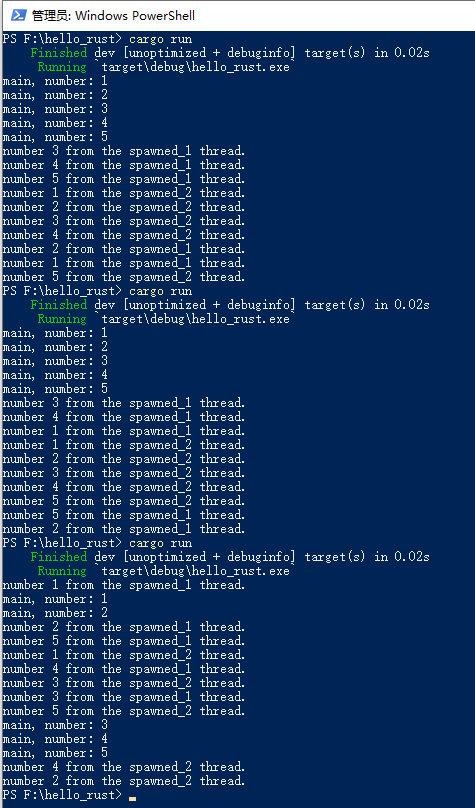
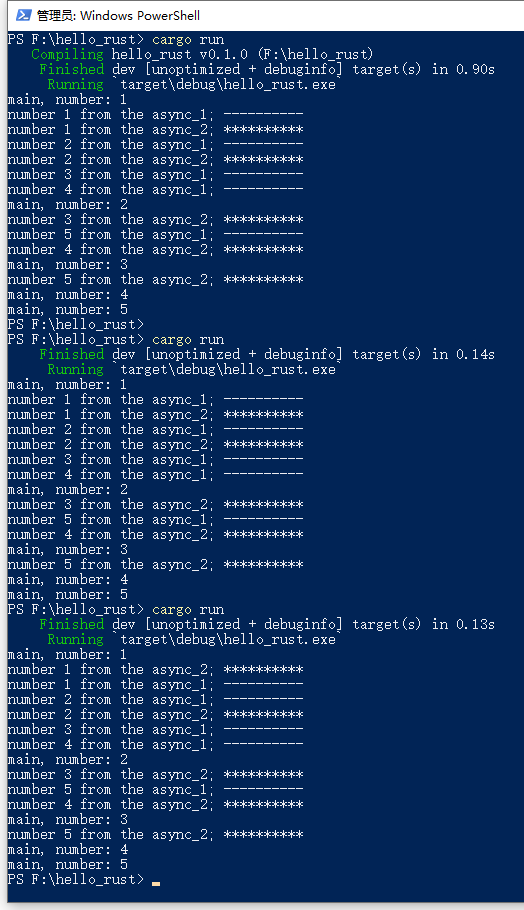

# 第8章 并发编程


一个程序可以有一个或多个进程，一个进程有一个或多个线程。进程是受操作系统管理的基本运行单元，每个进程都享有独立的内存单元和 CPU 时间片等资源。

线程是在进程中独立运行的子任务，无法独立存在。线程的系统资源都来源于进程。每个进程可以生成一个或若干个线程来并发执行任务，但只能有一个主线程。线程与线程之间可以共享同一个进程内的资源，同时每个线程也可以拥有自己独享的资源。

在有操作系统的环境中，进程往往被交替地调度得以执行，线程则在进程以内由程序进行调度。

并发编程的一个重要思想是让程序的不同部分可以同时独立运行、互不干扰。在进行并发编程时，会面临诸如：上下文切换、死锁以及调试等问题。


## 8.1 多线程并发

一个进程一定有一个子线程，主线程之外创建的线程叫作子线程。一个进程可以运行多个线程的机制叫作多线程并发编程。

### 8.1.1 线程管理

程序由单线程变成多线程并发，让程序同时运行多个任务来改善性能。这里的同时运行并非同一时刻运行，而是指在某一时间段内完成所有任务。

线程的同时运行，无法保证不同线程中代码的执行顺序，会导致诸多问题：

1.  多个线程以不一致的顺序访问数据或资源，使程序无法实现预期效果。
2.  两个线程相互等待对方停止使用其拥有的某个资源，可能出现死锁的情况。
3.  多线程程序难以调试。

Rust 支持多线程并发编程，将所有权系统和类型系统作为解决内存安全和并发问题的强力工具，来尽可能地把最常见的错误消灭在编译阶段，这一点其他语言不具备。但这不意味着我们编程的时候可以不小心，迄今为止由于并发造成的问题还没有在公共范围内得到完全解决，仍有可能出现错误，并发编程时要尽量小心！

#### 1. 创建新线程

Rust 标准库中的 `std::thread` 模块用于支持多线程编程，提供了很多方法来创建线程、管理线程和结束线程。

默认情况下，当主线程执行结束，所有子线程也会立即结束，且不管子线程中的代码是否执行完毕。极端情况下，如果主线程在创建子线程后立即结束，子线程可能根本 没有机会开始执行。为了避免这种情况发生，可以通过阻塞主线程来等待子线程执行完毕。这里所说的阻塞线程，是指阻止该线程工作或退出。

Rust 标准库提供 `thread::JoinHandle` 结构体的 `join` 方法，可用于把子线程加入主线程等待队列，这样主线程会等待子线程执行完毕后退出。

```rust
// 使用 spawn 函数创建子线程
use std::thread; // 导入线程模块
use std::time::Duration; // 导入时间模块

fn main() {
    // 创建第一个子线程
    let thread_1 = thread::spawn(|| {
        for i in 1..=5 {
            println!("number {} from the spawned_1 thread.", i);
            thread::sleep(Duration::from_secs(2)); // 强制当前线程停止执行代码一段时间，如何调度其他线程具体还要看操作系统的实现
        }
    });

    // 创建第二个子线程
    let thread_2 = thread::spawn(|| {
        for i in 1..=5 {
            println!("number {} from the spawned_2 thread.", i);
            thread::sleep(Duration::from_secs(4));
        }
    });

    // 主线程执行的代码
    for i in 1..=5 {
        println!("number {} from the main thread.", i);
        thread::sleep(Duration::from_secs(8));
    }

    // 阻塞主线程知道子线程执行至结束
    thread_1.join().unwrap(); // 如果不接 unwrap 方法，代码依然可以跑起来。但编译器会给出警告 this `Result` may be an `Err` variant, which should be handled
    						  // 大意：这个 `Result` 可能是一个 `Err` 变体，应该被处理
    thread_2.join().unwrap();
}


/*
运行结果：

number 1 from the main thread.
number 1 from the spawned_1 thread.
number 1 from the spawned_2 thread.
number 2 from the spawned_1 thread.
number 2 from the spawned_2 thread.
number 3 from the spawned_1 thread.
number 4 from the spawned_1 thread.
number 2 from the main thread.
number 3 from the spawned_2 thread.
number 5 from the spawned_1 thread.
number 4 from the spawned_2 thread.
number 3 from the main thread.
number 5 from the spawned_2 thread.
number 4 from the main thread.
number 5 from the main thread.
*/
```

使用 `thread::spawn` 函数创建了子线程（返回值类型是 `thead::JoinHandle`，是一个枚举 `Result<T, E>` 类型），并将返回值与变量 `thread_1` 绑定。调用 `thread_1` 的 `join` 方法时，会阻塞主线程以阻止主线程退出，直到子线程 `thread_1` 中所有代码执行结束。

主线程会首先打印，即便子线程的代码位于主线程打印语句的前面。两个子线程启动后，无法保证线程间代码的执行顺序，所以该程序每次的执行结果可能都略有不同。


调用 `join` 方法的位置会直接影响线程的执行顺序。

```rust
// 调整调用 join 方法的位置，改变线程执行顺序
use std::thread;
use std::time::Duration;

fn main() {
    let thread_1 = thread::spawn(|| {
        for i in 1..=5 {
            println!("number {} from the spawned_1 thread.", i);
            thread::sleep(Duration::from_secs(2));
        }
    });

    let thread_2 = thread::spawn(|| {
        for i in 1..=5 {
            println!("number {} from the spawned_2 thread.", i);
            thread::sleep(Duration::from_secs(4));
        }
    });

    thread_1.join().unwrap();
    thread_2.join().unwrap();

    for i in 1..=5 {
        println!("number {} from the main thread.", i);
        thread::sleep(Duration::from_secs(8));
    }
}


/*
运行结果：

number 1 from the spawned_1 thread.
number 1 from the spawned_2 thread.
number 2 from the spawned_1 thread.
number 2 from the spawned_2 thread.
number 3 from the spawned_1 thread.
number 4 from the spawned_1 thread.
number 3 from the spawned_2 thread.
number 5 from the spawned_1 thread.
number 4 from the spawned_2 thread.
number 5 from the spawned_2 thread.
number 1 from the main thread.
number 2 from the main thread.
number 3 from the main thread.
number 4 from the main thread.
number 5 from the main thread.
*/
```

`thread_1` 和 `thread_2` 调用 `join` 方法的位置位于主线程打印的代码之前，主线程会等待两个子线程执行结束之后才开始执行 `for` 循环中的代码。输出结果中，主线程与两个子线程不会交替出现。


#### 2. 线程与 `move` 闭包

如果需要在子线程中使用主线程的数据，可以通过闭包来获取需要的值。

先来看一个**错误的**子线程使用主线程上动态数组的示例：

```rust
// 子线程使用主线程数据，示例1（错误示例）
use std::thread;

fn main() {
    let v = vec![1, 2, 3, 4, 5];

    let handle = thread::spawn(|| {
        println!("{:?}", v);
    });

    handle.join().unwrap();
}


/*
运行结果：

无法通过编译
*/
```

编译时会得到如下错误信息：

```rust
error[E0373]: closure may outlive the current function, but it borrows `v`, which is owned by the current function
//		大意：闭包可能比当前函数存活时间更长，但它借用了当前函数拥有的 `v`
 --> main.rs:6:32
  |
6 |     let handle = thread::spawn(|| {
  |                                ^^ may outlive borrowed value `v`
7 |         println!("{:?}", v);
  |                          - `v` is borrowed here
  |
note: function requires argument type to outlive `'static`
 --> main.rs:6:18
  |
6 |       let handle = thread::spawn(|| {
  |  __________________^
7 | |         println!("{:?}", v);
8 | |     });
  | |______^
help: to force the closure to take ownership of `v` (and any other referenced variables), use the `move` keyword
  |
6 |     let handle = thread::spawn(move || {
  |                                ++++
```

错误原因：在子线程中尝试使用当前函数的资源，它将破坏所有权机制销毁资源的一定性。另外，主线程中的某些操作可能会使子线程会动态数组的引用无效。


解决方案：通过在闭包之前增加 `move` 关键字来强制闭包获取动态数组的所有权。

`move` 关键字覆盖了默认的借用，将动态数组的所有权移到子线程，以保证主线程上不会再使用动态数组。加入主线程上继续使用该动态数组，那就违反了所有权规则，编译时将会报错。

```rust
// 子线程使用主线程数据，示例2（正确示例）
use std::thread;

fn main() {
    let v = vec![1, 2, 3, 4, 5];

    let handle = thread::spawn(move || {
        println!("{:?}", v);
    });

    handle.join().unwrap();
}


/*
运行结果：

[1, 2, 3, 4, 5]
*/
```


#### 3. 消息传递

Rust 中实现消息传递并发的主要工具是通道（`channel`）。通道有两部分组成：一个发送者（`transmitter`）和一个接收者（`receiver`）。

`std::sync::mpsc` 包含了消息传递的方法。

```rust
// 通过通道传递两个线程间的数据
use std::sync::mpsc; // Multi-producer, single-consumer FIFO queue communication primitives
					 // 多生产者、单消费者的 FIFO 队列通信原语
use std::thread;

fn main() {
    let (tx, rx) = mpsc::channel(); // mpsc::channel() 返回值是 (Sender<T>, Receiver<T>) 类型
    								// T 的类型是通过后续子线程代码中，传递数据的类型，由编译器自动判定。判定后数据类型绑定，不能再传递其他类型

    thread::spawn(move || {
        let val = String::from("hello");
        tx.send(val).unwrap();
    });

    let received = rx.recv().unwrap();
    println!("{}", received);
}


/*
运行结果：

hello
*/
```

子线程获得了主线程的发送者 `tx`，并调用了 `tx` 的 `send` 方法发送了一个字符串，然后主线程就通过对应的接收者 `rx` 接收到了。


遇到多种数据类型，就需要创建多种类型的通道：

```rust
// 多种数据类型，就需要各自对应的类型的通道来应对
use std::sync::mpsc;
use std::thread;

fn main() {
    // 传递 i32 类型
    let (tx_i32, rx_i32) = mpsc::channel();
    thread::spawn(move || {
        let val = 1;
        tx_i32.send(val).unwrap();
    });
    println!("{}", rx_i32.recv().unwrap());

    // 传递 String 类型
    let (tx_str, rx_str) = mpsc::channel();
    thread::spawn(move || {
        let val = String::from("abcd");
        tx_str.send(val).unwrap();
    });
    println!("{}", rx_str.recv().unwrap());
}


/*
运行结果：

1
abcd
*/
```


#### 4. 线程池

线程池可以有效地实现对线程的复用，避免多次创建、销毁线程的系统开销。`threadpool` 实现了创建工作线程、处理线程异常、运行时改变工作线程数量以及管理工作线程的状态。

当接收到一个新任务，线程池会分配一个线程来处理该任务，而其余线程会同时处理接收到的其他任务。线程池会维护一个接收任务的队列，每个空闲线程会从队列中取出一个任务，处理完毕后再从队列中获取新的任务，直到队列中无待处理的任务。

要使用 `threadpool`，需要先在 `Cargo.toml` 中引入 `threadpool`：

```rust
[dependencies]
threadpool = "1.8.1"
```


示例：

```rust
// 使用 threadpool 多线程并发执行任务
use threadpool::ThreadPool;

fn main() {
    let pool = ThreadPool::new(3);

    for i in 1..=5 {
        pool.execute(move || {
            println!("number {} from the spawned_1 thread.", i);
        });
    }

    for i in 1..=5 {
        pool.execute(move || {
            println!("number {} from the spawned_2 thread.", i);
        });
    }

    for i in 1..=5 {
        println!("main, number: {}", i);
    }

    pool.join(); // 阻塞主线程，等待线程池中的任务执行完毕
}
```

通过 `ThreadPool::new` 创建了线程池，它有一个可配置初始线程数的参数。`execute` 方法与 `thread::spawn` 类似，可以接收闭包，闭包会在当前线程中执行。

无法保证线程间的执行顺序，每次运行的结果都会不一致：





## 8.2 异步并发

**异步并发允许在单个线程中并发执行多个任务**，相比多线程并发执行多个任务，可以减少线程切换和线程共享数据时产生的系统开销，以及空跑线程会占用的系统资源。

### 8.2.1 `async/.await` 语法

Rust 通过 `future` 并发模型和 `async/.await` 方案来实现异步并发。

`async` 和 `.await` 是两个可以分开理解的术语：

1.  `async`：通常与 `fn` 函数定义一起使用，用于创建异步函数，返回值的类型实现了 `Future trait`，这个返回值需要由执行器来运行。比如：执行器 `block_on` 会阻塞当前线程来执行 `future`，直到有结果返回。
2.  `.await`：不阻塞当前线程，异步等待 `future` 完成。在当前 `future` 无法执行时，`.await` 将调度当前 `future` 让出线程控制权，由其他 `future` 继续执行。这个语法只有 `future` 对象才能调用，且必须在 `async` 函数内使用。


要使用 `async/.await`，需要先在 `Cargo.toml` 中引入 `futures`：

```rust
[dependencies]
futures = "0.3.17"
```

最新的版本号，去 Github 上查看：https://github.com/rust-lang/futures-rs


示例：

```rust
// 异步函数
use futures::executor::block_on;

async fn hello_async() {
    println!("hello, async");
}

fn main() {
    let future = hello_async(); // 直接调用带有 async 关键字的函数是没有任何用的
    block_on(future); // 必须由执行器 block_on 来运行 future 才会打印内容
}


/*
运行结果：

hello, async
*/
```


### 8.2.2 `async-std` 库

`async-std` 是一个旨在简化异步编程的第三方库。提供了诸如文件系统、网络、计时器等常用功能的异步版本，并支持 `async/.await` 语法。

`async-std` 库提供了 `task` 模块，多个 `task` 可共享同一个执行线程，在线程上可切换执行任务。


要使用 `async-std`，需要先在 `Cargo.toml` 中引入 `async-std`：

```rust
[dependencies]
async-std = "1.9.0"
```

Github 主页：https://github.com/async-rs/async-std


`async-std` 常用的几个函数介绍：

1.  `task::spawn` 函数：

    `task:spawn` 函数用于生成异步任务。用法如下：

    ```rust
    use async_std::task;
    
    let handle = task::spawn(async {
        1 + 2
    });
    
    assert_eq!(handle.await, 3);
    ```

    

2.  `task::block_on` 函数：

    `task:block_on` 函数用于阻塞当前线程直到任务执行结束。用法如下：

    ```rust
    use async_std::task;
    
    fn main() {
        task::block_on(async {
            println!(""hello async);
        });
    }
    ```

    

3.  `task::sleep` 函数：

    `task::sleep` 函数通过非阻塞的方式让任务等待一段时间再执行。用法如下：

    ```rust
    use async_std::task;
    use std::time::Duration;
    
    task::sleep(Duration::from_secs(1)).await;
    ```

    

示例：

```rust
// 使用 async-std 异步并发执行任务
use async_std::task;
use std::time::Duration;

async fn print_async_1(i: i32) {
    println!("number {} from the async_1; ----------", i);
    task::sleep(Duration::from_secs(2)).await;
}

async fn print_async_2(i: i32) {
    println!("number {} from the async_2; **********", i);
    task::sleep(Duration::from_secs(4)).await;
}

fn main() {
    // 生成异步任务，并返回 task::JoinHandle 类型的返回值
    // JoinHandle 实现了 Future trait，它在 task 运行结束后结束
    let async_1 = task::spawn(async {
        for i in 1..=5 {
            print_async_1(i).await;
        }
    });

    let async_2 = task::spawn(async {
        for i in 1..=5 {
            print_async_2(i).await;
        }
    });

    for i in 1..=5 {
        println!("main, number: {}", i);
        task::block_on(async {
            task::sleep(Duration::from_secs(8)).await;
        });
    }

    task::block_on(async_1); // block_on 函数使执行线程阻塞，以达到让 future 运行完毕的目的
    task::block_on(async_2);
}
```


运行结果如下：

从运行结果来看，不需要创建多个线程，就可在单线程中实现类似多线程并发执行多个任务的效果。



