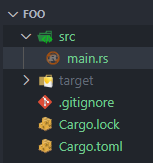
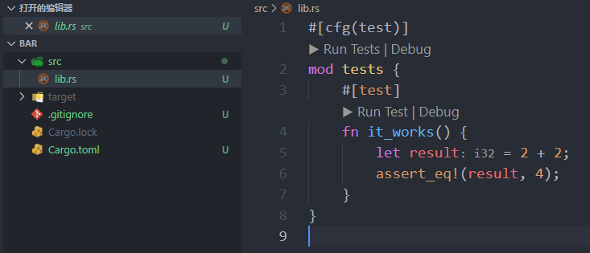
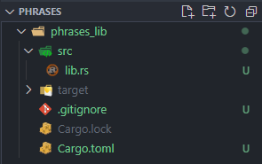
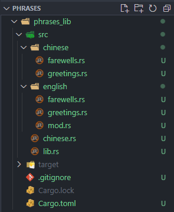
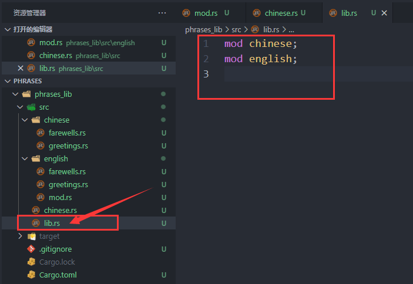
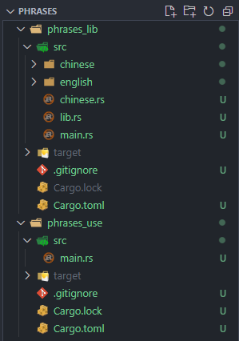

# 第10章 模块化编程


Rust 模块化编程是通过 `crate` 和 `module` 来组织代码的。

`module`（模块）可以将 `crate` 中的代码按功能进行分组，模块可以控制函数或类型定义的私有性。


注意：本章的运行方式都采用 `cargo run`，直接在 VSCode 下 run 代码是不正确的。


## 10.1 `crate` 管理

`crate` 是 Rust 的基本编译单元，分为二进制 `crate` 和库 `crate` 两种类型，编译后会分别对应生成一个可执行二进制程序或者库。二进制 `crate` 有一个 `main` 函数作为程序主入口，库 `crate` 是一组可以在其他项目中重用的模块，没有 `main` 函数。一个 `crate` 可以包含任意多个模块。

一个工程中至多包含一个库 `crate`，但可以包含任意多个二进制 `crate`。至少应包含一个 `crate`，可以是二进制 `crate`，也可以是库 `crate`。

### 10.1.1 使用 `Cargo` 创建 `crate`

#### 1. 创建二进制 `crate`

键入命令：`cargo new foo`

生成一个名为 `foo` 的新文件夹，目录结构如下图所示：



`main.rs` 是二进制 `crate` 的入口文件，编译后是一个可执行程序。

#### 2. 创建库 `crate`

键入命令：`cargo new bar --lib`

生成一个名为 `bar` 的新文件夹，目录结构如下图所示：



`lib.rs` 是库 `crate` 的入口文件，编译后是一个库。


### 10.1.2 使用第三方 `crate`

Rust 社区公开的第三方 `crate` 都集中在 https://crates.io/ 网站。


## 10.2 `module` 系统

`module` 系统是一个包含函数或类型定义的命名空间，用于将函数或类型定义按功能进行分组。每一个 Rust 文件都可以看作一个模块。

每个 `crate` 默认有一个隐式的根模块，也就是 `src/main.rs` 或 `src/lib.rs`。在根模块下，可以定义子模块并且可以定义多层级模块。

### 10.2.1 定义模块

Rust 通过在 `mod` 关键字后跟模块名来定义模块（单个文件本身就是一个默认的模块），或者引用另外一个文件中的模块。

### 10.2.2 创建多文件模块

如果所有模块代码都集中在 `src/lib.rs` 文件，该文件就会变得非常庞大。正确的做法是将每个模块放在独立文件中。

Rust 的模块文件系统规则如下：

1.  如果 `foo` 模块没有子模块，将 `foo` 模块的代码放在 `foo.rs` 文件中。

2.  如果 `foo` 模块有子模块，有两种处理方式：

    a. 将 `foo` 模块的代码放在 `foo.rs` 文件中，并将其子模块所在文件存放在 `foo/` 文件夹。（推荐这种方式）

    b. 将 `foo` 模块的代码放在 `foo/mod.rs` 文件中，并将其子模块所在文件存放在 `foo/` 文件夹。

### 10.2.3 多文件模块的层级关系

Rust 从安全性出发，要求模块引用路径中的每一个节点都是一个有效的模块，比如：`a::b::c` 中 `c` 是一个有效的模块，那么 `b` 和 `a` 都应该是有效的模块且可以被单独引用。

Rust 遵循以下规则在文件系统中寻找多层模块：

1.  `main.rs`、`lib.rs` 和 `mod.rs` 文件中出现 `mod xxx;`，默认优先寻找同级文件夹下的 `xxx.rs` 文件。
2.  如果同级文件夹下的 `xxx.rs` 文件不存在，则寻找 `xxx/mod.rs` 文件，即与 `xxx.rs` 文件所在同级文件夹的 `xxx` 文件夹下的 `mod.rs` 文件。
3.  如果其他文件如 `yyy.rs` 文件中出现 `mod xxx;`，默认寻找 `yyy/xxx.rs` 文件，即与 `yyy.rs` 文件所在同级文件夹的 `yyy` 文件夹下的 `xxx.rs` 文件。

Rust 以这样的规则，通过不断迭代实现对深层文件夹下的模块加载。

### 10.2.4 模块的可见性

实际开发中，通常 `src/lib.rs` 是一个库 `crate` 的根模块，`src/main.rs` 是一个二进制 `crate` 的根模块。先将主要功能放在库 `crate` 中，再在二进制 `crate` 中使用这个库 `crate`，同时其他程序也可以使用这个库 `crate`。

**Rust 默认所有的模块以及模块中的函数和类型都是私有的**，只有在与其平级的位置或下级的位置才能访问，不能从其外部访问。如果一个模块或者模块中的函数和类型需要为外部使用，必须添加 `pub` 关键字。

注意：如果模块中定义了结构体，结构体除了其本身是私有的以外，其字段也默认是私有的。所以如果想使用模块中的结构体以及其字段，都需要加上 `pub` 修饰。

### 10.2.5 使用 `use` 导入模块

Rust 提供了 `use` 和 `as` 两个关键字，使用 `use` 可以将指定的模块或函数引入本地作用域，但不会将其子模块也引入；使用 `as` 可以对模块或函数进行重命名。

`use` 的最佳实践是导入模块而不是直接导入函数。因为在代码少的时候可能不会出问题，但代码规模增大，如果导入时还使用了 `*` 通配符，很容易发生命名冲突，导致抛出 `the name xxx is defined multiple times` 的错误。

许多非基本类型标识符，诸如：`Vec`、`String`、`Option`、`Result` 可以直接使用，是 Rust 在每个模块的开头都插入了下面这行代码：

```rust
use std::prelude::v1::*;
```


### 10.2.6 模块的路径

每个 `crate` 是独立的基本编译单元。`src/main.rs` 或 `src/lib.rs` 是 `crate` 的根模块，每个模块都可以用一个精确的路径来表示，比如：`a::b::c`。

与文件系统类似，模块的路径分为绝对路径和相对路径。Rust 提供了 `crate`、`self` 和 `super` 三个关键字来分别表示绝对路径和相对路径：

1.  `crate` 表示从根模块开始的绝对路径。
2.  `self` 表示当前模块，`self::a` 表示当前模块中的子模块 `a`。`self` 关键字最常用的场景是 `use a::{self, b}`，表示导入当前模块 `a` 及其子模块 `b`。
3.  `super` 表示当前模块的父模块，`super::a` 表示当前模块的父模块中的子模块 `a`。

### 10.2.7 使用 `pub use` 重导出

使用 `pub use` 重导出是指把深层的模块、函数和类型定义导出到上层路径，这在接口设计中会经常用到。通过 `pub use` 统一导出到一个地方，给接口的使用者提供了便利。

### 10.2.8 加载外部 `crate`

找到二进制 `crate` 目录下的 `Cargo.toml` 文件，在文件中的 `[dependencies]` 下添加 `lib` 路径：

```rust
[dependencies]
lib_name = { path = "../lib_path" }
```


### 10.2.9 创建短语库的示例

通过创建一个库来理解巩固上述知识点。

短语库以中文和英文两种语言对外提供服务，最终运行结果如下：

```rust
F:\phrases\phrases_use> cargo run
   Compiling phrases_lib v0.1.0 (F:\phrases\phrases_lib)
   Compiling phrases_use v0.1.0 (F:\phrases\phrases_use)
    Finished dev [unoptimized + debuginfo] target(s) in 0.48s
     Running `target\debug\phrases_use.exe`
Hello in Chinese: 你好！
Goodbye in Chinese: 再见。
Hello in English: Hello
Goodbye in English: Goodbye
```


#### 1. 创建库 `phrases_lib`

````
mkdir phrases
cd phrases
cargo new phrases_lib --lib
````

目录结构如下图所示：



`phrases_lib` 是库的名字，其余都是模块。以 `phrases_lib` 为根，`src/lib.rs` 是当前库的根模块。


#### 2. 创建多文件模块

创建文件夹以及文件，这里演示两种寻找模块的方式（10.2.2 节中有介绍）。

目录结构如下图所示：



`src/lib.rs` 仍然是当前库的根模块，将其内容修改为：

```rust
mod chinese;
mod english;
```

如图所示：




为了演示两种寻找模块的方式，**这里对 `chinese` 模块采用第一种方式，对 `english` 模块采用第二种方式**。

修改 `src/chinese.rs` 文件，代码：

```rust
mod farewells;
mod greetings;
```

修改 `src/english.rs` 文件，代码：

```rust
mod farewells;
mod greetings;
```

在 `src/chinese/greetings.rs` 文件中添加代码：

```rust
fn hello() -> String {
    "你好！".to_string()
}
```

在 `src/chinese/farewells.rs` 文件中添加代码：

```rust
fn goodbye() -> String {
    "再见。".to_string()
}
```

在 `src/english/greetings.rs` 文件中添加代码：

```rust
fn hello() -> String {
    "Hello!".to_string()
}
```

在 `src/english/farewells.rs` 文件中添加代码：

```rust
fn goodbye() -> String {
    "Goodbye".to_string()
}
```


#### 3. 创建一个二进制 `crate`

创建一个二进制 `crate` 来使用这个库。

在使用这个库之前，有一点需要注意：**模块以及模块中定义的一切语法元素默认都是私有的**，要想在外部使用某个模块或函数，需要使用 `pub` 关键字来修改其可见性。

首先修改 `src/lib.rs` 文件：

```rust
pub mod chinese;
pub mod english;
```

接着依次修改其他文件。

修改 `src/chinese.rs` 和 `src/english/mod.rs` 文件：

```rust
pub mod farewells;
pub mod greetings;
```

修改 `src/chinese/greetings.rs` 文件，在函数签名前添加 `pub` 关键字：

```rust
pub fn hello() -> String {
    "你好！".to_string()
}
```

修改 `src/chinese/farewells.rs` 文件，在函数签名前添加 `pub` 关键字：

```rust
pub fn goodbye() -> String {
    "再见。".to_string()
}
```

修改 `src/english/greetings.rs` 文件，在函数签名前添加 `pub` 关键字：

```rust
pub fn hello() -> String {
    "Hello!".to_string()
}
```

修改 `src/english/farewells.rs` 文件，在函数签名前添加 `pub` 关键字：

```rust
pub fn goodbye() -> String {
    "Goodbye".to_string()
}
```


在 `src` 目录下，新建 `main.rs` 文件，代码如下：

```rust
fn main() {
    println!(
        "Hello in Chinese: {}",
        phrases_lib::chinese::greetings::hello()
    );
    println!(
        "Goodbye in Chinese: {}",
        phrases_lib::chinese::farewells::goodbye()
    );

    println!(
        "Hello in English: {}",
        phrases_lib::english::greetings::hello()
    );
    println!(
        "Goodbye in English: {}",
        phrases_lib::english::farewells::goodbye()
    );
}
```


使用 `cargo run` 命令编译并运行，可以看到正确的结果：

```
F:\phrases\phrases_lib> cargo run
   Compiling phrases_lib v0.1.0 (F:\phrases\phrases_lib)
    Finished dev [unoptimized + debuginfo] target(s) in 0.48s
     Running `target\debug\phrases_lib.exe`
Hello in Chinese: 你好！
Goodbye in Chinese: 再见。
Hello in English: Hello!
Goodbye in English: Goodbye
```


#### 4. 使用 `use` 和 `as`

修改 `src/main.rs` 文件：

```rust
use phrases_lib::chinese::farewells as cn_farewells; // 重命名，可以用一个较短的名字来调用函数
use phrases_lib::chinese::greetings as cn_greetings;
use phrases_lib::english::{farewells, greetings}; // 一种简写方式，方便从同一个模块中导入多个子模块

fn main() {
    println!("Hello in Chinese: {}", cn_greetings::hello());
    println!("Goodbye in Chinese: {}", cn_farewells::goodbye());

    println!("Hello in English: {}", greetings::hello());
    println!("Goodbye in English: {}", farewells::goodbye());
}
```

`cargo run` 得到如下结果：

```
F:\phrases\phrases_lib> cargo run
   Compiling phrases_lib v0.1.0 (F:\phrases\phrases_lib)
    Finished dev [unoptimized + debuginfo] target(s) in 0.34s
     Running `target\debug\phrases_lib.exe`
Hello in Chinese: 你好！
Goodbye in Chinese: 再见。
Hello in English: Hello!
Goodbye in English: Goodbye
```


同样也可以对上述简写方式进行重命名：

```rust
use phrases_lib::chinese::farewells as cn_farewells; // 重命名，可以用一个较短的名字来调用函数
use phrases_lib::chinese::greetings as cn_greetings;
use phrases_lib::english::{farewells as en_f, greetings as en_g}; // 一种简写方式，方便从同一个模块中导入多个子模块。如果需要重命名，需要分开操作

fn main() {
    println!("Hello in Chinese: {}", cn_greetings::hello());
    println!("Goodbye in Chinese: {}", cn_farewells::goodbye());

    println!("Hello in English: {}", en_g::hello()); // 使用简短的名称
    println!("Goodbye in English: {}", en_f::goodbye());
}
```


#### 5. 重导出

把深层的模块、函数和类型定义导出到上层路径，给接口的使用者提供方便。

修改 `src/chinese.rs` 文件：

```rust
// 模块的代码

mod farewells;
mod greetings;

// 将函数重导出到 phrases_lib::chinese 路径下
pub use self::farewells::goodbye;
pub use self::greetings::hello;
```


修改  `src/main.rs` 文件：

```rust
use phrases_lib::chinese; // 重导出后，只需要导入 chinese 即可使用其下两个模块中的函数。无需像下面 english 那样显式导入完整路径、完整模块名称
use phrases_lib::english::{farewells, greetings};

fn main() {
    println!("Hello in Chinese: {}", chinese::hello());
    println!("Goodbye in Chinese: {}", chinese::goodbye());

    println!("Hello in English: {}", greetings::hello());
    println!("Goodbye in English: {}", farewells::goodbye());
}
```


运行结果如预期一致：

```
Hello in Chinese: 你好！
Goodbye in Chinese: 再见。
Hello in English: Hello!
Goodbye in English: Goodbye
```


#### 6. 加载外部 `crate`

在 `phrases` 文件夹下，键入命令：`cargo new phrases_use`，创建名为 `phrases_use` 的二进制 `crate`。`phrases_use` 用来加载和使用库 `phrases_lib`。

目录结构如下图所示：




修改 `phrases_use/Cargo.toml` 文件，在 `[dependencies]` 下添加 `phrases_lib` 的路径：

```rust
[dependencies]
phrases_lib = { path = "../phrases_lib" }
```


修改 `phrases_use/src/main.rs` 文件：

```rust
use phrases_lib::chinese; // 重导出后，无需再引入子模块名称
use phrases_lib::english::{farewells, greetings};

fn main() {
    println!("Hello in Chinese: {}", chinese::hello());
    println!("Goodbye in Chinese: {}", chinese::goodbye());

    println!("Hello in English: {}", greetings::hello());
    println!("Goodbye in English: {}", farewells::goodbye());
}
```


运行结果：

```
F:\phrases\phrases_use> cargo run
   Compiling phrases_lib v0.1.0 (F:\phrases\phrases_lib)
   Compiling phrases_use v0.1.0 (F:\phrases\phrases_use)
    Finished dev [unoptimized + debuginfo] target(s) in 0.49s
     Running `target\debug\phrases_use.exe`
Hello in Chinese: 你好！
Goodbye in Chinese: 再见。
Hello in English: Hello!
Goodbye in English: Goodbye
```


#### 7. 最终效果

将当前目录下的 `phrases.zip` 文件解压开，即可看到目录结构和代码。