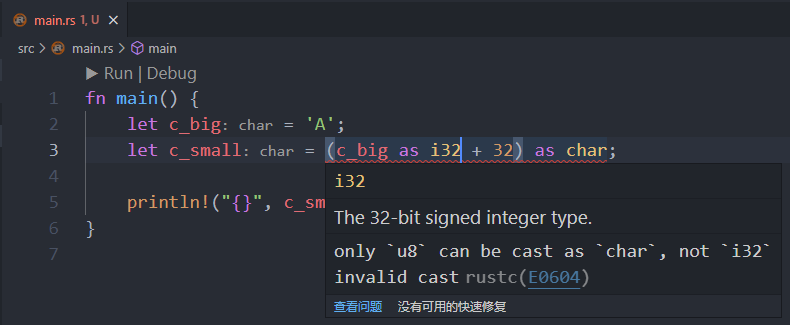
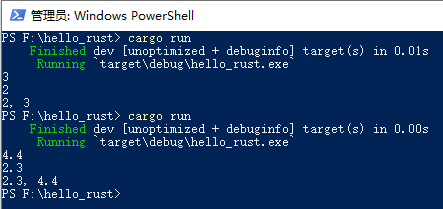
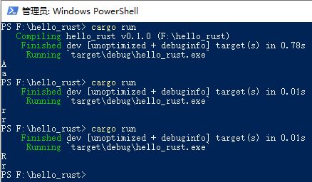
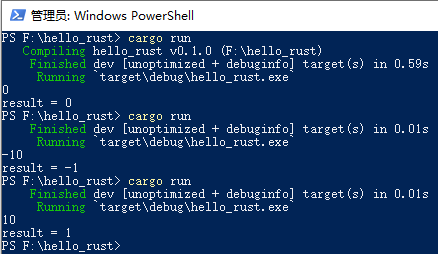
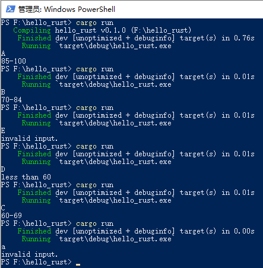

## 1. 温度转换

Link: https://mp.weixin.qq.com/s?__biz=MzA5MzQ5OTE2Mg==&mid=2247493132&idx=2&sn=266194b9aeb98603f417552cba3cdddb

### 问题

有人用温度计测量出用华氏温度 `98°F`，现把它转换为以摄氏法表示的温度。

### 解题思路

算法很简单，关键在于找到二者之间的转化公式。摄氏度 = 九分之五乘以(华氏度减去 32 的积)，也就是：`centigrade = (5.0/9) * (f_Degree - 32);`。

### 代码

```rust
fn main() {
    let f_degree = 98.0; // rust 对浮点数的自动推导为 f64 类型

    // rust 不像 C 语言那样，浮点数和整数可以直接运算
    // rust 中，参与运算的类型必须相同，因此需要类型转换
    println!("{}", (5.0 / 9 as f64) * (f_degree - 32 as f64));
}


/*
运行结果：

36.66666666666667
*/
```

### 注意事项

`println!()` 中，`(5.0 / 9 as f64) * (f_degree - 32 as f64)` 代码中的 `5.0`，**小数点 `.` 绝对不能漏下**！

原理同 C 语言，2 个 `int` 类型的数相除，结果只取整数部分，小数部分被截断。

另外要注意：Rust 不存在自动类型转换，必须手动地显式指定类型。否则，运算两边的类型不一致是无法通过编译的！


## 2. 计算存款本息和

Link: https://mp.weixin.qq.com/s?__biz=MzA5MzQ5OTE2Mg==&mid=2247493151&idx=2&sn=f974062cb784152516bc3a0893b927d3

### 问题

用 C 语言计算存款利息。假设有本金 1000 元，想存一年，有三种方法可选择：

1.  活期，年利率为 0.0036；
2.  一年期定期，年利率为 0.0225；
3.  存两次半年定期，年利率为 0.0198；

请分别计算出一年后按3种方法所得到的本息和。

### 解题思路

算法很简单，关键在于找到公式，若存款额为 `principal_0`，也就是本金。

则：

活期存款一年后的本息和为：`principal_0*(1+interest_Rate1);`。

一年定期存款后，本息和为：`principal_0*(1+interest_Rate2);`。

两次半年定期存款，一年后本息和：`principal_0*(1+interest_Rate3/2)*(1+interest_Rate3/2);`。

### 代码

```rust
fn main() {
    let (interest_rate1, interest_rate2, interest_rate3) = (0.0036, 0.0225, 0.0198); // 元祖形式，一次性定义多个变量

    let principal_0 = 1000.0; // 带上小数，就会被推导成 f64 类型
    println!("{}", principal_0 * (1.0 + interest_rate1)); // 1.0 的类型是 f64，与加号右边的变量相匹配了
    println!("{}", principal_0 * (1.0 + interest_rate2));
    println!(
        "{}",
        principal_0 * (1.0 + interest_rate3 / 2.0) * (1.0 + interest_rate3 / 2.0) // 带上小数点，就是 f64 类型了，运算符两边的类型就能匹配上
    );
}


/*
运行结果：

1003.6
1022.5
1019.89801
*/
```

### 注意事项

就是应该定义为浮点型类型的变量，因为存款的钱都是有小数点的，不要定义成整型的。

任然要注意运算符两边的数据类型都要一致！


## 3. 大写字母 `A` 转换为小写 `a`

Link: https://mp.weixin.qq.com/s?__biz=MzA5MzQ5OTE2Mg==&mid=2247493164&idx=2&sn=a8c9adefe3db54f74aa2efd01ce0e715

### 问题

实现将大写字母 `A`，输出为小写字母 `a`。

### 解题思路

字符数据以 ASCII 码存储在内存的，形式与整数的存储形式相同，所以字符型数据和其他算术型数据之间可以互相赋值和运算。

### 代码

```rust
fn main() {
    let c_big = 'A';
    let c_small = (c_big as u8 + 32) as char; // only `u8` can be cast as `char`

    println!("{}", c_small);
}


/*
运行结果：

a
*/
```

### 注意事项

在 Rust 中，只有 `u8` 类型才可以与 `char` 类型之间相互转换，`u8` 和 `char` 的数值范围都是 `0 ~ 255`。如果使用其他类型与 `char` 进行转换，就会报错：




## 4. 用 `%f` 控制符输出 6 位小数


Link: https://mp.weixin.qq.com/s?__biz=MzA5MzQ5OTE2Mg==&mid=2247493216&idx=2&sn=ab01b2a73b9b777c8f15a61a17e5a82f

### 问题

实现用 `%f` 输出实数，且只能得到 6 位小数。

### 解题思路

不指定输出数据的长度，由系统根据数据的实际情况决定数据所占的列数。

系统处理的方法一般是：实数中的整数部分全部输出，小数部分输出 6 位。

使用 `{:.N}` 格式说明符。

### 代码

```rust
fn main() {
    let num = 1.0;
    println!("{:.6}", num / 3.0); // {:.6} 是格式说明符

    let out = format!("{:.6}", num / 3.0); // 这里打算将结果赋值给变量，采用了字符串格式化来实现
    println!("{}", out.parse::<f64>().unwrap()); // 将字符串转换为 f64 类型
}


/*
运行结果：

0.333333
0.333333
*/
```

### 注意事项

还是要注意运算符两边的类型必须一致！


## 5. 用逐字输出 `Love`


Link: https://mp.weixin.qq.com/s?__biz=MzA5MzQ5OTE2Mg==&mid=2247493233&idx=2&sn=b6e412520abcf1a3e90428099cbb039d

### 问题

实现先后输出 `Love` 四个个字符。

### 解题思路

使用 `print!` 函数逐个输出 4 个字符即可。

### 代码

```rust
fn main() {
    print!("L");
    print!("o");
    print!("v");
    print!("e");
    print!("\n");
}


/*
运行结果：

Love
*/
```

### 注意事项

尚未找到 Rust 中，有像 C 语言 `putchar` 函数可以放入整数并输出字符的方式。


## 6. 输入两个实数，由小到大输出


Link: https://mp.weixin.qq.com/s?__biz=MzA5MzQ5OTE2Mg==&mid=2247493238&idx=2&sn=958492cb7b453110f7e8c1afba0fb6fa

### 问题

实现输入两个实数，按照数值由小到大的顺序输出这两个数。

### 解题思路

逻辑很简单，只要做一次比较，然后进行交换即可。

### 代码

```c
use std::io::stdin;

fn main() {
    let mut buf = String::new();
    stdin().read_line(&mut buf).unwrap();

    let m: f64 = buf.trim_end().parse().unwrap(); // 如果类型指定了 i32，那么输入浮点数就会报错！

    let mut buf = String::new();
    stdin().read_line(&mut buf).unwrap();
    let n: f64 = buf.trim_end().parse().unwrap(); // f64 即能支持整数，也能支持浮点数

    if n > m {
        println!("{}, {}", m, n);
    } else {
        println!("{}, {}", n, m);
    }
}
```

运行结果如下：



### 注意事项

调用 `parse` 方法转换类型时要注意，如果指定了 `i32` 类型，那么输入浮点数就会报错！因为 `f64` 类型与 `i32` 类型不能相互转换，低数据类型不能兼容高数据类型。

指定了 `f64` 类型，即能支持整数，也能支持浮点数。


## 7. 三目运算实现判断大写


Link: https://mp.weixin.qq.com/s?__biz=MzA5MzQ5OTE2Mg==&mid=2247493240&idx=2&sn=ebcd2d0b1b91878a00432d7a400f0d9a

### 问题

输入一个字符，判别它是否为大写字母。如果是，将它转换成小写；如果不是，不转换。然后输出最后得到的字符，**要求使用三目运算符**。

### 解题思路

Rust 中没有条件表达式（三目运算符）。可以将输入的内容转换为字符迭代器后，取出迭代器内的元素，然后使用模式匹配来实现。

### 代码

```c
use std::io::stdin;

fn main() {
    let mut buf = String::new();
    stdin().read_line(&mut buf).unwrap();

    let mut c = buf.trim().chars(); // 将 `&str` 转换为 bytes 迭代器

    match c.next() { // next 可以取出输入的那个字符
        None => {
            println!("")
        }
        Some(cc) => {
            if cc.is_uppercase() {
                println!("{}", cc.to_ascii_lowercase())
            } else {
                println!("{}", cc)
            }
        }
    }
}
```

运行结果：



### 注意事项


## 8. 输入一个数输出对应的值


Link: https://mp.weixin.qq.com/s?__biz=MzA5MzQ5OTE2Mg==&mid=2247493256&idx=2&sn=e6e50d0008a38f9f17b890ed0575815f

### 问题

编写一个程序，输入一个 `num` 值，要求输出相应的result值。

当 `num < 0` 时，输出 `result = -1`；当 `num > 0` 时，`result = 1`；当 `num = 0` 时，`result = 0`。

### 解题思路

Rust 没有条件表达式（三目运算符）。

### 代码

```rust
use std::io::stdin;

fn main() {
    let mut buf = String::new();
    stdin().read_line(&mut buf).unwrap();

    let num = buf.trim().to_string().parse::<f64>().unwrap();
    let mut result = 0.0; // 浮点数被推导为 f64 类型，以达到运算符左右两边类型一致的规则
    result = if num == 0.0 {
        result
    } else if num < 0.0 {
        -1.0
    } else {
        1.0
    };

    println!("result = {}", result);
}
```

运行结果：



### 注意事项

注意 `parse()` 指定了什么类型，关系运算符的左右两边也必须是相同的类型，否则就是错误的！


## 9. 成绩等级判别


Link: https://mp.weixin.qq.com/s?__biz=MzA5MzQ5OTE2Mg==&mid=2247493271&idx=2&sn=39f008e6fe8d84149519bf0b7a8fb49f

### 问题

按照考试成绩的等级输出百分制分数段。

`A` 等为 85-100 分，`B` 等为 70-84 分，`C` 等为 60-69 分，`D` 等为 60 分以下。

### 解题思路

这是一个多分支选择问题，根据分数将学生成绩分为 4 个等级。

### 代码

```rust
use std::io::stdin;

fn main() {
    let mut buf = String::new();
    stdin().read_line(&mut buf).unwrap();

    let grade = buf.trim().to_string().chars().next().unwrap();

    if grade == 'A' {
        println!("85-100");
    } else if grade == 'B' {
        println!("70-84");
    } else if grade == 'C' {
        println!("60-69");
    } else if grade == 'D' {
        println!("less than 60");
    } else {
        println!("invalid input.");
    }
}
```

运行结果：



### 注意事项


## 10. 判断某年是否只闰年


Link: https://mp.weixin.qq.com/s?__biz=MzA5MzQ5OTE2Mg==&mid=2247493297&idx=2&sn=973ed2cff1cd8bbd923f3d7b5ba2f970

### 问题

判断某一年是否是闰年。

### 解题思路

闰年是公历中的名词，分为普通闰年和世纪闰年。普通闰年：公历年份是 4 的倍数，且不是 100 的倍数。世纪闰年：公历年份是整百数的，必须是 400 的倍数才是世纪闰年。

### 代码

```rust
use std::io::stdin;

fn main() {
    let mut buf = String::new();
    stdin().read_line(&mut buf).unwrap();

    let year = buf.trim().to_string().parse::<usize>().unwrap();

    println!(
        "{}",
        if year % 4 == 0 && year % 100 != 0 || year % 400 == 0 {
            "leap year"
        } else {
            "not a leap year"
        }
    );
}
```

### 注意事项