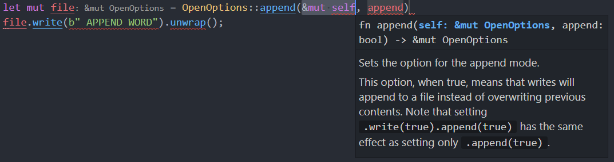

# 文件与 IO


## 接收命令行参数

在 Rust 中主函数是个无参函数，环境参数需要通过 `std::env` 模块取出。

```rust
fn main() {
    let args = std::env::args();
    println!("{:?}", args);
}


/*
运行结果：

F:\hello_rust> cargo run
   Compiling hello_rust v0.1.0 (F:\hello_rust)
    Finished dev [unoptimized + debuginfo] target(s) in 0.78s
     Running `target\debug\hello_rust.exe`
Args { inner: ["target\\debug\\hello_rust.exe"] }
*/
```

这个结果中 `Args` 结构体中有一个 `inner` 数组，只包含唯一的字符串，代表了当前运行的程序所在的位置。


## 命令行输入

在 Rust 中，`std::io` 模块提供了标准输入（可认为是命令行输入）的相关功能。

```rust
use std::io::stdin;

fn main() {
    let mut str_buf = String::new();
    stdin().read_line(&mut str_buf).expect("Failed to read line.");

    println!("your input is:\n{}", str_buf);
}


/*
运行结果：

F:\hello_rust> cargo run
    Finished dev [unoptimized + debuginfo] target(s) in 0.01s
     Running `target\debug\hello_rust.exe`
RUNOOB
your input is:
RUNOOB
*/
```

`read_line` 方法可以读取一行字符串到缓冲区，返回值都是 `Result` 枚举类，用于传递读取中出现的错误，所以常用 `expect` 或 `unwrap` 函数来处理错误。


## 文件读取

在 `main.rs` 文件所在的目录中，新建一个文本文件 `text.txt`，内容：`This is a text file.`

```rust
// 将文本文件内容读入字符串
use std::fs;

fn main() {
    let text = fs::read_to_string("./text.txt").unwrap(); // read_to_string 的返回值是 io::Result<String> 类型，需要有函数来处理错误
    println!("{}", text);
}


/*
运行结果：

This is a text file.
*/
```


如果要读取的文件是二进制文件，可以用 `std::fs::read` 函数读取 `u8` 类型集合：

```rust
use std::fs;

fn main() {
    let content = fs::read("./1.mp4").unwrap(); // fs::read 函数将文件的全部内容读入字节向量
    println!("{:?}", content);
}
```


很多情况下文件的大小可能远超内存容量，传统的按流读取的方式就变得很有用。

```rust
// Rust 中的文件流读取方式
use std::fs;
use std::io::prelude::*;

fn main() {
    let mut buffer = [0u8; 5];
    let mut file = fs::File::open("D:\\text.txt").unwrap();
    file.read(&mut buffer).unwrap();
    println!("{:?}", buffer);
    file.read(&mut buffer).unwrap();
    println!("{:?}", buffer);
}


/*
运行结果：

[84, 104, 105, 115, 32] 
[105, 115, 32, 97, 32]
*/
```

`File` 的 `read` 方法按流读取文件的下面一些字节到缓冲区（缓冲区是一个 `u8` 数组），读取的字节数等于缓冲区的长度。

`std::fs::File` 的 `open` 方法是"只读"打开文件，并且没有配套的 `close` 方法，因为 Rust 编译器可以在文件不再被使用时自动关闭文件。


## 文件写入

文件写入分为一次性写入和流式写入。

一次性写入：

```rust
use std::fs;

fn main() {
    fs::write("./1.txt", "FROM RUST PROGRAM").unwrap(); // 注意处理错误
}
```

执行程序之后， `./1.txt` 文件的内容将会被重写为 `FROM RUST PROGRAM`。所以，一次性写入请谨慎使用！因为它会直接删除文件内容（无论文件多么大）。如果文件不存在就会创建文件。


流式写入需要打开文件，打开方式有"新建"（`create`）和"追加"（`append`）两种。

流式写入需要显式引入 `std::io::prelude::*` 模块。

```rust
// 使用 std::fs::File 的 create 方法
use std::fs::File;
use std::io::prelude::*; // 如果只是写入，则可以只引入 `std::io::prelude::Write` 模块

fn main() {
    let mut file = File::create("./1.txt").unwrap();
    file.write(b"FROM RUST PROGRAM").unwrap(); // 注意字符串前面的 `b`，它用来代表 u8 类型
}
```

注意：打开的文件一定存放在可变的变量中才能使用 `File` 的方法！


`File` 中不存在 `append` 静态方法，可以使用 `OpenOptions` 来实现用特定方法打开文件：

```rust
// OpenOptions 来实现用特定方法打开文件
use std::fs::OpenOptions;
use std::io::Write;

fn main() {
    let mut file = OpenOptions::new().append(true).open("./1.txt").unwrap();
    file.write(b" APPEND WORD").unwrap();
}


/*
运行结果：

运行之后，`./1.txt` 文件内容将变成：
FROM RUST PROGRAM APPEND WORD
*/
```

`OpenOptions::append` 方法的第一个参数需要是 `self: &mut OpenOptions` 类型，所以先需要 `new` 一个类型出来，然后再用它自身来调用 `append` 方法。

在 VSCode 中就有相应的提示：




`OpenOptions` 是一个灵活的打开文件的方法，它可以设置打开权限。除了 `append` 权限以外，还有 `read` 权限和 `write` 权限。

如果我们想以读写权限打开一个文件可以这样写：

```rust
use std::fs::OpenOptions;
use std::io::prelude::*;

fn main() {
    let mut file = OpenOptions::new()
        .read(true)
        .write(true)
        .open("./1.txt")
        .unwrap();

    file.write(b"buffer ").unwrap();
}


/*
运行结果：

运行之后，`./1.txt` 文件内容将变成：
buffer ST PROGRAM APPEND WORD
*/
```

注意：打开文件会将光标定在文件的最开头处，再次往文件内写数据就会覆盖开头的那些内容。