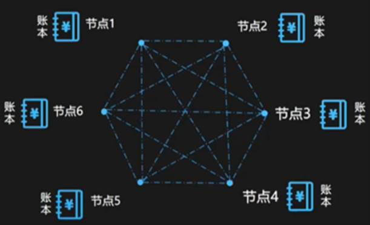
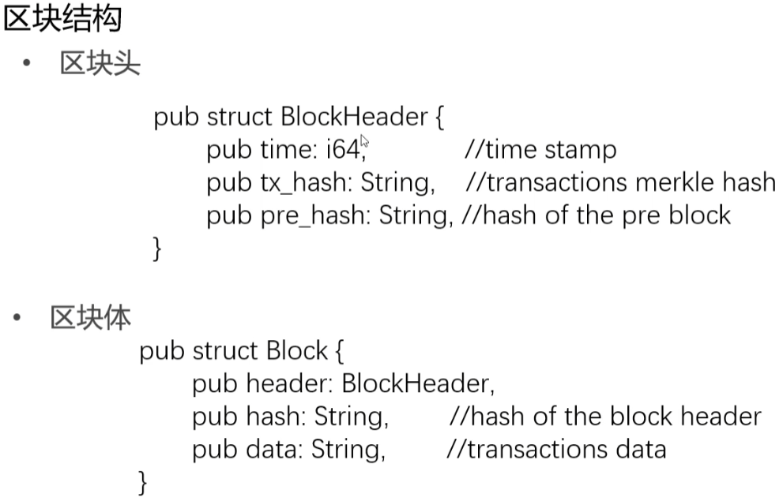
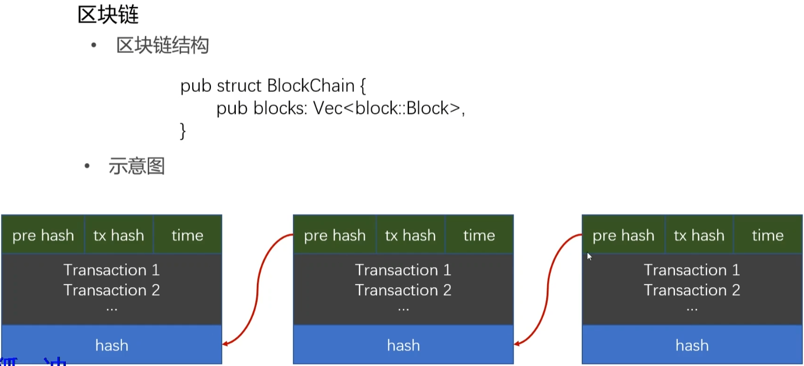
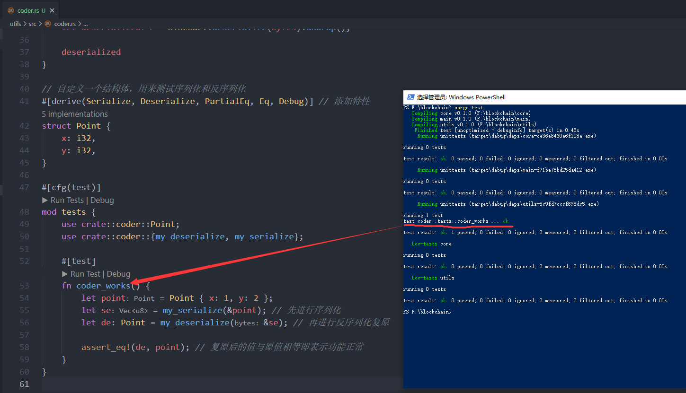
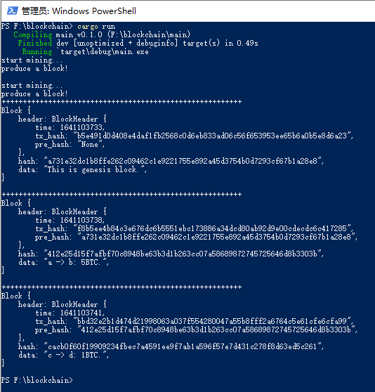

# 编写简单的区块链


## 简介

B 站地址：https://www.bilibili.com/video/BV145411t7qp?from=search&seid=6309337170873326220

使用到的第三方包，可以到 https://crates.io/ 去找。


## P1 比特币基本运行过程介绍

区块链的鼻祖：比特币。

2008 年，《Bitcoin: A Peer-to-Peer Electronic Cash System》论文。

去中心化的、共享的、防篡改的分布式账本。




## P2 区块等数据结构的介绍

简化后的区块结构体：







## P3 实现序列化与反序列化

### 创建工程

新建文件夹，并进入：

```shell
mkdir blockchain
```


设置工作空间：

新建文件 `Cargo.toml`，并创建包：

```toml
[workspace]
members = [
    "main",
    "core",
    "utils",
]
```

`main`：执行的包。

`core`：主要逻辑。

`utils`：一些功能代码。（例如：序列化、分序列化、求哈希）


开始创建包：

创建 `main` 包：

```shell
cargo new main
```

创建 `core` 库：

```shell
cargo new core --lib
```

创建 `utils` 库：

```shell
cargo new utils --lib
```


### 定义区块头

在 `./core/src/` 目录下，创建文件 `block.rs`。并键入代码：

```rust
// 定义区块头
pub struct BlockHeader {
    pub time: i64,        // 时间
    pub tx_hash: String,  // 交易的 merkle 哈希
    pub pre_hash: String, // 前一个区块的哈希
}

// 定义区块
pub struct Block {
    pub header: BlockHeader, // 区块头
    pub hash: String,        // 自身的哈希
    pub data: String,        // 交易数据。只放一个来模拟
}
```


### 编写功能函数

在 `./utils/` 目录下的 `Cargo.toml` 文件中，添加依赖：

```toml
[dependencies]
bincode = "1.3.3"
serde = {version = "1.0.132", features = ["derive"]} # 为了指定特性
```


在 `./utils/src/` 目录下，创建文件 `coder.rs`。并键入代码：

```rust
// 实现：序列化（转化为字节列表/数组），反序列化，求哈希等功能

use bincode;
use serde::{Deserialize, Serialize};

// 序列化函数用到了 bincode
// https://docs.rs/bincode/1.3.3/bincode/fn.serialize.html
/*
pub fn serialize<T: ?Sized>(value: &T) -> Result<Vec<u8>>
where
    T: Serialize,
 */
// T: ?Sized 表示传入的类型的大小不确定，可以传递动态大小类型的泛型。并且对泛型类型进行约束
pub fn my_serialize<T: ?Sized>(value: T) -> Vec<u8>
where
    T: Serialize,
{
    let serialized = bincode::serialize(value).unwrap(); // 这里不想返回 Result 类型，所以需要调用 unwrap 函数

    serialized
}

// 反序列化函数
// 写法参考文档：https://docs.rs/bincode/1.3.3/bincode/fn.deserialize.html
/*
pub fn deserialize<'a, T>(bytes: &'a [u8]) -> Result<T>
where
    T: Deserialize<'a>,
 */
// 传入的是一个引用，需要生命周期注解
pub fn my_deserialize<'a, T>(bytes: &'a [u8]) -> T
where
    T: Deserialize<'a>,
{
    let deserialized = bincode::deserialize(bytes).unwrap();

    deserialized
}
```


## P4 对序列化和反序列化的测试

进入 `./utils/src/lib.rs` 文件，将原来的代码全部剪切到 `./utils/src/coder.rs` 的末尾。并添加 `pub` 修饰，以导出 `corder`：

```rust
pub mod coder;
```


最终 `./utils/src/coder.rs` 文件的代码：

```rust
// 实现：序列化（转化为字节列表/数组），反序列化，求哈希等功能

use bincode;
use serde::{Deserialize, Serialize};

// 序列化函数用到了 bincode
// https://docs.rs/bincode/1.3.3/bincode/fn.serialize.html
/*
pub fn serialize<T: ?Sized>(value: &T) -> Result<Vec<u8>>
where
    T: Serialize,
 */
// T: ?Sized 表示传入的类型的大小不确定，可以传递动态大小类型的泛型。并且对泛型类型进行约束
pub fn my_serialize<T: ?Sized>(value: &T) -> Vec<u8>
where
    T: Serialize,
{
    let serialized = bincode::serialize(value).unwrap(); // 这里不想返回 Result 类型，所以需要调用 unwrap 函数

    serialized
}

// 反序列化函数
// 写法参考文档：https://docs.rs/bincode/1.3.3/bincode/fn.deserialize.html
/*
pub fn deserialize<'a, T>(bytes: &'a [u8]) -> Result<T>
where
    T: Deserialize<'a>,
 */
// 传入的是一个引用，需要生命周期注解
pub fn my_deserialize<'a, T>(bytes: &'a [u8]) -> T
where
    T: Deserialize<'a>,
{
    let deserialized = bincode::deserialize(bytes).unwrap();

    deserialized
}

// 自定义一个结构体，用来测试序列化和反序列化
#[derive(Serialize, Deserialize, PartialEq, Eq, Debug)] // 添加特性
struct Point {
    x: i32,
    y: i32,
}

#[cfg(test)]
mod tests {
    use crate::coder::Point;
    use crate::coder::{my_deserialize, my_serialize};

    #[test]
    fn coder_works() {
        let point = Point { x: 1, y: 2 };
        let se = my_serialize(&point); // 先进行序列化
        let de: Point = my_deserialize(&se); // 再进行反序列化复原

        assert_eq!(de, point); // 复原后的值与原值相等即表示功能正常
    }
}
```


在项目根目录，键入 `cargo test` 命令，得到结果：




## P5 实现 `block` 数据结构以及相关方法

### 完成 `./utils/src/coder.rs` 文件

在 `./utils/` 目录下的 `Cargo.toml` 文件中，添加 `rust-crypto` 依赖，以便实现求哈希功能：

```rust
[dependencies]
bincode = "1.3.3"
serde = {version = "1.0.132", features = ["derive"]} # 为了指定特性
rust-crypto = "0.2.36" # 实现求哈希的库
```


在 `./utils/src/coder.rs` 文件中，导入包：

```rust
use crypto::digest::Digest;
use crypto::sha3::Sha3;
```


最终整个 `./utils/src/coder.rs` 文件的代码：

```rust
// 实现：序列化（转化为字节列表/数组），反序列化，求哈希等功能

use bincode;
use serde::{Deserialize, Serialize};

use crypto::digest::Digest;
use crypto::sha3::Sha3;

// 序列化函数用到了 bincode
// https://docs.rs/bincode/1.3.3/bincode/fn.serialize.html
/*
pub fn serialize<T: ?Sized>(value: &T) -> Result<Vec<u8>>
where
    T: Serialize,
 */
// T: ?Sized 表示传入的类型的大小不确定，可以传递动态大小类型的泛型。并且对泛型类型进行约束
pub fn my_serialize<T: ?Sized>(value: &T) -> Vec<u8>
where
    T: Serialize,
{
    let serialized = bincode::serialize(value).unwrap(); // 这里不想返回 Result 类型，所以需要调用 unwrap 函数

    serialized
}

// 反序列化函数
// 写法参考文档：https://docs.rs/bincode/1.3.3/bincode/fn.deserialize.html
/*
pub fn deserialize<'a, T>(bytes: &'a [u8]) -> Result<T>
where
    T: Deserialize<'a>,
 */
// 传入的是一个引用，需要生命周期注解
pub fn my_deserialize<'a, T>(bytes: &'a [u8]) -> T
where
    T: Deserialize<'a>,
{
    let deserialized = bincode::deserialize(bytes).unwrap();

    deserialized
}

// 求哈希的函数
// 传入的是序列化后的字节数组
pub fn get_hash(value: &[u8]) -> String {
    let mut hasher = Sha3::sha3_256();
    hasher.input(value);

    hasher.result_str()
}

/* ----------------- 以下是测试 ----------------- */

// 自定义一个结构体，用来测试序列化和反序列化
#[derive(Serialize, Deserialize, PartialEq, Eq, Debug)] // 添加特性
struct Point {
    x: i32,
    y: i32,
}

#[cfg(test)]
mod tests {
    use crate::coder::Point;
    use crate::coder::{my_deserialize, my_serialize};

    #[test]
    fn coder_works() {
        let point = Point { x: 1, y: 2 };
        let se = my_serialize(&point); // 先进行序列化
        let de: Point = my_deserialize(&se); // 再进行反序列化复原

        assert_eq!(de, point); // 复原后的值与原值相等即表示功能正常
    }
}
```


### 实现 `./core/src/block.rs` 中的逻辑

添加 `./core/Cargo.toml` 文件中的时间戳依赖：

```toml
[dependencies]
chrono = "0.4.19"
```

将自定义的 `utils` 导入：

```toml
[dependencies]
chrono = "0.4.19"
utils = {path = "../utils"}# 添加自定义的 utils 包
```


导出 `block` 模块，修改 `./core/src/lib.rs` 文件中的代码：

```rust
pub mod block;
```

继续在 `./core/Cargo.toml` 文件添加依赖：

```toml
[dependencies]
chrono = "0.4.19"
serde = {version = "1.0.132", features = ["derive"]}# 可序列化依赖，需要为 BlockHeader 结构体指定特性
utils = {path = "../utils"}
```


最终 `./core/src/block.rs` 文件中的代码：

```rust
use serde::{Deserialize, Serialize};

use chrono::prelude::*;
use utils::coder; // 自定义的 utils 包

// 定义区块头
#[derive(Serialize, Deserialize)] // 添加序列化、反序列化特性，因为 coder::my_serialize(T) 函数中的泛型限制必须实现 Serialize
pub struct BlockHeader {
    pub time: i64,        // 时间
    pub tx_hash: String,  // 交易的 merkle 哈希
    pub pre_hash: String, // 前一个区块的哈希
}

// 定义区块
pub struct Block {
    pub header: BlockHeader, // 区块头
    pub hash: String,        // 自身的哈希
    pub data: String,        // 交易数据。只放一个来模拟
}

/* 实现区块的一些方法 */
impl Block {
    pub fn set_hash(&mut self) {
        // self.header.time = Utc::now().timestamp(); // 求时间戳
        let header = coder::my_serialize(&self.header);
        self.hash = coder::get_hash(&header);
    }

    // 创建区块
    pub fn new_block(data: String, pre_hash: String) -> Block {
        let transaction = coder::my_serialize(&data);
        let tx_hash = coder::get_hash(&transaction);

        // create
        let mut block = Block {
            header: BlockHeader {
                time: Utc::now().timestamp(),
                tx_hash,
                pre_hash,
            },
            hash: "".to_string(),
            data,
        };

        block.set_hash();

        block
    }
}
```


## P6 实现 `blockchain` 数据结构以及方法

导出所需的模块，修改 `./core/src/lib.rs` 文件：

```rust
pub mod block;
pub mod blockchain;
```


`./core/src` 目录下，新建文件 `blockchain.rs`，键入代码：

```rust
// 实现区块链

use crate::block; // 需要使用到 block 中的属性、方法

pub struct BlockChain {
    pub blocks: Vec<block::Block>,
}

impl BlockChain {
    // 创建创始区块
    pub fn new_genesis_block() -> block::Block {
        block::Block::new_block("This is genesis block.".to_string(), String::from("None"))
    }

    // 创建一条链
    pub fn new_blockchain() -> BlockChain {
        BlockChain {
            blocks: vec![BlockChain::new_genesis_block()], // 最开始肯定没有任何区块，直接调用创建创始区块的函数
        }
    }

    // 添加新的区块
    pub fn add_block(&mut self, data: String) {
        let pre_block = &self.blocks[&self.blocks.len() - 1]; // 得到最后一个区块，新的区块链在它的后面

        // pre_block.hash 属性，属于上一行代码中的 pre_block
        // 解决所有权转移的方式：clone 一份过去。或者实现 Copy 特性。
        let new_block = block::Block::new_block(data, pre_block.hash.clone());

        self.blocks.push(new_block);
    }
}
```


## P7 在 `main` 函数中启动区块链

在 `./main/Cargo.toml` 文件中添加自定义的依赖：

```toml
[dependencies]
core = {path = "../core"}
```


修改 `./main/src/main.rs` 文件中的代码：

```rust
use std::thread;
use std::time::Duration;

use core::blockchain;

fn main() {
    let mut bc = blockchain::BlockChain::new_blockchain(); // 创建一条链

    println!("start mining...");
    thread::sleep(Duration::from_secs(5)); // 让线程睡眠一会儿，模拟在挖矿的耗时
    bc.add_block("a -> b: 5BTC.".to_string()); // 添加交易来模拟，每个区块就添加一个交易
    println!("produce a block!");

    println!();

    println!("start mining...");
    thread::sleep(Duration::from_secs(3));
    bc.add_block(String::from("c -> d: 1BTC.")); // 两种传字符串的方式
    println!("produce a block!");

    // 打印一下创始区块，看看效果
    for b in bc.blocks {
        println!("+++++++++++++++++++++++++++++++++++++++++++++++++++++++++");
        println!("{:#?}", b);
        println!();
    }
}
```


最终运行效果：

