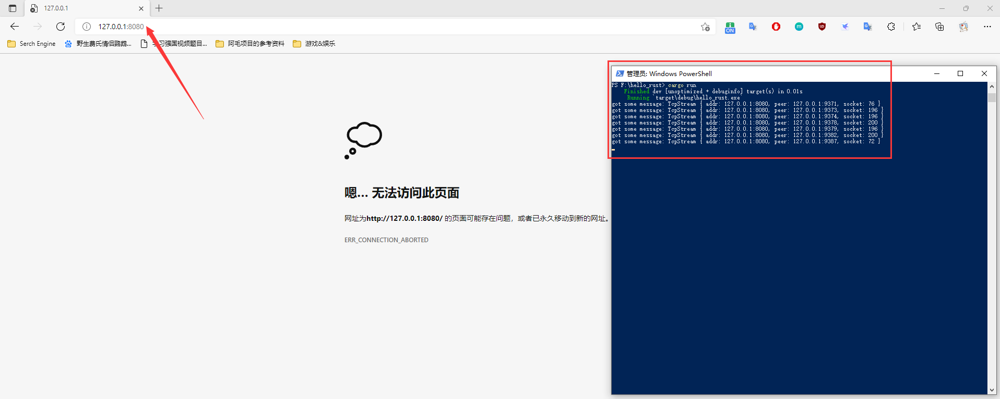
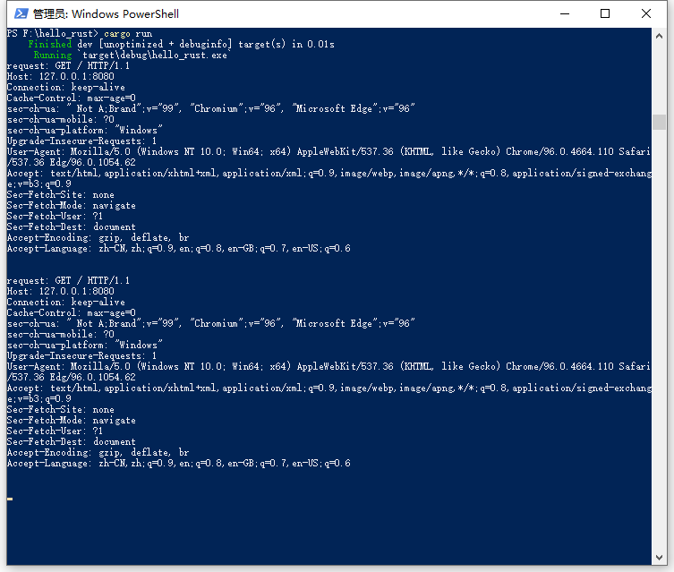
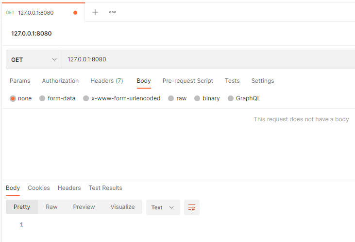
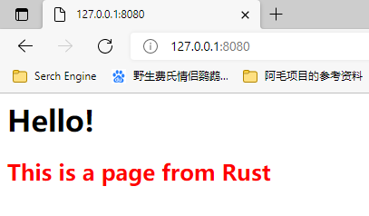
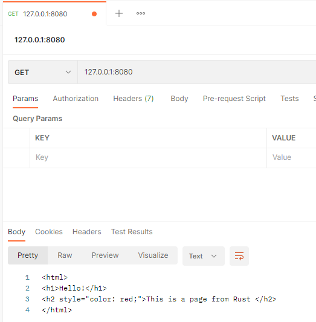
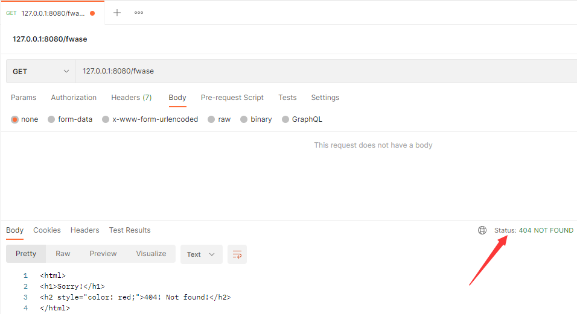
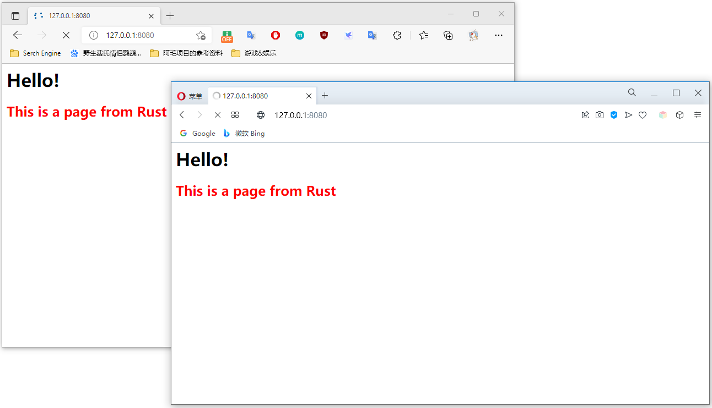
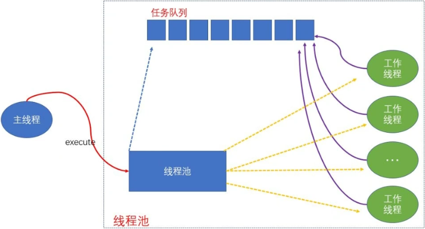
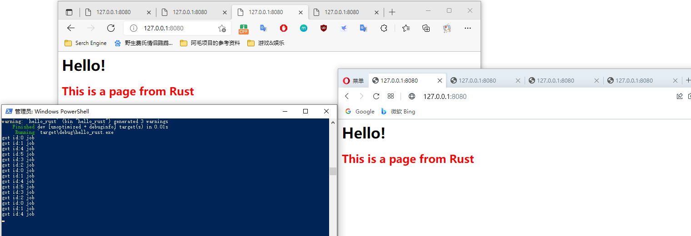
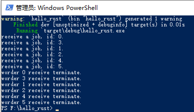

# webserver


## 简介

用到的标准库文档：https://doc.rust-lang.org/stable/std/net/index.html

B 站地址：https://www.bilibili.com/video/BV177411m784/


## P1 创建一个具有监听链接功能的 WebServer

使用到了 `std::net::TcpListener` 模块：https://doc.rust-lang.org/stable/std/net/struct.TcpListener.html


代码：

```rust
use std::net::{TcpListener, TcpStream};

fn handle_client(stream: TcpStream) {
    println!("got some message: {:?}", stream);
}

fn main() -> std::io::Result<()> {
    let listener = TcpListener::bind("127.0.0.1:8080")?;

    // accept connections and process them serially
    // 接受连接并串行处理它们
    for stream in listener.incoming() {
        handle_client(stream?);
    }
    Ok(())
}
```


运行后，在浏览器地址栏中输入 http://127.0.0.1:8080/ 即可看到服务端已经收到了请求。只是现阶段的服务端没有做任何事情，也没有返回。




## P2 读取请求的内容

读取请求中的内容。


代码：

```rust
use std::{
    io::Read,
    net::{TcpListener, TcpStream},
};

fn handle_client(mut stream: TcpStream) {
    // 读取时可能会改变 stream，因此也需要是可变的
    let mut buffer = [0; 1024]; // 如果数组长度不够，请求内容就无法全部读取完整，会被截断
    stream.read(&mut buffer).unwrap(); // 从 stream 中读取内容

    println!("request: {}", String::from_utf8_lossy(&buffer));
}

fn main() -> std::io::Result<()> {
    let listener = TcpListener::bind("127.0.0.1:8080")?;

    // 接受连接并串行处理它们
    for stream in listener.incoming() {
        handle_client(stream?);
    }
    Ok(())
}
```


运行结果：




## P3 返回网页

### HTTP 简介

1.  HTTP 请求报文包含三个部分内容：请求行、请求头、请求体。

    Method Request-URI HTTP-Version CRLF：请求行。请求方式、协议版本等。

    headers CRLF：请求头。包含若干个属性，格式为“属性名 : 属性值”，服务端根据请求头获取客户端信息。

    message-body：请求体。客户端真正传送给服务端的内容。

2.  HTTP 响应报文也包含三个部分内容：响应行、响应头、响应体。

    HTTP-Version Status-Code Reason-Phrase CRLF：响应行。报文协议及版本，状态码及状态描述。

    headers CRLF：响应头。有多个属性组成。

    message-body：响应体。真正响应的内容。


### 1. 返回一个响应行

代码：

```rust
use std::{
    io::{Read, Write},
    net::{TcpListener, TcpStream},
};

fn handle_client(mut stream: TcpStream) {
    // 2. 读取请求内容
    let mut buffer = [0; 1024]; // 如果数组长度不够，请求内容就无法全部读取完整，会被截断
    stream.read(&mut buffer).unwrap(); // 从 stream 中读取内容

    // println!("request: {}", String::from_utf8_lossy(&buffer));

    // 3. 编写响应
    // 3.1 返回一个响应行
    let response = "HTTP/1.1 200 OK\r\n\r\n"; // HTTP 响应行的格式
    stream.write(response.as_bytes()).unwrap();
    stream.flush().unwrap(); // 注意不要忘记冲刷
}

fn main() -> std::io::Result<()> {
    // 1. 建立 TcpListener
    let listener = TcpListener::bind("127.0.0.1:8080")?;

    // 接受连接并串行处理它们
    for stream in listener.incoming() {
        handle_client(stream?);
    }
    Ok(())
}
```


运行结果：




### 2. 返回一个网页

在项目根目录中，创建一个 `index.html` 文件，键入代码：

```html
<html>
<h1>Hello!</h1>
<h2 style="color: red;">This is a page from Rust </h2>
</html>
```


修改 `src/main.rs` - `handle_client` 函数中的代码，最终代码如下：

```rust
use std::{
    fs,
    io::{Read, Write},
    net::{TcpListener, TcpStream},
};

fn handle_client(mut stream: TcpStream) {
    // 2. 读取请求内容
    let mut buffer = [0; 1024]; // 如果数组长度不够，请求内容就无法全部读取完整，会被截断
    stream.read(&mut buffer).unwrap(); // 从 stream 中读取内容

    // println!("request: {}", String::from_utf8_lossy(&buffer));

    // 3. 编写响应
    // 3.1 返回一个响应行
    // let response = "HTTP/1.1 200 OK\r\n\r\n"; // HTTP 响应行的格式
    // stream.write(response.as_bytes()).unwrap();
    // stream.flush().unwrap(); // 注意不要忘记冲刷

    // 3.2 返回一个真正的网页
    let content = fs::read_to_string("./index.html").unwrap(); // 使用 cargo run 命令，主文件是 Cargo.toml，所有查找规则以该文件为根目录
    let response = format!("HTTP/1.1 200 OK\r\n\r\n{}", content); // 将响应体拼接到响应行之后
    stream.write(response.as_bytes()).unwrap();
    stream.flush().unwrap(); // 冲刷到客户端

    // 3.3 有条件的返回网页（正常情况下返回正常的网页，有时候返回 404）
}

fn main() -> std::io::Result<()> {
    // 1. 建立 TcpListener
    let listener = TcpListener::bind("127.0.0.1:8080")?;

    // 接受连接并串行处理它们
    for stream in listener.incoming() {
        handle_client(stream?);
    }
    Ok(())
}
```


运行结果：




## P4 有条件的返回网页

### 根据条件返回指定网页

情况 A 的时候返回 `index.html` 页面，其他情况返回 `404.html` 页面。

代码：

```rust
use std::{
    fs,
    io::{Read, Write},
    net::{TcpListener, TcpStream},
};

fn handle_client(mut stream: TcpStream) {
    // 2. 读取请求内容
    let mut buffer = [0; 1024]; // 如果数组长度不够，请求内容就无法全部读取完整，会被截断
    stream.read(&mut buffer).unwrap(); // 从 stream 中读取内容

    // 打印得到的请求信息
    // println!("request: {}", String::from_utf8_lossy(&buffer));

    // 3. 编写响应
    // 3.1 返回一个响应行
    // let response = "HTTP/1.1 200 OK\r\n\r\n"; // HTTP 响应行的格式
    // stream.write(response.as_bytes()).unwrap();
    // stream.flush().unwrap(); // 注意不要忘记冲刷

    // 3.2 返回一个真正的网页
    // let content = fs::read_to_string("./index.html").unwrap(); // 使用 cargo run 命令，主文件是 Cargo.toml，所有查找规则以该文件为根目录
    // let response = format!("HTTP/1.1 200 OK\r\n\r\n{}", content); // 将响应内容拼接到响应行之后
    // stream.write(response.as_bytes()).unwrap();
    // stream.flush().unwrap(); // 冲刷到客户端

    // 3.3 有条件的返回网页（正常情况下返回正常的网页，有时候返回 404）
    let get = b"GET / HTTP/1.1"; // 按字节处理，类型转化
    if buffer.starts_with(get) {
        let content = fs::read_to_string("./index.html").unwrap();
        let response = format!("HTTP/1.1 200 OK\r\n\r\n{}", content);
        stream.write(response.as_bytes()).unwrap();
        stream.flush().unwrap();
    } else {
        let content = fs::read_to_string("./404.html").unwrap();
        let response = format!("HTTP/1.1 404 NOT FOUND\r\n\r\n{}", content);
        stream.write(response.as_bytes()).unwrap();
        stream.flush().unwrap();
    }
}

fn main() -> std::io::Result<()> {
    // 1. 建立链接并监听，使用的是 TcpListener
    let listener = TcpListener::bind("127.0.0.1:8080")?;

    // 接受连接并串行处理它们
    for stream in listener.incoming() {
        // incoming 读取内容
        handle_client(stream?);
    }
    Ok(())
}
```


运行结果：






### 简单的优化

将上部分代码中的 `if-else` 语句合并起来。读取文件内容以及内容拼接的操作是都会用到的，因此放到 `if` 语句块的外面。

简单优化后的代码：

```rust
use std::{
    fs,
    io::{Read, Write},
    net::{TcpListener, TcpStream},
};

fn handle_client(mut stream: TcpStream) {
    // 2. 读取请求内容
    let mut buffer = [0; 1024]; // 如果数组长度不够，请求内容就无法全部读取完整，会被截断
    stream.read(&mut buffer).unwrap(); // 从 stream 中读取内容

    // 3. 根据条件返回网页
    let get = b"GET / HTTP/1.1";
    let (status, filename) = if buffer.starts_with(get) {
        ("HTTP/1.1 200 OK\r\n\r\n", "./index.html")
    } else {
        ("HTTP/1.1 404 NOT FOUND\r\n\r\n", "./404.html")
    }; // 别忘了加分号，因为它是 let 语句

    let content = fs::read_to_string(filename).unwrap(); // 读取文件内容
    let response = format!("{}{}", status, content); // 拼接
    stream.write(response.as_bytes()).unwrap(); // 返回内容，实质上是写内容到客户端去
    stream.flush().unwrap();
}

fn main() -> std::io::Result<()> {
    // 1. 建立链接并监听，使用的是 TcpListener
    let listener = TcpListener::bind("127.0.0.1:8080")?;

    for stream in listener.incoming() {
        // incoming 读取内容
        handle_client(stream?);
    }
    Ok(())
}
```


运行结果一致：


## P5 编写多线程的 WebServer

请求只能串行处理，也就是说：当第一个连接处理完之前，不会处理第二个连接。如果连接太多，就会导致一直处于等待状态。

```rust
use std::{
    fs,
    io::{Read, Write},
    net::{TcpListener, TcpStream},
    time,
};

use std::thread;

fn handle_client(mut stream: TcpStream) {
    let mut buffer = [0; 1024];
    stream.read(&mut buffer).unwrap();

    let get = b"GET / HTTP/1.1";
    let (status, filename) = if buffer.starts_with(get) {
        ("HTTP/1.1 200 OK\r\n\r\n", "./index.html")
    } else {
        ("HTTP/1.1 404 NOT FOUND\r\n\r\n", "./404.html")
    }; // 别忘了加分号，因为它是 let 语句

    let content = fs::read_to_string(filename).unwrap();
    let response = format!("{}{}", status, content);
    stream.write(response.as_bytes()).unwrap();
    stream.flush().unwrap();

    // 睡眠 5 秒，模拟复杂处理时需要等待的时长
    thread::sleep(time::Duration::from_secs(5));
}

fn main() -> std::io::Result<()> {
    let listener = TcpListener::bind("127.0.0.1:8080")?;

    for stream in listener.incoming() {
        // 创建子线程
        thread::spawn(move || {
            handle_client(stream.unwrap());
        });
    }
    Ok(())
}
```


每过来一个请求，就用子线程去处理。运行结果中，虽然都还在转圈圈（还在处理中），但能显示内容了。




在主线程中，需要等待子线程。代码如下：

```rust
use std::{
    fs,
    io::{Read, Write},
    net::{TcpListener, TcpStream},
    time,
};

use std::thread;

fn handle_client(mut stream: TcpStream) {
    let mut buffer = [0; 1024];
    stream.read(&mut buffer).unwrap();

    let get = b"GET / HTTP/1.1";
    let (status, filename) = if buffer.starts_with(get) {
        ("HTTP/1.1 200 OK\r\n\r\n", "./index.html")
    } else {
        ("HTTP/1.1 404 NOT FOUND\r\n\r\n", "./404.html")
    }; // 别忘了加分号，因为它是 let 语句

    let content = fs::read_to_string(filename).unwrap();
    let response = format!("{}{}", status, content);
    stream.write(response.as_bytes()).unwrap();
    stream.flush().unwrap();

    // 睡眠 N 秒，模拟复杂处理时需要等待的时长
    thread::sleep(time::Duration::from_secs(10));
}

fn main() -> std::io::Result<()> {
    let listener = TcpListener::bind("127.0.0.1:8080")?;

    let mut thread_vec: Vec<thread::JoinHandle<()>> = Vec::new(); // 存放线程句柄的容器

    for stream in listener.incoming() {
        // 创建子线程
        let handle = thread::spawn(move || {
            handle_client(stream.unwrap());
        });

        thread_vec.push(handle); // 将线程放入容器
    }

    // 等待子线程完成
    for handle in thread_vec {
        handle.join().unwrap();
    }

    Ok(())
}
```


## P6 用线程池实现 WebServer

当存在海量请求时，系统也会跟着创建海量线程，造成资源浪费，最终系统崩溃。使用线程池来解决问题。


### 线程池



从主线程将任务发送到管道，工作线程等待在管道的接收端，当收到任务时，进行处理。


### 实现

```rust
use std::io::{Read, Write};
use std::net::{TcpListener, TcpStream};
use std::{fs, time};

// mpsc: 多个生产者，单个消费者
// Arc: 线程安全
// Mutex: 接收端是多个工作线程在等待
use std::sync::{mpsc, Arc, Mutex};

use std::thread;

// 工作线程
struct Worker {
    id: usize,                      // 线程编号
    thread: thread::JoinHandle<()>, // 句柄
}

impl Worker {
    // 把任务传给管道，工作线程才能在管道另一端接收任务
    fn new(id: usize, receiver: Arc<Mutex<mpsc::Receiver<Job>>>) -> Worker {
        let thread = thread::spawn(move || {
            // 循环等待任务处理
            loop {
                let job = receiver.lock().unwrap().recv().unwrap();
                println!("got id:{} job", id);
                job();
            }
        });

        Worker { id, thread }
    }
}

// 定义任务
type Job = Box<dyn FnOnce() + Send + 'static>;

// 线程池
struct ThreadPool {
    workers: Vec<Worker>,      // 存放线程句柄
    sender: mpsc::Sender<Job>, // 发送任务
}

impl ThreadPool {
    // 创建线程池
    fn new(size: usize) -> ThreadPool {
        assert!(size > 0); // 工作线程必须大于 0，否则没有工作线程是没有任何意义的

        // 工作线程的容器
        let mut workers: Vec<Worker> = Vec::with_capacity(size);

        // 创建管道
        let (sender, receiver) = mpsc::channel();
        let receiver = Arc::new(Mutex::new(receiver)); // 线程安全，包裹起来保护一下

        // 创建工作线程
        for i in 0..size {
            workers.push(Worker::new(i, Arc::clone(&receiver))); // 传递参数时也要包裹一下
        }

        ThreadPool { workers, sender }
    }

    // 处理任务的方法
    // 传递参数的是一个闭包，管道之间需要发送数据
    /* 当不知道怎么写函数的时候，可以去参考标准库中的写法
    // 以下是标准库中，thread::spawn 方法的定义
    pub fn spawn<F, T>(f: F) -> JoinHandle<T>
    	where
		    F: FnOnce() -> T,
		    F: Send + 'static,
		    T: Send + 'static,
     */
    // 示例是无返回值，因此不需要写 T
    fn execute<F>(&self, f: F)
    where
        F: FnOnce() + Send + 'static,
    {
        let job = Box::new(f);
        self.sender.send(job).unwrap();
    }
}

fn handle_client(mut stream: TcpStream) {
    let mut buffer = [0; 1024];
    stream.read(&mut buffer).unwrap();

    let get = b"GET / HTTP/1.1";
    let (status, filename) = if buffer.starts_with(get) {
        ("HTTP/1.1 200 OK\r\n\r\n", "./index.html")
    } else {
        ("HTTP/1.1 404 NOT FOUND\r\n\r\n", "./404.html")
    }; // 别忘了加分号，因为它是 let 语句

    let content = fs::read_to_string(filename).unwrap();
    let response = format!("{}{}", status, content);
    stream.write(response.as_bytes()).unwrap();
    stream.flush().unwrap();

    // 睡眠 N 秒，模拟复杂处理时需要等待的时长
    thread::sleep(time::Duration::from_secs(10));
}

fn main() -> std::io::Result<()> {
    let listener = TcpListener::bind("127.0.0.1:8080")?;
    let pool = ThreadPool::new(6); // 推荐有几个物理核，就创建多少个线程

    for stream in listener.incoming() {
        pool.execute(|| handle_client(stream.unwrap()));
    }

    // 等待子线程完成
    // for handle in thread_vec {
    //     handle.join().unwrap();
    // }
    // 线程池中的线程如何结束？

    Ok(())
}
```


运行结果：




## P7 实现线程池清除的 WebServer

为线程池增加结束机制。

```rust
use std::io::{Read, Write};
use std::net::{TcpListener, TcpStream};
// use std::sync::mpsc::Sender;
use std::{fs, time};

// mpsc: 多个生产者，单个消费者
// Arc: 线程安全
// Mutex: 接收端是多个工作线程在等待
use std::sync::{mpsc, Arc, Mutex};

use std::thread;

// 工作线程
struct Worker {
    id: usize,                              // 线程编号
    thread: Option<thread::JoinHandle<()>>, // 句柄
}

impl Worker {
    // 把任务传给管道，工作线程才能在管道另一端接收任务
    fn new(id: usize, receiver: Arc<Mutex<mpsc::Receiver<Message>>>) -> Worker {
        let thread = thread::spawn(move || {
            // 循环等待任务处理
            loop {
                // let job = receiver.lock().unwrap().recv().unwrap();
                // println!("got id:{} job", id);
                // job();
                let message = receiver.lock().unwrap().recv().unwrap();
                match message {
                    Message::NewJob(job) => {
                        println!("receive a job, id: {}.", id);
                        job();
                    }
                    Message::Terminate => {
                        println!("worder {} receive terminate.", id);
                        break;
                    }
                }
            }
        });

        Worker {
            id,
            thread: Some(thread),
        }
    }
}

// 定义任务
type Job = Box<dyn FnOnce() + Send + 'static>;
enum Message {
    NewJob(Job), // 发送具体的任务
    Terminate,   // 发送结束的消息
}

// 线程池
struct ThreadPool {
    workers: Vec<Worker>,          // 存放线程句柄
    sender: mpsc::Sender<Message>, // 发送任务
}

impl ThreadPool {
    // 创建线程池
    fn new(size: usize) -> ThreadPool {
        assert!(size > 0); // 工作线程必须大于 0，否则没有工作线程是没有任何意义的

        // 工作线程的容器
        let mut workers: Vec<Worker> = Vec::with_capacity(size);

        // 创建管道
        let (sender, receiver) = mpsc::channel();
        let receiver = Arc::new(Mutex::new(receiver)); // 线程安全，包裹起来保护一下

        // 创建工作线程
        for i in 0..size {
            workers.push(Worker::new(i, Arc::clone(&receiver))); // 传递参数时也要包裹一下
        }

        ThreadPool { workers, sender }
    }

    // 处理任务的方法
    // 传递参数的是一个闭包，管道之间需要发送数据
    /* 当不知道怎么写函数的时候，可以去参考标准库中的写法
    // 以下是标准库中，thread::spawn 方法的定义
    pub fn spawn<F, T>(f: F) -> JoinHandle<T>
    	where
		    F: FnOnce() -> T,
		    F: Send + 'static,
		    T: Send + 'static,
     */
    // 示例是无返回值，因此不需要写 T
    fn execute<F>(&self, f: F)
    where
        F: FnOnce() + Send + 'static,
    {
        let job = Box::new(f);
        self.sender.send(Message::NewJob(job)).unwrap();
    }
}

impl Drop for ThreadPool {
    fn drop(&mut self) {
        // 发送结束消息给所有的工作线程
        for _ in &mut self.workers {
            self.sender.send(Message::Terminate).unwrap();
        }

        // 等待工作线程结束
        for worker in &mut self.workers {
            if let Some(thread) = worker.thread.take() {
                thread.join().unwrap();
            }
        }
    }
}

fn handle_client(mut stream: TcpStream) {
    let mut buffer = [0; 1024];
    stream.read(&mut buffer).unwrap();

    let get = b"GET / HTTP/1.1";
    let (status, filename) = if buffer.starts_with(get) {
        ("HTTP/1.1 200 OK\r\n\r\n", "./index.html")
    } else {
        ("HTTP/1.1 404 NOT FOUND\r\n\r\n", "./404.html")
    }; // 别忘了加分号，因为它是 let 语句

    let content = fs::read_to_string(filename).unwrap();
    let response = format!("{}{}", status, content);
    stream.write(response.as_bytes()).unwrap();
    stream.flush().unwrap();

    // 睡眠 N 秒，模拟复杂处理时需要等待的时长
    thread::sleep(time::Duration::from_secs(10));
}

fn main() -> std::io::Result<()> {
    let listener = TcpListener::bind("127.0.0.1:8080")?;
    let pool = ThreadPool::new(6); // 推荐有几个物理核，就创建多少个线程

    for stream in listener.incoming() {
        // 如果在 incoming() 方法后面接上 take(6) 方法，表示限制多少个线程后就结束，结束线程池中的线程以及整个程序
        // 当前情况下是无限等待连接
        pool.execute(|| handle_client(stream.unwrap()));
    }

    Ok(())
}
```


运行结果：

