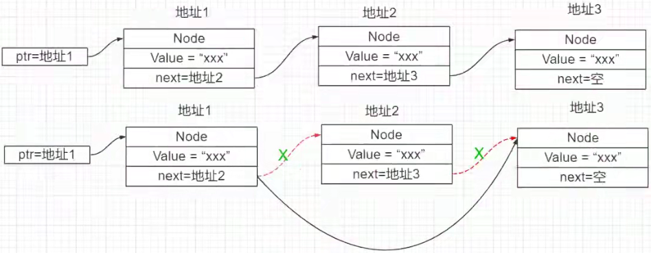
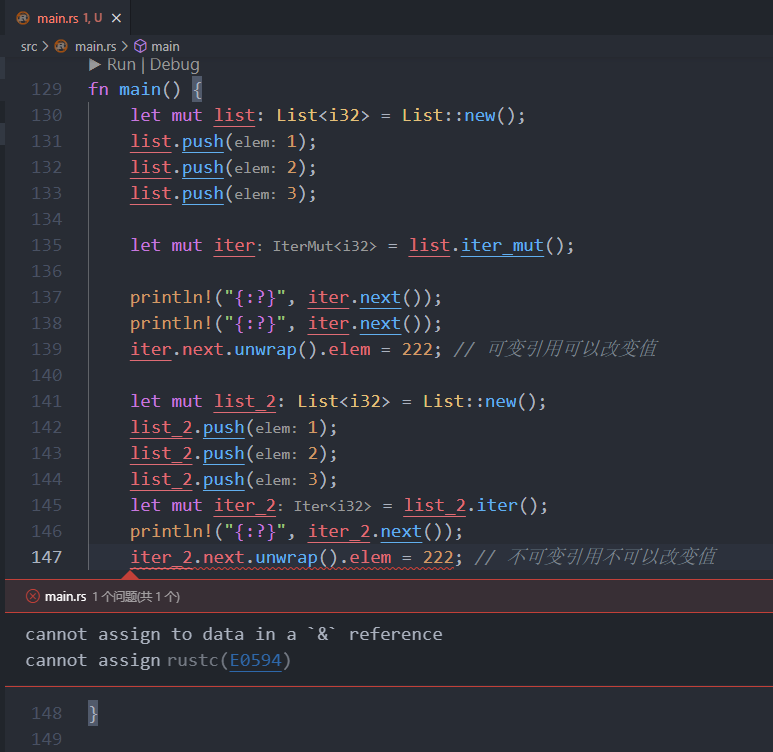
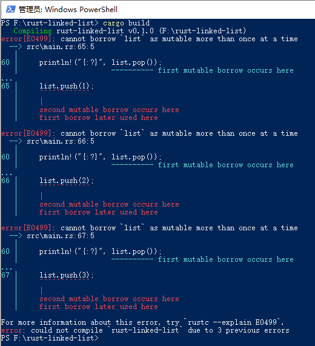

# 通过链表学习 RUST


## 简介

B 站地址：https://www.bilibili.com/video/BV1eb4y1Q7FA?spm_id_from=333.999.0.0

书本教程源地址：https://rust-unofficial.github.io/too-many-lists/index.html


## P1 通过链表学习 Rust

通过枚举类型，实现最基础的链表：

```rust
#[derive(Debug)]
enum List<T> {
    // 用 Cons 来表示 list
    Cons(T, Box<List<T>>), // Box 智能指针指向堆上的内存
    Nil,
}

fn main() {
    let list: List<i32> = List::Cons(1, Box::new(List::Cons(2, Box::new(List::Nil))));
    println!("{:?}", list);
}


/*
运行结果：

Cons(1, Cons(2, Nil))
*/
```

或者换成下面的等价写法：

```rust
#[derive(Debug)]
enum List {
    Elem(i32, Box<List>),
    Empty, // 表示 NULL
}

fn main() {
    let list = List::Elem(
        1,
        Box::new(List::Elem(
            2,
            Box::new(List::Elem(3, Box::new(List::Empty))),
        )),
    );
    println!("{:?}", list);
}


/*
运行结果：

Elem(1, Elem(2, Elem(3, Empty)))
*/
```


## P2 链表布局分析

### 第一种方式存在的问题

如果 `[]` 代表指向栈，`()` 代表指向堆。

代码：`List::Elem(1, Box::new(List::Elem(2, Box::new(List::Elem(3, Box::new(List::Empty))))));`

可以解释为：`[Elem A, ptr] -> (Elem B, ptr) -> (Elem C, ptr) -> (Empty, junk)`

第一个元素放在栈上，因为可以确定它的大小。但之后有多少数据无法得知，`Box<>` 智能指针指向堆上的内存，后面的数据都是放在堆上，因此都指向堆上。

但这样递归式的存储有两个问题：

1.  元素 A 是分配在栈上而不是分配在堆上。
2.  最后的空元素也要分配空间。


### 使用第二种方式

修改一下，使用第二种表达形式：

`[ptr] -> (Elem A, ptr) -> (Elem B, ptr) -> (Elem C, NULL)`

在栈上只存放一个指针，指向堆上的数据。看起来很像 C 语言定义存放链表的方式。


### 拆分链表时，第二种方式的优势

举个链表构造的例子：




现在有个需求：从一条链表中，提取出某个节点，成为另一条独立的链表。

按第一种方式，把 `[Elem A, ptr] -> (Elem B, ptr) -> (Elem C, ptr) -> (Empty, junk)` 这条链表中，`Elem C` 拆分出去，单独成为一条链表。

涉及的操作：

1.  把 `Elem C` 从堆上复制到栈上。
2.  在 `Elem C` 后面加上一个空元素。

伪代码：

```rust
[Elem A, ptr] -> (Elem B, ptr) -> (Empty, junk)
[Elem C, ptr] -> (Empty, junk)
```


对第二种方式的链表 `[ptr] -> (Elem A, ptr) -> (Elem B, ptr) -> (Elem C, NULL)`，进行拆分：

```
[ptr] -> (Elem A, ptr) -> (Elem B, NULL)
[ptr] -> (Elem C, NULL)
```

涉及的操作：

1.  创建一个指针，直接指向 `Elem C`，变成了一个新链表。
2.  让 `Elem B` 的指针指向 `NULL`。


整体看来，是第二种方式的布局更加清爽。


## P3 C 风格的链表布局

最基础的 C 风格链表：

```rust
#[derive(Debug)]
struct Node {
    elem: i32,
    next: List, // 充当指向下一个节点的指针
}

#[derive(Debug)]
enum List {
    Empty,
    More(Box<Node>),
}

fn main() {
    let node2 = Node {
        elem: 2,
        next: List::Empty,
    };
    let node1 = Node {
        elem: 1,
        next: List::More(Box::new(node2)),
    };

    let list = Box::new(node1);

    println!("{:?}", list);
}


/*
运行结果：

Node { elem: 1, next: More(Node { elem: 2, next: Empty }) }
*/
```


使用指针指向第一个元素的方式：

```rust
#[derive(Debug)]
struct Node {
    elem: i32,
    next: Link,
}

#[derive(Debug)]
enum Link {
    Empty,           // 后面没有元素了
    More(Box<Node>), // 后面还有其他元素
}

#[derive(Debug)]
struct List {
    head: Link,
}

fn main() {
    let node2 = Node {
        elem: 2,
        next: Link::Empty,
    };
    let node1 = Node {
        elem: 1,
        next: Link::More(Box::new(node2)),
    };

    let list = List {
        head: Link::More(Box::new(node1)),
    };

    println!("{:?}", list);
}


/*
运行结果：

List { head: More(Node { elem: 1, next: More(Node { elem: 2, next: Empty }) }) }
*/
```

运行结果中，`head` 指向第一个元素。


## P4 添加函数

添加 `push` 和 `pop` 函数：

````rust
use std::mem; // https://doc.rust-lang.org/stable/std/mem/fn.replace.html

#[derive(Debug)]
struct Node {
    elem: i32,
    next: Link,
}

#[derive(Debug)]
enum Link {
    Empty,           // 后面没有元素了
    More(Box<Node>), // 后面还有其他元素
}

#[derive(Debug)]
struct List {
    head: Link,
}

impl List {
    fn new() -> Self {
        List { head: Link::Empty } // 一开始没有元素
    }

    // 修改链表肯定是要可变引用
    fn push(&mut self, elem: i32) {
        // 创建一个节点
        let node = Box::new(Node {
            elem,
            next: mem::replace(&mut self.head, Link::Empty), // 指向之前的 head
        });

        self.head = Link::More(node);
    }

    // 也是在修改链表本身
    // pop 的时候，可能链表已经为空，没有元素了。Option<> 类型可以表示为 None
    fn pop(&mut self) -> Option<i32> {
        // 这里是 pop 队首的节点
        match mem::replace(&mut self.head, Link::Empty) {
            Link::Empty => None,
            Link::More(node) => {
                self.head = node.next;
                Some(node.elem)
            }
        }
    }
}

fn main() {}
````

编译一下，没有错误至少表明这两个函数的语法是没有问题了。


## P5 基本函数测试

```rust
use std::mem; // https://doc.rust-lang.org/stable/std/mem/fn.replace.html

#[derive(Debug)]
struct Node {
    elem: i32,
    next: Link,
}

#[derive(Debug)]
enum Link {
    Empty,           // 后面没有元素了
    More(Box<Node>), // 后面可能还有其他节点
}

// 定义链表
#[derive(Debug)]
struct List {
    head: Link,
}

impl List {
    fn new() -> Self {
        List { head: Link::Empty } // 一开始没有元素
    }

    // 修改链表肯定是要可变引用
    fn push(&mut self, elem: i32) {
        // 创建一个节点
        let node = Box::new(Node {
            elem,
            next: mem::replace(&mut self.head, Link::Empty), // 这里演示在头部添加
        });

        self.head = Link::More(node);
    }

    // 也是在修改链表本身
    // pop 的时候，可能链表已经为空，没有元素了。Option<> 类型可以表示为 None
    fn pop(&mut self) -> Option<i32> {
        // 这里是 pop 队首的节点
        match mem::replace(&mut self.head, Link::Empty) {
            Link::Empty => None,
            Link::More(node) => {
                self.head = node.next;
                Some(node.elem)
            }
        }
    }
}

fn main() {
    let mut list = List::new();
    assert_eq!(list.pop(), None);

    list.push(1);
    list.push(2);
    list.push(3); // 3 -> 2 -> 1 -> NULL

    println!("{:?}", list.pop());
    println!("{:?}", list.pop()); // 1 -> NULL

    list.push(4);
    list.push(5); // 5 -> 4 -> 1 -> NULL

    println!("{:?}", list.pop());
    println!("{:?}", list.pop());
    println!("{:?}", list.pop());
    println!("{:?}", list.pop());
}


/*
运行结果：

Some(3)
Some(2)
Some(5)
Some(4)
Some(1)
None
*/
```


## P6 实现 `Drop`

自动释放内存空间的处理会很糟糕。

假设有链表如下：

```
list -> A -> B -> C
```

当链表被自动释放时，它会尝试删除 `A`，再尝试删除 `B`，然后尝试删除 `C`。这是递归代码，如果节点非常多，递归代码会爆栈！

而且，释放后无法删除 `Box` 的内容，因此无法以尾递归的方式释放！我们不得不手动为 `List` 编写一个迭代 `drop`，将节点从它们的 `Box` 中提取出来。

```rust
// ... 其余代码同 P5 一样 ...

// 实现 Drop
impl Drop for List {
    fn drop(&mut self) {
        let mut link = mem::replace(&mut self.head, Link::Empty);
        // 循环地取节点，把所有节点取完就好
        // `while let` == "do this thing until this pattern doesn't match"
        // 做这件事直到这个模式不匹配
        while let Link::More(mut node) = link {
            link = mem::replace(&mut node.next, Link::Empty);
        }
    }
}

// ... 其余代码同 P5 一样 ...
```


## P7 使用 `Option`

使用 `Option` 来代替之前的枚举类型，因为 `Option` 类型中自带了 `None` 类型。

```rust
struct Node {
    elem: i32,
    next: Link, // 充当指向下一个节点的指针
}

struct List {
    head: Link,
}

// Option 类型来代替枚举类型
type Link = Option<Box<Node>>;

// 为链表实现方法
impl List {
    // 直接返回 List 自身的类型
    fn new() -> Self {
        List { head: None } // 创建一条空链表
    }

    fn push(&mut self, elem: i32) {
        let node = Box::new(Node {
            elem,
            next: self.head.take(), // 在头部插入。把之前的拿出来，放到当前节点的 next
        });

        self.head = Some(node);
    }

    // pop 时可能为空
    fn pop(&mut self) -> Option<i32> {
        match self.head.take() {
            Some(node) => {
                self.head = node.next; // 下一个节点赋值给当前节点，相当于直接覆盖，实现删除
                Some(node.elem)
            }
            None => None, // 链表为空了，直接返回 None
        }
    }
}

impl Drop for List {
    fn drop(&mut self) {
        let mut link = self.head.take(); // Option 类型可以直接使用 take() 从里面拿元素

        // 循环 take() 每个节点
        while let Some(mut node) = link {
            link = node.next.take();
        }
    }
}

fn main() {
    let mut list = List::new();
    println!("{:?}", list.pop());

    list.push(1);
    list.push(2);
    println!("{:?}", list.pop());
    println!("{:?}", list.pop());
    println!("{:?}", list.pop());
}


/*
运行结果：

None
Some(2)
Some(1)
None
*/
```


## P8 支持泛型

P7 的代码只能支持 `i32` 类型。现在改写代码，让一套代码，能够支持 `i32`、`f64`、`String` 类型。

```rust
struct Node<T> {
    elem: T,
    next: Link<T>,
}

// 支持泛型的链表
struct List<T> {
    head: Link<T>,
}

type Link<T> = Option<Box<Node<T>>>;

impl<T> List<T> {
    fn new() -> Self {
        List { head: None }
    }

    fn push(&mut self, elem: T) {
        // 用 Box<> 来装 Node
        let node = Box::new(Node {
            elem,
            next: self.head.take(), // 头部插入。把之前的节点拿出来
        });

        self.head = Some(node);
    }

    fn pop(&mut self) -> Option<T> {
        // 如果有节点，就用 map 适配器做进一步的处理
        self.head.take().map(|node| {
            self.head = node.next;
            node.elem
        })
    }
}

impl<T> Drop for List<T> {
    fn drop(&mut self) {
        let mut link = self.head.take();
        while let Some(mut node) = link {
            link = node.next.take();
        }

        /*
        while let 相当于 C 语言中：
        *ptr = node;
        ptr = node->next;
         */
    }
}

fn main() {
    let mut list: List<i32> = List::new(); // 显式指定类型
    println!("{:?}", list.pop());
    list.push(1);
    list.push(2);
    list.push(3);
    println!("{:?}", list.pop());
    println!("{:?}", list.pop());
    list.push(4);
    println!("{:?}", list.pop());
    println!("{:?}", list.pop());
    println!("{:?}", list.pop());

    println!();

    // 变量遮蔽
    let mut list = List::new();
    list.push(3.14); // 通过具体的值，让编译器自动推导类型。如果不给具体的值，编译通不过
    list.push(1.1);
    println!("{:?}", list.pop());
    println!("{:?}", list.pop());
    println!("{:?}", list.pop());

    println!();

    let mut list: List<String> = List::new();
    list.push(String::from("Hello")); // 注意：指定的是 String 类型，直接写双引号的话是 &str 引用类型，类型不匹配
    list.push(String::from("Rust"));
    list.push(String::from("!"));
    println!("{:?}", list.pop());
    println!("{:?}", list.pop());
    println!("{:?}", list.pop());
    println!("{:?}", list.pop());
}


/*
运行结果：

None
Some(3)
Some(2)
Some(4)
Some(1)
None

Some(1.1)
Some(3.14)
None

Some("!")
Some("Rust")
Some("Hello")
None
*/
```


## P9 实现 `Peek` 函数

获取链表中第一个节点的值（不删除节点）。

```rust
struct Node<T> {
    elem: T,
    next: Link<T>,
}

// 支持泛型的链表
struct List<T> {
    head: Link<T>,
}

type Link<T> = Option<Box<Node<T>>>;

impl<T> List<T> {
    fn new() -> Self {
        List { head: None }
    }

    fn push(&mut self, elem: T) {
        // 用 Box<> 来装 Node
        let node = Box::new(Node {
            elem,
            next: self.head.take(), // 头部插入。把之前的节点拿出来
        });

        self.head = Some(node);
    }

    fn pop(&mut self) -> Option<T> {
        // 如果有节点，就用 map 适配器做进一步的处理
        self.head.take().map(|node| {
            self.head = node.next;
            node.elem
        })
    }

    // peek 只是获取节点中的值，并不删除节点，因此不需要可变类型
    // 只是使用该节点中的值，并不是拿出来。因此返回值是引用类型
    fn peek(&self) -> Option<&T> {
        // 返回的是一个引用类型。map 中，node 的生命周期不够长。
        // node 是 head 中的内容，将 head 转换为对值的引用，&node.elem 即可与 &self 的生命周期一样长。
        self.head.as_ref().map(|node| &node.elem)

        // 在确保有节点的情况下，可以写成下面这行代码。如果没有节点，程序运行时就是报 panicked at 'called `Option::unwrap()` on a `None` value' 错误
        // Some(&self.head.as_ref().take().unwrap().elem)
    }

    // 可变查找
    fn peek_mut(&mut self) -> Option<&mut T> {
        Some(&mut self.head.as_mut().take().unwrap().elem)
    }
}

impl<T> Drop for List<T> {
    fn drop(&mut self) {
        let mut link = self.head.take();
        while let Some(mut node) = link {
            link = node.next.take();
        }
    }
}

fn main() {
    let mut list: List<i32> = List::new(); // 显式指定类型
    list.push(1);
    list.push(2);
    println!("peek: {:?}", list.peek());

    // peek_mut 可以改变值
    list.peek_mut().map(|val| {
        *val = 100;
    });
    // *list.peek_mut().take().unwrap() = 100; // 修改具体的值，也就是在修改内容。在确保有节点的情况下，可以这样写
    println!("has changed the first node's value.");    

    println!("peek: {:?}", list.peek());
    println!("pop: {:?}", list.pop());
    println!("pop: {:?}", list.pop());
}


/*
运行结果：

peek: Some(2)
has changed the first node's value.
peek: Some(100)
pop: Some(100)
pop: Some(1)
*/
```


## P10 `IntoIter`

实现迭代器主要是实现 `Iter trait`。

```rust
trait Iterator {
    type Item;
    fn next(&mut self) -> Option<Self::Item>;
}
```


`IntoIter` 返回 `T` 类型，为链表实现迭代器：

```rust
struct Node<T> {
    elem: T,
    next: Link<T>,
}

// 支持泛型的链表
struct List<T> {
    head: Link<T>,
}

type Link<T> = Option<Box<Node<T>>>;

impl<T> List<T> {
    fn new() -> Self {
        List { head: None }
    }

    fn push(&mut self, elem: T) {
        // 用 Box<> 来装 Node
        let node = Box::new(Node {
            elem,
            next: self.head.take(), // 头部插入。把之前的节点拿出来
        });

        self.head = Some(node);
    }

    fn pop(&mut self) -> Option<T> {
        // 如果有节点，就用 map 适配器做进一步的处理
        self.head.take().map(|node| {
            self.head = node.next;
            node.elem
        })
    }

    fn peek(&self) -> Option<&T> {
        self.head.as_ref().map(|node| &node.elem)
    }

    // 可变查找
    fn peek_mut(&mut self) -> Option<&mut T> {
        Some(&mut self.head.as_mut().take().unwrap().elem)
    }
}

impl<T> Drop for List<T> {
    fn drop(&mut self) {
        let mut link = self.head.take();
        while let Some(mut node) = link {
            link = node.next.take();
        }
    }
}

// 实现 IntoIter
struct IntoIter<T>(List<T>);

impl<T> List<T> {
    // 将链表转换为 IntoIter，对链表不做任何改变，不需要 mutable
    fn into_iter(self) -> IntoIter<T> {
        IntoIter(self)
    }
}

// 为 IntoIter 类型实现 Iterator 特性
impl<T> Iterator for IntoIter<T> {
    type Item = T;

    // pop 出来就会改变链表，需要是可变引用
    fn next(&mut self) -> Option<Self::Item> {
        self.0.pop()
    }
}

fn main() {
    let mut list: List<i32> = List::new(); // 显式指定类型
    list.push(1);
    list.push(2);
    list.push(3);

    let mut iter = list.into_iter(); // 将链表转换为迭代器

    // 使用迭代器
    println!("{:?}", iter.next());
    println!("{:?}", iter.next());
    println!("{:?}", iter.next());
    println!("{:?}", iter.next());
}


/*
运行结果：

Some(3)
Some(2)
Some(1)
None
*/
```


## P11 `Iter`

```rust
struct Node<T> {
    elem: T,
    next: Link<T>,
}

// 支持泛型的链表
struct List<T> {
    head: Link<T>,
}

type Link<T> = Option<Box<Node<T>>>;

impl<T> List<T> {
    fn new() -> Self {
        List { head: None }
    }

    fn push(&mut self, elem: T) {
        // 用 Box<> 来装 Node
        let node = Box::new(Node {
            elem,
            next: self.head.take(), // 头部插入。把之前的节点拿出来
        });

        self.head = Some(node);
    }

    fn pop(&mut self) -> Option<T> {
        // 如果有节点，就用 map 适配器做进一步的处理
        self.head.take().map(|node| {
            self.head = node.next;
            node.elem
        })
    }

    fn peek(&self) -> Option<&T> {
        self.head.as_ref().map(|node| &node.elem)
    }

    // 可变查找
    fn peek_mut(&mut self) -> Option<&mut T> {
        Some(&mut self.head.as_mut().take().unwrap().elem)
    }
}

impl<T> Drop for List<T> {
    fn drop(&mut self) {
        let mut link = self.head.take();
        while let Some(mut node) = link {
            link = node.next.take();
        }
    }
}

// 实现 IntoIter
struct IntoIter<T>(List<T>);

impl<T> List<T> {
    fn into_iter(self) -> IntoIter<T> {
        IntoIter(self)
    }
}

impl<T> Iterator for IntoIter<T> {
    type Item = T;

    fn next(&mut self) -> Option<Self::Item> {
        self.0.pop()
    }
}

// 实现 Iter
// Iter 返回 &T 类型，引用类型需要显式修饰生命周期
struct Iter<'a, T> {
    next: Option<&'a Node<T>>,
}

// List 转换为 Iter 类型
impl<T> List<T> {
    // Iter 返回 &T 类型，所以需要引用类型
    // 该函数是一个方法，符合生命周期省略规则中的第三条，因此无需显式修饰生命周期
    fn iter(&self) -> Iter<T> {
        // https://doc.rust-lang.org/stable/std/option/enum.Option.html#method.as_deref
        Iter {
            next: self.head.as_deref(), // Iter 结构体中 next 字段的类型是 Option 包裹的引用类型。使用该方法可以将源类型转换为  Option<&'a Node<T>> 类型
        }
    }
}

impl<'a, T> Iterator for Iter<'a, T> {
    type Item = &'a T; // 是引用类型

    fn next(&mut self) -> Option<Self::Item> {
        self.next.map(|node| {
            self.next = node.next.as_deref();
            &node.elem // 返回当前节点值的引用
        })
    }
}

fn main() {
    let mut list: List<i32> = List::new();
    list.push(1);
    list.push(2);
    list.push(3);

    let mut iter = list.iter();

    // 使用迭代器
    println!("{:?}", iter.next()); // 返回的是值的不可变引用
    println!("{:?}", iter.next());
    println!("{:?}", iter.next());
    println!("{:?}", iter.next());
}


/*
运行结果：

Some(3)
Some(2)
Some(1)
None
*/
```


## P12 `IterMut`

```rust
struct Node<T> {
    elem: T,
    next: Link<T>,
}

// 支持泛型的链表
struct List<T> {
    head: Link<T>,
}

type Link<T> = Option<Box<Node<T>>>;

impl<T> List<T> {
    fn new() -> Self {
        List { head: None }
    }

    fn push(&mut self, elem: T) {
        // 用 Box<> 来装 Node
        let node = Box::new(Node {
            elem,
            next: self.head.take(), // 头部插入。把之前的节点拿出来
        });

        self.head = Some(node);
    }

    fn pop(&mut self) -> Option<T> {
        // 如果有节点，就用 map 适配器做进一步的处理
        self.head.take().map(|node| {
            self.head = node.next;
            node.elem
        })
    }

    fn peek(&self) -> Option<&T> {
        self.head.as_ref().map(|node| &node.elem)
    }

    // 可变查找
    fn peek_mut(&mut self) -> Option<&mut T> {
        Some(&mut self.head.as_mut().take().unwrap().elem)
    }
}

impl<T> Drop for List<T> {
    fn drop(&mut self) {
        let mut link = self.head.take();
        while let Some(mut node) = link {
            link = node.next.take();
        }
    }
}

// 实现 IntoIter。返回 T 类型
struct IntoIter<T>(List<T>); // 直接放链表本身

impl<T> List<T> {
    fn into_iter(self) -> IntoIter<T> {
        IntoIter(self)
    }
}

impl<T> Iterator for IntoIter<T> {
    type Item = T;

    fn next(&mut self) -> Option<Self::Item> {
        self.0.pop()
    }
}

// 实现 Iter
// Iter 返回 &T 类型，引用类型需要显式修饰生命周期
struct Iter<'a, T> {
    next: Option<&'a Node<T>>,
}

// List 转换为 Iter 类型
impl<T> List<T> {
    // Iter 返回 &T 类型，所以需要引用类型
    // 该函数是一个方法，符合生命周期省略规则中的第三条，因此无需显式修饰生命周期
    fn iter(&self) -> Iter<T> {
        // https://doc.rust-lang.org/stable/std/option/enum.Option.html#method.as_deref
        Iter {
            next: self.head.as_deref(), // Iter 结构体中 next 字段的类型是 Option 包裹的引用类型。使用该方法可以将源类型转换为  Option<&'a Node<T>> 类型
        }
    }
}

impl<'a, T> Iterator for Iter<'a, T> {
    type Item = &'a T; // 是引用类型

    fn next(&mut self) -> Option<Self::Item> {
        self.next.map(|node| {
            self.next = node.next.as_deref();
            &node.elem // 返回当前节点值的引用
        })
    }
}

// 实现 IterMut
// 可变引用注意需要显式修饰生命周期
struct IterMut<'a, T> {
    next: Option<&'a mut Node<T>>,
}

// 从 List 转换为 IterMut
impl<T> List<T> {
    fn iter_mut(&mut self) -> IterMut<T> {
        // 官方文档 https://doc.rust-lang.org/stable/std/option/enum.Option.html#method.as_deref_mut 中对 as_deref_mut() 方法的描述：
        // pub fn as_deref_mut(&mut self) -> Option<&mut <T as Deref>::Target>
        IterMut {
            next: self.head.as_deref_mut(),
        }
    }
}

impl<'a, T> Iterator for IterMut<'a, T> {
    type Item = &'a mut T;

    fn next(&mut self) -> Option<Self::Item> {
        self.next.take().map(|node| {
            self.next = node.next.as_deref_mut();
            &mut node.elem
        })
    }
}

fn main() {
    let mut list: List<i32> = List::new();
    list.push(1);
    list.push(2);
    list.push(3);

    let mut iter = list.iter_mut();

    println!("{:?}", iter.next());
    println!("{:?}", iter.next());
    // println!("{:?}", iter.next()); // 不要将节点取完，否则下一行代码取到的就会是 None 类型，None 类型不能赋值
    iter.next.unwrap().elem = 222; // 可变引用可以改变值
}
```

为了演示本节可变引用与 P11 不可变引用的区别，在上段代码的 `main()` 函数中加入以下代码：

```rust
fn main() {
    // ... 其余代码同上相同 ...
    
	let mut list_2: List<i32> = List::new();
	list_2.push(1);
	list_2.push(2);
    list_2.push(3);
    let mut iter_2 = list_2.iter(); // &T 类型
    println!("{:?}", iter_2.next());

    // 下行代码会报错
    iter_2.next.unwrap().elem = 222; // 不可变引用不可以改变值
}
```

IDE 已提示错误：




## P13 共享链表的布局

共享链表的结构：

```
list1 -> A ---+
              |
              v
list2 ------> B -> C -> D
              ^
              |
list3 -> X ---+
```

节点 `A` 和节点 `X` 都指向了 `B` 节点。也就是：

```
list1: (A, list2)
list2: (B, C, D)
list3: (X, list2)
```

节点 `B` 的所有权是共享的。

采用之前几节定义链表的方式显然不行，需要用到计数引用的智能指针 `std::rc::Rc`。


共享节点的定义代码：

```rust
use std::rc::Rc;

struct Node<T> {
    elem: T,
    next: Link<T>, // 指向后面的链表
}

type Link<T> = Option<Rc<Node<T>>>; // 为了要共享节点 B

struct List<T> {
    head: Link<T>,
}

fn main() {}
```

与之前章节的区别在于 `type Link<T> = Option<Rc<Node<T>>>;` 这行代码。这里 `Option` 包裹的是 `Rc` 引用计数智能指针，而之前是 `Box` 独占所有权的智能指针。


## P14 共享链表的基础函数1

```rust
use std::rc::Rc;

struct Node<T> {
    elem: T,
    next: Link<T>, // 指向后面的链表
}

type Link<T> = Option<Rc<Node<T>>>; // 为了要共享节点 B

struct List<T> {
    head: Link<T>,
}

impl<T> List<T> {
    fn new() -> Self {
        List { head: None }
    }

    fn append(&mut self, elem: T) -> List<T> {
        List {
            head: Some(Rc::new(Node {
                elem,
                next: self.head.clone(),
            })),
        }
    }

    fn tail(&self) -> List<T> {
        List {
            head: self.head.as_ref().and_then(|node| node.next.clone()),
        }
    }
}

fn main() {}
```


## P15 共享链表的基础函数2

```rust
use std::rc::Rc;

struct Node<T> {
    elem: T,
    next: Link<T>, // 指向后面的链表
}

type Link<T> = Option<Rc<Node<T>>>; // 为了要共享节点 B

struct List<T> {
    head: Link<T>,
}

impl<T> List<T> {
    fn new() -> Self {
        List { head: None }
    }

    fn append(&mut self, elem: T) -> List<T> {
        List {
            head: Some(Rc::new(Node {
                elem,
                next: self.head.clone(),
            })),
        }
    }

    fn tail(&self) -> List<T> {
        List {
            head: self.head.as_ref().and_then(|node| node.next.clone()),
        }
    }

    // 返回头结点，值的引用
    fn head(&self) -> Option<&T> {
        self.head.as_deref().map(|node| &node.elem)
        // Some(&self.head.as_ref().unwrap().elem) // 在确保有节点的情况下，可以这样写
    }
}

fn main() {
    let mut list: List<i32> = List::new();
    println!("{:?}", list.head());

    list = list.append(1).append(2).append(3);
    println!("{:?}", list.head()); // 返回的是值的引用

    list = list.tail();
    println!("{:?}", list.head());

    list = list.tail().tail().tail();
    println!("{:?}", list.head());
}


/*
运行结果：

None
Some(3)
Some(2)
None
*/
```


## P16 共享链表的迭代器

共享链表的结构：

```
list1 -> A ---+
              |
              v
list2 ------> B -> C -> D
              ^
              |
list3 -> X ---+
```

节点 `B` 是被共享的，如果实现了 `IterMut` 就有可能将节点 `B` 删除，从而引发违背所有权原则的错误。


实现 `Iter` 的代码：

```rust
use std::rc::Rc;

struct Node<T> {
    elem: T,
    next: Link<T>, // 指向后面的链表
}

type Link<T> = Option<Rc<Node<T>>>; // 为了要共享节点 B

struct List<T> {
    head: Link<T>,
}

impl<T> List<T> {
    fn new() -> Self {
        List { head: None }
    }

    fn append(&mut self, elem: T) -> List<T> {
        List {
            head: Some(Rc::new(Node {
                elem,
                next: self.head.clone(),
            })),
        }
    }

    fn tail(&self) -> List<T> {
        List {
            head: self.head.as_ref().and_then(|node| node.next.clone()),
        }
    }

    // 返回头结点，值的引用
    fn head(&self) -> Option<&T> {
        self.head.as_deref().map(|node| &node.elem)
        // Some(&self.head.as_ref().unwrap().elem) // 在确保有节点的情况下，可以这样写
    }
}

// 实现 Iter
struct Iter<'a, T> {
    next: Option<&'a Node<T>>,
}

impl<T> List<T> {
    fn iter(&self) -> Iter<T> {
        // 返回的是 Iter 这个结构体类型
        Iter {
            next: self.head.as_deref(),
        }
    }
}

impl<'a, T> Iterator for Iter<'a, T> {
    // 迭代器 trait 的语法是语言规定好的。只需要给 type Item 赋值，以及往 next 方法中填代码即可。

    type Item = &'a T;

    fn next(&mut self) -> Option<Self::Item> {
        // Self::Item 就是上面赋给 type Item 的值的类型
        self.next.map(|node| {
            self.next = node.next.as_deref();
            &node.elem
        })
    }
}

fn main() {
    let list = List::new().append(1).append(2).append(3);
    let mut iter = list.iter();
    println!("{:?}", iter.next()); // 值的引用
    println!("{:?}", iter.next());
    println!("{:?}", iter.next());
    println!("{:?}", iter.next());
}


/*
运行结果：

Some(3)
Some(2)
Some(1)
None
*/
```


## P17 共享链表的 `Drop`

```rust
// ... 其余代码同 P16 一样 ...

// 实现 Drop trait
impl<T> Drop for List<T> {
    fn drop(&mut self) {
        let mut head = self.head.take();

        while let Some(node) = head {
            // 该链表为共享链表，必须确保当前节点没有其他节点引用，才能释放
            if let Ok(mut node) = Rc::try_unwrap(node) {
                head = node.next.take();
            } else {
                break;
            }
        }
    }
}

// ... 其余代码同 P16 一样 ...
```


## P18 线程安全

之前的 `Rc` 并不是原子的。如果开多线程，线程之间就会有安全问题。

需要使用 `Arc` 来解决线程安全的问题。


## P19 双链表定义

单链表的 `Box` 和 `Rc` 是只读的，智能指针变量是在栈上的，指向堆上的数据，但无法改变里面包含的内容。

双链表是需要改变 `next` 和 `prev`，因此需要用到 `RefCell`，被 `RefCell` 包裹的内容是可以修改的。


例如，原始的双链表 `A <--> B <--> C <--> D`。

现在，要在头部插入一个节点 `E`，步骤如下：

1.  创建新节点，节点的值是 `E` 提供的值，节点的 `next` 是 `head`（也就是 `A`），`prev` 是 `None`。
2.  `head`（也就是 `A`）的 `prev` 需要指向新节点。
3.  将新节点赋值给 `head`，将原来的 `head` 覆盖。


`Rc` 包裹的内容，是无法修改 `A` 的 `prev` 指向。但利用 `RefCell` 能够修改内容的特性，可以达到修改 `prev` 指向的目的。


定义双链表的结构：

```rust
use std::cell::RefCell;
use std::rc::Rc;

struct Node<T> {
    elem: T,
    next: Link<T>,
    prev: Link<T>,
}

type Link<T> = Option<Rc<RefCell<Node<T>>>>;

// 双链表即有头，也有尾
struct List<T> {
    head: Link<T>,
    tail: Link<T>,
}

fn main() {}
```


## P20 双链表添加元素

```rust
use std::cell::RefCell;
use std::rc::Rc;

struct Node<T> {
    elem: T,
    next: Link<T>,
    prev: Link<T>,
}

type Link<T> = Option<Rc<RefCell<Node<T>>>>;

// 双链表即有头，也有尾
struct List<T> {
    head: Link<T>,
    tail: Link<T>,
}

impl<T> Node<T> {
    // 双链表的节点需要使用 Rc<RefCell<>> 包裹起来
    fn new(elem: T) -> Rc<RefCell<Self>> {
        Rc::new(RefCell::new(Node {
            elem,
            next: None,
            prev: None,
        }))
    }
}

impl<T> List<T> {
    fn new() -> Self {
        List {
            head: None,
            tail: None,
        }
    }

    // 头部插入
    fn push_front(&mut self, elem: T) {
        let node = Node::new(elem);
        match self.head.take() {
            Some(head) => {
                head.borrow_mut().prev = Some(node.clone());
                node.borrow_mut().next = Some(head);
                self.head = Some(node);
            }

            None => {
                self.tail = Some(node.clone());
                self.head = Some(node);
            }
        }
    }
}

fn main() {}
```


## P21 双链表实现 `pop_front`

```rust
use std::cell::RefCell;
use std::rc::Rc;

struct Node<T> {
    elem: T,
    next: Link<T>,
    prev: Link<T>,
}

type Link<T> = Option<Rc<RefCell<Node<T>>>>;

// 双链表即有头，也有尾
struct List<T> {
    head: Link<T>,
    tail: Link<T>,
}

impl<T> Node<T> {
    // 双链表的节点需要使用 Rc<RefCell<>> 包裹起来
    fn new(elem: T) -> Rc<RefCell<Self>> {
        Rc::new(RefCell::new(Node {
            elem,
            next: None,
            prev: None,
        }))
    }
}

impl<T> List<T> {
    fn new() -> Self {
        List {
            head: None,
            tail: None,
        }
    }

    // 头部插入
    fn push_front(&mut self, elem: T) {
        let node = Node::new(elem);
        match self.head.take() {
            Some(head) => {
                head.borrow_mut().prev = Some(node.clone());
                node.borrow_mut().next = Some(head);
                self.head = Some(node);
            }

            None => {
                self.tail = Some(node.clone());
                self.head = Some(node);
            }
        }
    }

    fn pop_front(&mut self) -> Option<T> {
        self.head.take().map(|node| {
            match node.borrow_mut().next.take() {
                // 当前节点之后，还有下一个节点
                Some(next) => {
                    next.borrow_mut().prev.take();
                    self.head = Some(next);
                }

                // 没有后面的节点了
                None => {
                    self.tail.take();
                }
            }

            // 参考官方文档
            // Rc::try_unwrap(): https://doc.rust-lang.org/stable/std/rc/struct.Rc.html#method.try_unwrap
            // RefCell::into_inner(): https://doc.rust-lang.org/stable/std/cell/struct.RefCell.html#method.into_inner
            // Rc::try_unwrap(node) 返回类型为 Result<T, Rc<T>>
            // Result<T, Rc<T>> 类型中可以调用 ok() 方法来把内容取出来，取出来后的类型是 Rc<RefCell<Node<T>>>。如果没有任何内容，则返回 None
            // Rc<RefCell<Node<T>>> 调用 unwrap 取出 RefCell<Node<T>>
            // RefCell<Node<T>> 调用 into_inner() 方法才能得到最里面的 Node
            Rc::try_unwrap(node).ok().unwrap().into_inner().elem
        })
    }
}

fn main() {
    let mut list = List::new();
    println!("{:?}", list.pop_front());

    list.push_front(1);
    list.push_front(2);
    list.push_front(3);

    println!("{:?}", list.pop_front());
    println!("{:?}", list.pop_front());
    
    println!("----------------");

    list.push_front(4);
    list.push_front(5);

    println!("{:?}", list.pop_front());
    println!("{:?}", list.pop_front());
    println!("{:?}", list.pop_front());
    println!("{:?}", list.pop_front());
}


/*
运行结果：

None
Some(3)
Some(2)
----------------
Some(5)
Some(4)
Some(1)
None
*/
```


## P22 双链表 `peek`

```rust
use std::cell::{Ref, RefCell};
use std::rc::Rc;

struct Node<T> {
    elem: T,
    next: Link<T>,
    prev: Link<T>,
}

type Link<T> = Option<Rc<RefCell<Node<T>>>>;

// 双链表即有头，也有尾
struct List<T> {
    head: Link<T>,
    tail: Link<T>,
}

impl<T> Node<T> {
    // 双链表的节点需要使用 Rc<RefCell<>> 包裹起来
    fn new(elem: T) -> Rc<RefCell<Self>> {
        Rc::new(RefCell::new(Node {
            elem,
            next: None,
            prev: None,
        }))
    }
}

impl<T> List<T> {
    fn new() -> Self {
        List {
            head: None,
            tail: None,
        }
    }

    // 头部插入
    fn push_front(&mut self, elem: T) {
        let node = Node::new(elem);
        match self.head.take() {
            Some(head) => {
                head.borrow_mut().prev = Some(node.clone());
                node.borrow_mut().next = Some(head);
                self.head = Some(node);
            }

            None => {
                self.tail = Some(node.clone());
                self.head = Some(node);
            }
        }
    }

    fn pop_front(&mut self) -> Option<T> {
        self.head.take().map(|node| {
            match node.borrow_mut().next.take() {
                // 当前节点之后，还有下一个节点
                Some(next) => {
                    next.borrow_mut().prev.take();
                    self.head = Some(next);
                }

                // 没有后面的节点了
                None => {
                    self.tail.take();
                }
            }

            Rc::try_unwrap(node).ok().unwrap().into_inner().elem
        })
    }

    // 返回值的引用
    fn peek_front(&self) -> Option<Ref<T>> {
        // 返回引用类型，需要显式添加生命周期注解
        self.head
            .as_ref()
            .map(|node| Ref::map(node.borrow(), |node| &node.elem))
        // https://doc.rust-lang.org/stable/std/cell/struct.Ref.html#method.map
    }
}

fn main() {
    let mut list = List::new();
    println!("{:?}", list.peek_front());

    list.push_front(1);
    list.push_front(2);
    list.push_front(3);

    println!("{:?}", list.peek_front().unwrap()); // list.peek_front() 返回 Option<Ref<T>> 类型，需要再“解开”
}


/*
运行结果：

None
3
*/
```


## P23 双链表 `push_back`、`pop_back`、`peek_back`

```rust
use std::cell::Ref;
use std::cell::RefCell;
use std::cell::RefMut;
use std::rc::Rc;

pub struct List<T> {
    head: Link<T>,
    tail: Link<T>,
}

type Link<T> = Option<Rc<RefCell<Node<T>>>>;

struct Node<T> {
    elem: T,
    next: Link<T>,
    prev: Link<T>,
}

impl<T> Node<T> {
    fn new(elem: T) -> Rc<RefCell<Self>> {
        Rc::new(RefCell::new(Node {
            elem: elem,
            prev: None,
            next: None,
        }))
    }
}

impl<T> List<T> {
    fn new() -> Self {
        List {
            head: None,
            tail: None,
        }
    }

    fn push_front(&mut self, elem: T) {
        let node = Node::new(elem);
        match self.head.take() {
            Some(head) => {
                head.borrow_mut().prev = Some(node.clone());
                node.borrow_mut().next = Some(head);
                self.head = Some(node);
            }

            None => {
                self.tail = Some(node.clone());
                self.head = Some(node);
            }
        }
    }

    fn push_back(&mut self, elem: T) {
        let node = Node::new(elem);
        match self.tail.take() {
            Some(tail) => {
                tail.borrow_mut().next = Some(node.clone());
                node.borrow_mut().prev = Some(tail);
                self.tail = Some(node);
            }

            None => {
                self.head = Some(node.clone());
                self.tail = Some(node);
            }
        }
    }

    fn pop_front(&mut self) -> Option<T> {
        self.head.take().map(|node| {
            match node.borrow_mut().next.take() {
                Some(next) => {
                    next.borrow_mut().prev.take();
                    self.head = Some(next);
                }
                None => {
                    self.tail.take();
                }
            }

            Rc::try_unwrap(node).ok().unwrap().into_inner().elem
        })
    }

    fn pop_back(&mut self) -> Option<T> {
        // 用 match 还要额外对 None 进行处理，用 map 就不需要对 None 进行处理了
        self.tail.take().map(|node| {
            match node.borrow_mut().prev.take() {
                Some(prev) => {
                    prev.borrow_mut().next.take();
                    self.tail = Some(prev);
                }

                None => {
                    self.head.take();
                }
            }

            Rc::try_unwrap(node).ok().unwrap().into_inner().elem
        })
    }

    fn peek_front(&self) -> Option<Ref<T>> {
        self.head
            .as_ref()
            .map(|node| Ref::map(node.borrow(), |node| &node.elem))
    }

    fn peek_back(&self) -> Option<Ref<T>> {
        self.tail
            .as_ref()
            .map(|node| Ref::map(node.borrow(), |node| &node.elem))
    }

    fn peek_front_mut(&self) -> Option<RefMut<T>> {
        self.head
            .as_ref()
            .map(|node| RefMut::map(node.borrow_mut(), |node| &mut node.elem)) // 可变引用
    }

    fn peek_back_mut(&self) -> Option<RefMut<T>> {
        self.tail
            .as_ref()
            .map(|node| RefMut::map(node.borrow_mut(), |node| &mut node.elem))
    }
}

fn main() {}
```


## P24 迭代器

```rust
use std::cell::Ref;
use std::cell::RefCell;
use std::cell::RefMut;
use std::rc::Rc;

pub struct List<T> {
    head: Link<T>,
    tail: Link<T>,
}

type Link<T> = Option<Rc<RefCell<Node<T>>>>;

struct Node<T> {
    elem: T,
    next: Link<T>,
    prev: Link<T>,
}

impl<T> Node<T> {
    fn new(elem: T) -> Rc<RefCell<Self>> {
        Rc::new(RefCell::new(Node {
            elem: elem,
            prev: None,
            next: None,
        }))
    }
}

impl<T> List<T> {
    fn new() -> Self {
        List {
            head: None,
            tail: None,
        }
    }

    fn push_front(&mut self, elem: T) {
        let node = Node::new(elem);
        match self.head.take() {
            Some(head) => {
                head.borrow_mut().prev = Some(node.clone());
                node.borrow_mut().next = Some(head);
                self.head = Some(node);
            }

            None => {
                self.tail = Some(node.clone());
                self.head = Some(node);
            }
        }
    }

    fn push_back(&mut self, elem: T) {
        let node = Node::new(elem);
        match self.tail.take() {
            Some(tail) => {
                tail.borrow_mut().next = Some(node.clone());
                node.borrow_mut().prev = Some(tail);
                self.tail = Some(node);
            }

            None => {
                self.head = Some(node.clone());
                self.tail = Some(node);
            }
        }
    }

    fn pop_front(&mut self) -> Option<T> {
        self.head.take().map(|node| {
            match node.borrow_mut().next.take() {
                Some(next) => {
                    next.borrow_mut().prev.take();
                    self.head = Some(next);
                }
                None => {
                    self.tail.take();
                }
            }

            Rc::try_unwrap(node).ok().unwrap().into_inner().elem
        })
    }

    fn pop_back(&mut self) -> Option<T> {
        // 用 match 还要额外对 None 进行处理，用 map 就不需要对 None 进行处理了
        self.tail.take().map(|node| {
            match node.borrow_mut().prev.take() {
                Some(prev) => {
                    prev.borrow_mut().next.take();
                    self.tail = Some(prev);
                }

                None => {
                    self.head.take();
                }
            }

            Rc::try_unwrap(node).ok().unwrap().into_inner().elem
        })
    }

    fn peek_front(&self) -> Option<Ref<T>> {
        self.head
            .as_ref()
            .map(|node| Ref::map(node.borrow(), |node| &node.elem))
    }

    fn peek_back(&self) -> Option<Ref<T>> {
        self.tail
            .as_ref()
            .map(|node| Ref::map(node.borrow(), |node| &node.elem))
    }

    fn peek_front_mut(&self) -> Option<RefMut<T>> {
        self.head
            .as_ref()
            .map(|node| RefMut::map(node.borrow_mut(), |node| &mut node.elem)) // 可变引用
    }

    fn peek_back_mut(&self) -> Option<RefMut<T>> {
        self.tail
            .as_ref()
            .map(|node| RefMut::map(node.borrow_mut(), |node| &mut node.elem))
    }
}

// 实现 IntoIter
struct IntoIter<T>(List<T>); // 元祖结构体

// List 转换方法
impl<T> List<T> {
    fn into_iter(self) -> IntoIter<T> {
        IntoIter(self)
    }
}

impl<T> Iterator for IntoIter<T> {
    type Item = T;

    fn next(&mut self) -> Option<Self::Item> {
        self.0.pop_front() // 元祖的访问方式
    }
}

impl<T> DoubleEndedIterator for IntoIter<T> {
    fn next_back(&mut self) -> Option<Self::Item> {
        self.0.pop_back()
    }
}

fn main() {
    let mut list = List::new();
    list.push_front(1);
    list.push_front(2);
    list.push_front(3);

    let mut iter = list.into_iter();
    println!("{:?}", iter.next());
    println!("{:?}", iter.next_back());
    println!("{:?}", iter.next());
    println!("{:?}", iter.next_back());
    println!("{:?}", iter.next());
}


/*
运行结果：

Some(3)
Some(1)
Some(2)
None
None
*/
```


## P25 为什么要非安全编程实现链表

```rust
use std::borrow::BorrowMut;

struct Node<T> {
    elem: T,
    next: Link<T>,
}

type Link<T> = Option<Box<Node<T>>>;

struct List<'a, T> {
    head: Link<T>,
    tail: Option<&'a mut Node<T>>,
}

impl<'a, T> List<'a, T> {
    fn new() -> Self {
        List {
            head: None,
            tail: None,
        }
    }

    // 从 tail 位置插入
    fn push(&'a mut self, elem: T) {
        let new_tail = Box::new(Node { elem, next: None });

        let tail = match self.tail.take() {
            // 链表中已有节点
            Some(old_tail) => {
                old_tail.next = Some(new_tail);
                old_tail.next.as_deref_mut() // 把新的 tail 返回出去
            }

            // 链表中没有节点
            None => {
                self.head = Some(new_tail);
                self.head.as_deref_mut()
            }
        };

        self.tail = tail;
    }

    // 从头部 pop
    fn pop(&'a mut self) -> Option<T> {
        // 将 head.next 赋值给 self.head
        self.head.take().map(|node| {
            let head = *node;
            self.head = head.next;

            if self.head.is_none() {
                self.tail = None;
            }

            head.elem
        })
    }
}

fn main() {
    let mut list: List<i32> = List::new();
    println!("{:?}", list.pop());

    // 以下代码肯定会报错
    // List 的 tail 中有可变引用类型 Option<&'a mut Node<T>>
    // 这里的 list 也是可变的，push 的时候又指向了可变引用。Rust 规定有可变引用之后，不能再引用，更不能再可变引用
    list.push(1);
    list.push(2);
    list.push(3);
}
```

无法通过编译，报错信息如下：（报错原因已在上段代码 `main` 函数的注释部分写出）



这是 Rust 为了安全编程而设计的规则。如果想要实现该设计思路的链表，就要使用非安全编程。

注：教程并不是鼓励非安全编程，只是在介绍 Rust 提供了这样的特性，以及如何使用这个特性。


## P26 非安全实现链表

```rust
use std::ptr;

struct Node<T> {
    elem: T,
    next: Link<T>,
}

type Link<T> = Option<Box<Node<T>>>;

struct List<T> {
    head: Link<T>,
    tail: *mut Node<T>, // 想要改变 tail 所指向的 Node。该字段为指针类型
}

impl<T> List<T> {
    fn new() -> Self {
        List {
            head: None,            // 全编程的只能指针
            tail: ptr::null_mut(), // 非安全编程的原始指针
        }
    }

    // 尾部添加
    fn push(&mut self, elem: T) {
        // 后面需要转换为原始指针，所以需要可变类型
        let mut new_tail = Box::new(Node { elem, next: None });

        // 原始的指针
        let raw_tail: *mut _ = &mut *new_tail; // 需要注明指针的类型，但这里元素的类型是泛型，所以不关心具体的类型，用下划线来省略

        if !self.tail.is_null() {
            // 有元素

            // 对原始指针的解引用操作涉及非安全编程，需要使用 unsafe 块包裹起来
            unsafe {
                (*self.tail).next = Some(new_tail);
            }
        } else {
            self.head = Some(new_tail);
        }

        self.tail = raw_tail;
    }

    fn pop(&mut self) -> Option<T> {
        // 从头部取出节点
        self.head.take().map(|node| {
            let head = *node;
            self.head = head.next;

            if self.head.is_none() {
                self.tail = ptr::null_mut();
            }

            head.elem
        })
    }
}

fn main() {
    let mut list = List::new();
    println!("{:?}", list.pop());
    list.push(1);
    list.push(2);
    list.push(3);

    println!("{:?}", list.pop());
    println!("{:?}", list.pop());
    println!("{:?}", list.pop());
    println!("{:?}", list.pop());
}


/*
运行结果：

None
Some(1)
Some(2)
Some(3)
None
*/
```

注：教程并不是鼓励非安全编程，只是在介绍 Rust 提供了这样的特性，以及如何使用这个特性。


## P27 非安全实现链表之迭代器

```rust
use std::ptr;

struct Node<T> {
    elem: T,
    next: Link<T>,
}

type Link<T> = Option<Box<Node<T>>>;

struct List<T> {
    head: Link<T>,
    tail: *mut Node<T>, // 想要改变 tail 所指向的 Node。该字段为指针类型
}

impl<T> List<T> {
    fn new() -> Self {
        List {
            head: None,            // 全编程的只能指针
            tail: ptr::null_mut(), // 非安全编程的原始指针
        }
    }

    // 尾部添加
    fn push(&mut self, elem: T) {
        // 后面需要转换为原始指针，所以需要可变类型
        let mut new_tail = Box::new(Node { elem, next: None });

        // 原始的指针
        let raw_tail: *mut _ = &mut *new_tail; // 需要注明指针的类型，但这里元素的类型是泛型，所以不关心具体的类型，用下划线来省略

        if !self.tail.is_null() {
            // 有元素

            // 对原始指针的解引用操作涉及非安全编程，需要使用 unsafe 块包裹起来
            unsafe {
                (*self.tail).next = Some(new_tail);
            }
        } else {
            self.head = Some(new_tail);
        }

        self.tail = raw_tail;
    }

    fn pop(&mut self) -> Option<T> {
        // 从头部取出节点
        self.head.take().map(|node| {
            let head = *node;
            self.head = head.next;

            if self.head.is_none() {
                self.tail = ptr::null_mut();
            }

            head.elem
        })
    }
}

// 实现 IntoIter
struct IntoIter<T>(List<T>);

// List 转换为 IntoIter
impl<T> List<T> {
    fn into_iter(self) -> IntoIter<T> {
        IntoIter(self)
    }
}

impl<T> Iterator for IntoIter<T> {
    type Item = T;

    // 迭代到没有元素了，就会返回 None
    fn next(&mut self) -> Option<Self::Item> {
        self.0.pop()
    }
}

// 实现 Iter
// 引用就需要显式声明生命周期注解
struct Iter<'a, T> {
    next: Option<&'a Node<T>>,
}

impl<T> List<T> {
    fn iter(&self) -> Iter<T> {
        Iter {
            next: self.head.as_deref(),
        }
    }
}

impl<'a, T> Iterator for Iter<'a, T> {
    type Item = &'a T;

    fn next(&mut self) -> Option<Self::Item> {
        self.next.map(|node| {
            self.next = node.next.as_deref();
            &node.elem
        })
    }
}

// 实现 IterMut
// 引用类型就需要显式声明生命周期注解
struct IterMut<'a, T> {
    next: Option<&'a mut Node<T>>,
}

impl<T> List<T> {
    fn iter_mut(&mut self) -> IterMut<T> {
        IterMut {
            next: self.head.as_deref_mut(),
        }
    }
}

impl<'a, T> Iterator for IterMut<'a, T> {
    type Item = &'a mut T;

    fn next(&mut self) -> Option<Self::Item> {
        // 要改变它了，就需要 take 拿出来
        self.next.take().map(|node| {
            self.next = node.next.as_deref_mut();
            &mut node.elem
        })
    }
}

fn main() {
    let mut list = List::new();
    list.push(1);
    list.push(2);
    list.push(3);

    let mut into_iter = list.into_iter();
    println!("{:?}", into_iter.next());
    println!("{:?}", into_iter.next());
    println!("{:?}", into_iter.next());
    println!("{:?}", into_iter.next());

    println!("----------------");

    let mut list = List::new();
    list.push(1);
    list.push(2);
    list.push(3);

    let mut iter = list.iter();
    println!("{:?}", iter.next());
    println!("{:?}", iter.next());
    println!("{:?}", iter.next());
    println!("{:?}", iter.next());

    println!("----------------");

    let mut list = List::new();
    list.push(1);
    list.push(2);
    list.push(3);

    let mut iter_mut = list.iter_mut();
    println!("{:?}", iter_mut.next());
    println!("{:?}", iter_mut.next());
    println!("{:?}", iter_mut.next());
    println!("{:?}", iter_mut.next());
}


/*
运行结果：

Some(1)
Some(2)
Some(3)
None
----------------
Some(1)
Some(2)
Some(3)
None
----------------
Some(1)
Some(2)
Some(3)
None
*/
```

注：教程并不是鼓励非安全编程，只是在介绍 Rust 提供了这样的特性，以及如何使用这个特性。


## P28 Stack

通过单链表来实现链式栈。

```rust
use std::borrow::BorrowMut;

struct Node<T> {
    elem: T,
    next: Link<T>,
}

type Link<T> = Option<Box<Node<T>>>;

struct Stack<T> {
    head: Link<T>,
}

impl<T> Stack<T> {
    fn new() -> Self {
        Stack { head: None }
    }

    // 头部插入
    fn push_node(&mut self, mut node: Box<Node<T>>) {
        node.next = self.head.take();
        self.head = Some(node);
    }

    fn push(&mut self, elem: T) {
        let node = Box::new(Node { elem, next: None });
        self.push_node(node);
    }

    fn pop_node(&mut self) -> Option<Box<Node<T>>> {
        self.head.take().map(|mut node| {
            self.head = node.next.take();
            node
        })
    }

    fn pop(&mut self) -> Option<T> {
        self.pop_node().map(|node| node.elem)
    }

    fn peek(&self) -> Option<&T> {
        self.head.as_ref().map(|node| &node.elem)
    }

    fn peek_mut(&mut self) -> Option<&mut T> {
        self.head.as_deref_mut().map(|node| &mut node.elem)
    }
}

impl<T> Drop for Stack<T> {
    fn drop(&mut self) {
        let mut link = self.head.take();
        while let Some(mut node) = link {
            link = node.next.take(); // 循环拿出下一个节点
        }
    }
}

fn main() {
    let mut stack = Stack::new();
    stack.push(1);
    stack.push(2);
    stack.push(3);

    println!("{:?}", stack.pop());
    println!("{:?}", stack.pop());
    println!("{:?}", stack.pop());
    println!("{:?}", stack.pop());
}


/*
运行结果：

Some(3)
Some(2)
Some(1)
None
*/
```


## P29 双端队列

```rust
use std::borrow::BorrowMut;

struct Node<T> {
    elem: T,
    next: Link<T>,
}

type Link<T> = Option<Box<Node<T>>>;

struct Stack<T> {
    head: Link<T>,
}

impl<T> Stack<T> {
    fn new() -> Self {
        Stack { head: None }
    }

    // 头部插入
    fn push_node(&mut self, mut node: Box<Node<T>>) {
        node.next = self.head.take();
        self.head = Some(node);
    }

    fn push(&mut self, elem: T) {
        let node = Box::new(Node { elem, next: None });
        self.push_node(node);
    }

    fn pop_node(&mut self) -> Option<Box<Node<T>>> {
        self.head.take().map(|mut node| {
            self.head = node.next.take();
            node
        })
    }

    fn pop(&mut self) -> Option<T> {
        self.pop_node().map(|node| node.elem)
    }

    fn peek(&self) -> Option<&T> {
        self.head.as_ref().map(|node| &node.elem)
    }

    fn peek_mut(&mut self) -> Option<&mut T> {
        self.head.as_deref_mut().map(|node| &mut node.elem)
    }
}

impl<T> Drop for Stack<T> {
    fn drop(&mut self) {
        let mut link = self.head.take();
        while let Some(mut node) = link {
            link = node.next.take(); // 循环拿出下一个节点
        }
    }
}

// 实现双端队列
// 实际上是对应两个栈
struct List<T> {
    left: Stack<T>,
    right: Stack<T>,
}

impl<T> List<T> {
    fn new() -> Self {
        List {
            left: Stack::new(),
            right: Stack::new(),
        }
    }

    fn push_left(&mut self, elem: T) {
        self.left.push(elem);
    }

    fn push_right(&mut self, elem: T) {
        self.right.push(elem);
    }

    fn pop_left(&mut self) -> Option<T> {
        self.left.pop()
    }

    fn pop_right(&mut self) -> Option<T> {
        self.right.pop()
    }

    fn peek_left(&self) -> Option<&T> {
        self.left.peek()
    }

    fn peek_right(&self) -> Option<&T> {
        self.right.peek()
    }

    fn peek_left_mut(&mut self) -> Option<&mut T> {
        self.left.peek_mut()
    }

    fn peek_right_mut(&mut self) -> Option<&mut T> {
        self.right.peek_mut()
    }

    // 将左边的栈，全部 push 到右边的栈中去
    fn go_left(&mut self) -> bool {
        self.left
            .pop_node()
            .map(|node| {
                self.right.push_node(node);
            })
            .is_some()
    }

    fn go_right(&mut self) -> bool {
        self.right
            .pop_node()
            .map(|node| {
                self.left.push_node(node);
            })
            .is_some()
    }
}

fn main() {
    let mut list = List::new(); // [_]

    list.push_left(0); // [0,_]
    list.push_right(1); // [0, _, 1]
    println!("{:?}", list.peek_left());
    println!("{:?}", list.peek_right());

    list.push_left(2); // [0, 2, _, 1]
    list.push_left(3); // [0, 2, 3, _, 1]
    list.push_right(4); // [0, 2, 3, _, 4, 1]

    while list.go_left() {} // [_, 0, 2, 3, 4, 1]

    println!("{:?}", list.pop_left());
    println!("{:?}", list.pop_right()); // [_, 2, 3, 4, 1]
    println!("{:?}", list.pop_right()); // [_, 3, 4, 1]

    list.push_left(5); // [5, _, 3, 4, 1]
    println!("{:?}", list.pop_right()); // [5, _, 4, 1]
    println!("{:?}", list.pop_left()); // [_, 4, 1]
    println!("{:?}", list.pop_right()); // [_, 1]
    println!("{:?}", list.pop_right()); // [_]

    println!("{:?}", list.pop_right());
    println!("{:?}", list.pop_left());
}


/*
运行结果：

Some(0)
Some(1)
None
Some(0)
Some(2)
Some(3)
Some(5)
Some(4)
Some(1)
None
None
*/
```

